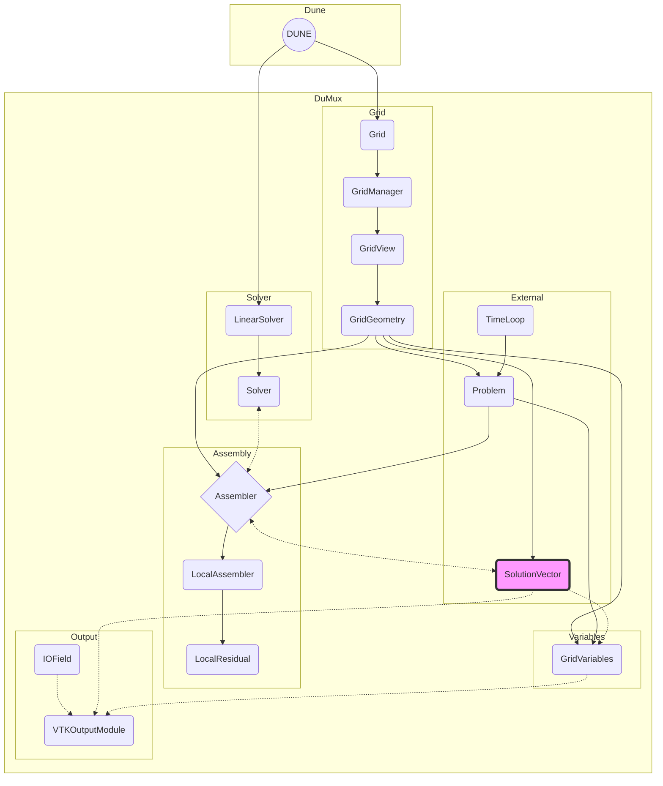

# High-Level Documentation for DuMux

## General Description

### Product Perspective
DuMux, built on the DUNE framework, offers functionalities like finite volume discretizations and multi-domain framework for model coupling.

### Tools Used
Key technologies include modern C++17 and MPI for parallel computing.

### General Constraints and Assumptions
Discussion on the GPL-3.0 license terms and their implications.

## Design Details

### Main Design Features
- list the main classes and only one section (2-3 sentences) what this class is about
#### Grid
#### GridManager
The concept of the GridManager in the DuMuX framework is to abstract and centralize the creation, manipulation, and management of various grid types used in numerical simulations. It serves as an interface between the user and the underlying grid data structures.
#### GridView
A GridView is a representation of the grid that allows for read-only access to certain parts of the Grid from which it is obtained. A leafGridView is a view on all elements of the grid without descendants in the hierarchy (which would be the leaves of a grid hierarchy) while a levelGridView is a view on all elements of a given level of a refinement hierarchy.
#### GridGeometry
The grid geometry constructs, from a GridView, all the geometrical and topological data necessary to evaluate the discrete equations.
#### GridVariables
GridVariables provide access to all variables needed to solve a particular (discrete) PDE, that is,
the primary and secondary variables at discrete locations.
These locations and also the type of variables can depend on the chosen discretization scheme.
#### Problem
The Problem class in DuMuX represents the conceptual framework where the scenario being simulated are characterized through the specification of initial and boundary conditions, as well as source terms.
#### TimeLoop
The TimeLoop class is instantiated to manage temporal aspects of transient PDEs, handling parameters such as time step size, current simulation time, and total simulation time, whereas stationary PDEs bypass the need for such temporal management.
#### SolutionVector
#### Assembler
#### LocalAssembler
#### LocalResidual
#### LinearSolver
#### Solver
#### IOField
#### VTKOutputModule
#### Coupling Manager

### Application and Technology Architecture
- Software architecture focusing on modularity and integration with DUNE framework.

### User Interface and User Experience
- Interaction through code for simulation setup and execution.
- Main interfaces
- vtu output?

## Diagrams and Visual Aids

### Architecture Diagrams
- Diagrams representing the architecture and integration with DUNE and output possibilities.

### Flowcharts
- Workflow of simulations and model setups.

## Conclusion

### Future Work
Planned future developments for DuMux.