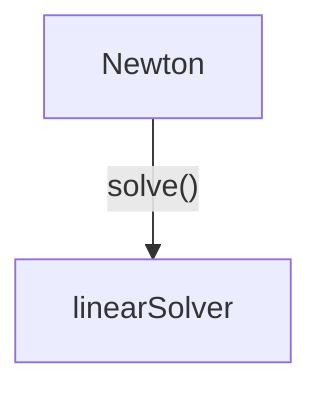

# linearSolver

| The linear solvers basically solves a linear-system of equations in  the form Ax=b.   In the case of Dumux it is Jx=r, with the Jacobian J and the residual r.   The implemented linear solvers are implemented in DUNE. |
| :--- |

## Key functionalities

- solve()
  - Input: Reference of A,x and b
  - Output: x

## Overview

