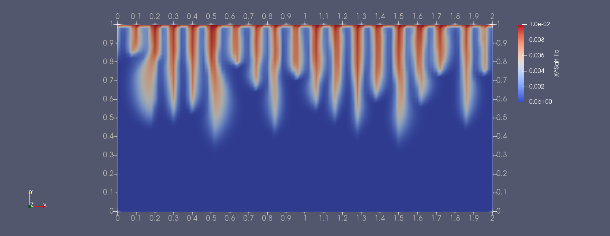
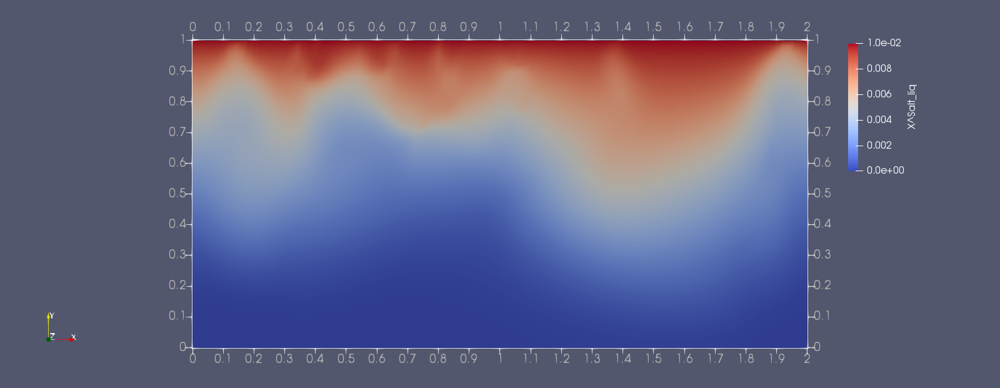

This tutorial addresses a problem of robustness with dispersion effects in instability problems

We provide here two exemplary approaches to include dispersion within the Box context. We have observed that the updated calculation of the dispersion tensor within a Newton iteration can lead to severe problems with numerical robustness when dispersivity values are sufficiently large.
In such a case, it helps to update dispersion tensors only after each time step. 
This is documented in the two examples here.

First of all, the problem setup is shown in the plots below. Saltwater at a small concentration of salt and thus at a slightly higher density than freshwater is initially layered above freshwater. The top boundary keeps concentration and pressure constant. All other boundaries are closed. This is an instable layering and after some time, a fingering regime starts with fingers of higher concentration protruding downward while less dense water at lower salt concentrations comes up.

Dependend on the dispersivity, the fingers are distinct features or they are rather smeared out.
Accordingly, this plot here represents a scenario with rather low dispersivity,  
   
while this one here is the same setup but with much higher dispersivity.  
 

Both scenarios can be simulated now with two different approaches and it can be observed that one of the approaches leads to severe problems in the convergence of the Newton solver.
