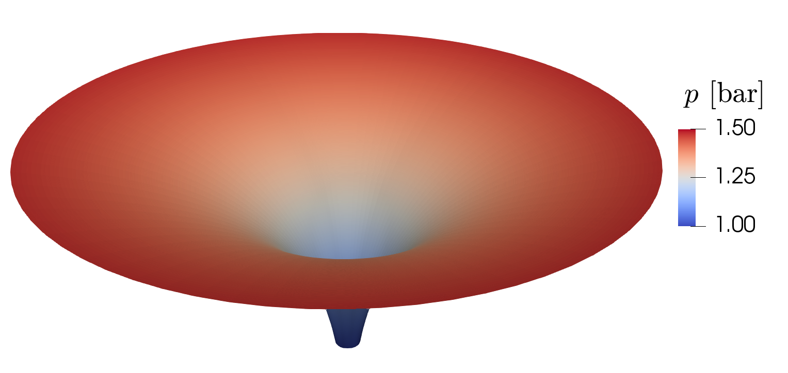

<!-- Important: This file has been automatically generated by generate_example_docs.py. Do not edit this file directly! -->

| [:arrow_left: Back to the main documentation](../README.md) | [:arrow_left: Go back to part 2](main.md) |
|---|---:|

# Part 3: Post-processing with ParaView

The result file `example_rotationsymmetry.pvd` can be opened with the software [ParaView](https://www.paraview.org/).
To obtain a visualisation as shown in the introduction of this documented example, after loading
the result file, choose `Filters`>`Alphabetical`>`Rotational Extrusion`.
You might have to reset your view and switch to `3D`. Then apply `Filters`>`Alphabetical`>`Warp By Scalar`.
The result should look like this:

<figure>
    

        
        <figcaption> <b> Fig.1 - </b>Rotation-symmetric pressure distribution on a disc (warped to 3D)</figcaption>
    

</figure>

| [:arrow_left: Back to the main documentation](../README.md) | [:arrow_left: Go back to part 2](main.md) |
|---|---:|

