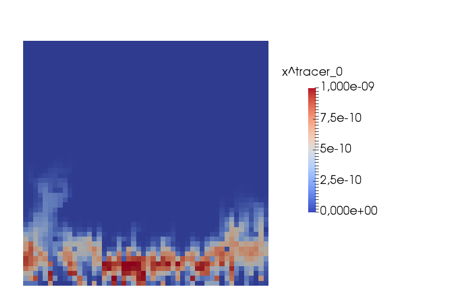

This tutorial was copied from dumux/test/porousmediumflow/tracer/1ptracer.

# One-phase flow with random permeability distribution and a tracer model

## Problem set-up
This example contains a contaminant transported by a base groundwater flow in a randomly distributed permeability field. The figure below shows the simulation set-up. The permeability values range between 6.12e-15 and 1.5 e-7 $`m^2`$. A pressure gradient between the top and the bottom boundary leads to a groundwater flux from the bottom to the top. Neumann no-flow boundaries are assigned to the left and right boundary. Initially, there is a contaminant concentration at the bottom of the domain.


## Model description
Two different models are applied to simulate the system: In a first step, the groundwater velocity is evaluated under stationary conditions. Therefore the single phase model is applied.
In a second step, the contaminant gets transported based on the groundwater velocity field. It is assumed, that the dissolved contaminant does not affect density and viscosity of the groundwater and thus, it is handled as a tracer by the tracer model. The tracer model is then solved instationarily.

### 1p Model
The single phase model uses Darcy's law as the equation for the momentum conservation:

```math
\textbf v = - \frac{\textbf K}{\mu} \left(\textbf{grad}\, p - \varrho {\textbf g} \right)
```

With the darcy velocity $` \textbf v `$, the permeability $` \textbf K`$, the dynamic viscosity $` \mu`$, the pressure $`p`$, the density $`\rho`$ and the gravity $`\textbf g`$.

Darcy's law is inserted into the continuity equation:

```math
\phi \frac{\partial \varrho}{\partial t} + \text{div} \textbf v = 0
```

with porosity $`\phi`$.

The equation is discretized using a cell-centered finite volume scheme as spatial discretization for the pressure as primary variable. For details on the discretization scheme, have a look at the dumux [handbook](https://dumux.org/handbook).

### Tracer Model
The transport of the contaminant component $`\kappa`$ is based on the previously evaluated velocity field $`\textbf v`$  with the help the following mass balance equation:

```math
\phi \frac{ \partial \varrho X^\kappa}{\partial t} - \text{div} \left\lbrace \varrho X^\kappa {\textbf v} + \varrho D^\kappa_\text{pm} \textbf{grad} X^\kappa \right\rbrace = 0
```

With the porosity $`\phi`$, the mass fraction of the contaminant component $`\kappa`$: $`X^\kappa`$, the porous medium diffusivity $` D^\kappa_\text{pm} `$ and the density of the fluid phase $`\varrho`$.

The porous medium diffusivity is a function of the diffusion coefficient of the component $`D^\kappa`$, the porosity $`\phi`$ and the porous medium tortuosity $`\tau`$ by the following equation:

```math
D^\kappa_\text{pm}= \phi \tau D^\kappa
```

The primary variable of this model is the mass fraction $`X^\kappa`$. We apply the same spatial discretization as in the single phase model and use the implicit Euler method for time discretization. For more information, have a look at the dumux handbook.

In the following, we take a close look at the files containing the set-up: At first, boundary conditions and spatially distributed parameters are set in `problem_1p.hh` and `spatialparams_1p.hh`, respectively, for the single phase model and subsequently in `problem_tracer.hh` and `spatialparams_tracer.hh` for the tracer model. Afterwards, we show the different steps for solving the model in the source file `main.cc`. At the end, we show some simulation results.


## The file `spatialparams_1p.hh`


In this file, we generate the random permeability field in the constructor of the `OnePTestSpatialParams` class. Thereafter, spatial properties of the porous medium such as the permeability and the porosity are defined in various functions for the 1p problem.
We want to generate a random permeability field. For this, we use a random number generation of the C++ standard library.
```cpp
#include <random>
```
In the file `properties.hh` all properties are declared.
```cpp
#include <dumux/porousmediumflow/properties.hh>
```
We include the spatial parameters for single-phase, finite volumes from which we will inherit.
```cpp
#include <dumux/material/spatialparams/fv1p.hh>

namespace Dumux {
```
In the `OnePTestSpatialParams` class, we define all functions needed to describe the porous matrix, e.g. porosity and permeability for the 1p_problem.
```cpp

template<class GridGeometry, class Scalar>
class OnePTestSpatialParams
: public FVSpatialParamsOneP<GridGeometry, Scalar,
                             OnePTestSpatialParams<GridGeometry, Scalar>>
{
```
We introduce `using` declarations that are derived from the property system, which we need in this class.
```cpp
    using GridView = typename GridGeometry::GridView;
    using FVElementGeometry = typename GridGeometry::LocalView;
    using SubControlVolume = typename FVElementGeometry::SubControlVolume;
    using Element = typename GridView::template Codim<0>::Entity;
    using ParentType = FVSpatialParamsOneP<GridGeometry, Scalar,
                                           OnePTestSpatialParams<GridGeometry, Scalar>>;

    static constexpr int dimWorld = GridView::dimensionworld;
    using GlobalPosition = typename SubControlVolume::GlobalPosition;

public:
    using PermeabilityType = Scalar;
    OnePTestSpatialParams(std::shared_ptr<const GridGeometry> gridGeometry)
    : ParentType(gridGeometry), K_(gridGeometry->gridView().size(0), 0.0)
    {
```
### Generation of the random permeability field
We get the permeability of the domain and the lens from the `params.input` file.
```cpp
        permeability_ = getParam<Scalar>("SpatialParams.Permeability");
        permeabilityLens_ = getParam<Scalar>("SpatialParams.PermeabilityLens");
```
Further, we get the position of the lens, which is defined by the position of the lower left and the upper right corner.
```cpp
        lensLowerLeft_ = getParam<GlobalPosition>("SpatialParams.LensLowerLeft");
        lensUpperRight_ =getParam<GlobalPosition>("SpatialParams.LensUpperRight");
```
We generate random fields for the permeability using a lognormal distribution, with the `permeability_` as mean value and 10 % of it as standard deviation. A seperate distribution is used for the lens using `permeabilityLens_`.
```cpp
        std::mt19937 rand(0);
        std::lognormal_distribution<Scalar> K(std::log(permeability_), std::log(permeability_)*0.1);
        std::lognormal_distribution<Scalar> KLens(std::log(permeabilityLens_), std::log(permeabilityLens_)*0.1);
        for (const auto& element : elements(gridGeometry->gridView()))
        {
            const auto eIdx = gridGeometry->elementMapper().index(element);
            const auto globalPos = element.geometry().center();
            K_[eIdx] = isInLens_(globalPos) ? KLens(rand) : K(rand);
        }
    }
```
### Properties of the porous matrix
We define the (intrinsic) permeability $`[m^2]`$ using the generated random permeability field. In this test, we use element-wise distributed permeabilities.
```cpp
    template<class ElementSolution>
    const PermeabilityType& permeability(const Element& element,
                                         const SubControlVolume& scv,
                                         const ElementSolution& elemSol) const
    {
        return K_[scv.dofIndex()];
    }

```
We set the porosity $`[-]`$ for the whole domain.
```cpp
    Scalar porosityAtPos(const GlobalPosition &globalPos) const
    { return 0.2; }
```
We reference to the permeability field. This is used in the main function to write an output for the permeability field.
```cpp
    const std::vector<Scalar>& getKField() const
    { return K_; }

private:
```
We have a convenient definition of the position of the lens.
```cpp
    bool isInLens_(const GlobalPosition &globalPos) const
    {
        for (int i = 0; i < dimWorld; ++i) {
            if (globalPos[i] < lensLowerLeft_[i] + eps_ || globalPos[i] > lensUpperRight_[i] - eps_)
                return false;
        }
        return true;
    }

    GlobalPosition lensLowerLeft_;
    GlobalPosition lensUpperRight_;

    Scalar permeability_, permeabilityLens_;

    std::vector<Scalar> K_;

    static constexpr Scalar eps_ = 1.5e-7;
};

} // end namespace Dumux

```


## The file `problem_1p.hh`


Before we enter the problem class containing initial and boundary conditions, we include necessary files and introduce properties.
### Include files
The dune grid interphase is included here:
```cpp
#include <dune/grid/yaspgrid.hh>
```
The cell centered, two-point-flux discretization scheme is included:
```cpp
#include <dumux/discretization/cctpfa.hh>
```
The one-phase flow model is included:
```cpp
#include <dumux/porousmediumflow/1p/model.hh>
```
This is the porous medium problem class that this class is derived from:
```cpp
#include <dumux/porousmediumflow/problem.hh>
```
The fluid properties are specified in the following headers:
```cpp
#include <dumux/material/components/simpleh2o.hh>
#include <dumux/material/fluidsystems/1pliquid.hh>
```
The local residual for incompressible flow is included:
```cpp
#include <dumux/porousmediumflow/1p/incompressiblelocalresidual.hh>
```
We include the header that specifies all spatially variable parameters:
```cpp
#include "spatialparams_1p.hh"
```
### Define basic properties for our simulation
We enter the namespace Dumux in order to import the entire Dumux namespace for general use
```cpp
namespace Dumux {
```
The problem class is forward declared:
```cpp
template<class TypeTag>
class OnePTestProblem;
```
We enter the namespace Properties, which is a sub-namespace of the namespace Dumux:
```cpp
namespace Properties {
```
A `TypeTag` for our simulation is created which inherits from the one-phase flow model and the cell centered, two-point-flux discretization scheme.
```cpp
namespace TTag {
struct IncompressibleTest { using InheritsFrom = std::tuple<OneP, CCTpfaModel>; };
}
```
We use a structured 2D grid:
```cpp
template<class TypeTag>
struct Grid<TypeTag, TTag::IncompressibleTest> { using type = Dune::YaspGrid<2>; };
```
The problem class specifies initial and boundary conditions:
```cpp
template<class TypeTag>
struct Problem<TypeTag, TTag::IncompressibleTest> { using type = OnePTestProblem<TypeTag>; };
```
We define the spatial parameters for our simulation:
```cpp
template<class TypeTag>
struct SpatialParams<TypeTag, TTag::IncompressibleTest>
{
```
We define convenient shortcuts to the properties `GridGeometry` and `Scalar`:
```cpp
    using GridGeometry = GetPropType<TypeTag, Properties::GridGeometry>;
    using Scalar = GetPropType<TypeTag, Properties::Scalar>;
```
Finally, we set the spatial parameters:
```cpp
    using type = OnePTestSpatialParams<GridGeometry, Scalar>;
};
```
The local residual contains analytic derivative methods for incompressible flow:
```cpp
template<class TypeTag>
struct LocalResidual<TypeTag, TTag::IncompressibleTest> { using type = OnePIncompressibleLocalResidual<TypeTag>; };
```
In the following we define our fluid properties.
```cpp
template<class TypeTag>
struct FluidSystem<TypeTag, TTag::IncompressibleTest>
{
```
We define a convenient shortcut to the property Scalar:
```cpp
    using Scalar = GetPropType<TypeTag, Properties::Scalar>;
```
We create a fluid system that consists of one liquid water phase. We use the simple
description of water, which means we do not use tabulated values but more general equations of state.
```cpp
    using type = FluidSystems::OnePLiquid<Scalar, Components::SimpleH2O<Scalar> >;
};
```
We enable caching for the grid volume variables.
```cpp
template<class TypeTag>
struct EnableGridVolumeVariablesCache<TypeTag, TTag::IncompressibleTest> { static constexpr bool value = true; };
```
We enable caching for the grid flux variables.
```cpp
template<class TypeTag>
struct EnableGridFluxVariablesCache<TypeTag, TTag::IncompressibleTest> { static constexpr bool value = true; };
```
We enable caching for the FV grid geometry
```cpp
template<class TypeTag>
struct EnableGridGeometryCache<TypeTag, TTag::IncompressibleTest> { static constexpr bool value = true; };
```
The cache stores values that were already calculated for later usage. This makes the simulation faster.
We leave the namespace Properties.
```cpp
}
```
### The problem class
We enter the problem class where all necessary boundary conditions and initial conditions are set for our simulation.
As this is a porous medium problem, we inherit from the basic `PorousMediumFlowProblem`.
```cpp
template<class TypeTag>
class OnePTestProblem : public PorousMediumFlowProblem<TypeTag>
{
```
We use convenient declarations that we derive from the property system.
```cpp
    using ParentType = PorousMediumFlowProblem<TypeTag>;
    using GridView = GetPropType<TypeTag, Properties::GridView>;
    using Element = typename GridView::template Codim<0>::Entity;
    using Scalar = GetPropType<TypeTag, Properties::Scalar>;
    using PrimaryVariables = GetPropType<TypeTag, Properties::PrimaryVariables>;
    using FVElementGeometry = typename GetPropType<TypeTag, Properties::GridGeometry>::LocalView;
    using SubControlVolumeFace = typename FVElementGeometry::SubControlVolumeFace;
    using GridGeometry = GetPropType<TypeTag, Properties::GridGeometry>;
    using BoundaryTypes = GetPropType<TypeTag, Properties::BoundaryTypes>;

    static constexpr int dimWorld = GridView::dimensionworld;

public:
```
This is the constructor of our problem class:
```cpp
    OnePTestProblem(std::shared_ptr<const GridGeometry> gridGeometry)
    : ParentType(gridGeometry) {}
```
First, we define the type of boundary conditions depending on location. Two types of boundary conditions
can be specified: Dirichlet or Neumann boundary condition. On a Dirichlet boundary, the values of the
primary variables need to be fixed. On a Neumann boundary condition, values for derivatives need to be fixed.
Mixed boundary conditions (different types for different equations on the same boundary) are not accepted.
```cpp
    BoundaryTypes boundaryTypes(const Element &element,
                                const SubControlVolumeFace &scvf) const
    {
        BoundaryTypes values;
```
we retreive the global position, i.e. the vector including the global coordinates
of the finite volume
```cpp
        const auto globalPos = scvf.ipGlobal();
```
we define a small epsilon value
```cpp
        Scalar eps = 1.0e-6;
```
We specify Dirichlet boundaries on the top and bottom of our domain:
```cpp
        if (globalPos[dimWorld-1] < eps || globalPos[dimWorld-1] > this->gridGeometry().bBoxMax()[dimWorld-1] - eps)
            values.setAllDirichlet();
        else
```
The top and bottom of our domain are Neumann boundaries:
```cpp
            values.setAllNeumann();

        return values;
    }
```
Second, we specify the values for the Dirichlet boundaries. We need to fix values of our primary variable
```cpp
    PrimaryVariables dirichlet(const Element &element,
                               const SubControlVolumeFace &scvf) const
    {
```
we retreive again the global position
```cpp
        const auto& pos = scvf.ipGlobal();
        PrimaryVariables values(0);
```
we assign pressure values in [Pa] according to a pressure gradient to 1e5 Pa at the top and 1.1e5 Pa at the bottom.
```cpp
        values[0] = 1.0e+5*(1.1 - pos[dimWorld-1]*0.1);
        return values;
    }
```
We need to specify a constant temperature for our isothermal problem.
Fluid properties that depend on temperature will be calculated with this value.
```cpp
    Scalar temperature() const
    {
        return 283.15; // 10°C
    }
```
This is everything the one phase problem class contains.
```cpp
};
```
We leave the namespace Dumux.
```cpp
} // end namespace Dumux
```


## The file `spatialparams_tracer.hh`


In this file, we define spatial properties of the porous medium such as the permeability and the porosity in various functions for the tracer problem. Further, spatial dependent properties of the tracer fluid system are defined and in the end two functions handel the calculated volume fluxes from the solution of the 1p problem.
In the file `properties.hh`, all properties are declared.
```cpp
#include <dumux/porousmediumflow/properties.hh>
```
As in the 1p spatialparams, we inherit from the spatial parameters for single-phase, finite volumes, which we include here.
```cpp
#include <dumux/material/spatialparams/fv1p.hh>
```
We enter the namespace Dumux
```cpp
namespace Dumux {
```
In the `TracerTestSpatialParams` class, we define all functions needed to describe spatially dependent parameters for the `tracer_problem`.
```cpp

template<class GridGeometry, class Scalar>
class TracerTestSpatialParams
: public FVSpatialParamsOneP<GridGeometry, Scalar,
                             TracerTestSpatialParams<GridGeometry, Scalar>>
{
    using GridView = typename GridGeometry::GridView;
    using FVElementGeometry = typename GridGeometry::LocalView;
    using SubControlVolume = typename FVElementGeometry::SubControlVolume;
    using SubControlVolumeFace = typename FVElementGeometry::SubControlVolumeFace;
    using Element = typename GridView::template Codim<0>::Entity;
    using ParentType = FVSpatialParamsOneP<GridGeometry, Scalar,
                                           TracerTestSpatialParams<GridGeometry, Scalar>>;

    static const int dimWorld = GridView::dimensionworld;
    using GlobalPosition = typename Dune::FieldVector<Scalar, dimWorld>;

public:

    TracerTestSpatialParams(std::shared_ptr<const GridGeometry> gridGeometry)
    : ParentType(gridGeometry) {}
```
### Properties of the porous matrix
We define the same porosity for the whole domain as in the 1p spatialparams.
```cpp
    Scalar porosityAtPos(const GlobalPosition& globalPos) const
    { return 0.2; }
```
We do not consider dispersivity for the tracer transport. So we set the dispersivity coefficient to zero.
```cpp
    template<class ElementSolution>
    Scalar dispersivity(const Element &element,
                        const SubControlVolume& scv,
                        const ElementSolution& elemSol) const
    { return 0; }
```
### Properties of the fluid system
In the following, we define fluid properties that are spatial parameters in the tracer model. They can possible vary with space but are usually constants. Further spatially constant values of the fluid system are defined in the `TracerFluidSystem` class in `problem.hh`.
We define the fluid density to a constant value of 1000 $`\frac{kg}{m^3}`$.
```cpp
    Scalar fluidDensity(const Element &element,
                        const SubControlVolume& scv) const
    { return 1000; }
```
We define the fluid molar mass.
```cpp
    Scalar fluidMolarMass(const Element &element,
                          const SubControlVolume& scv) const
    { return 18.0; }

    Scalar fluidMolarMass(const GlobalPosition &globalPos) const
    { return 18.0; }
```
### The volume fluxes
We define a function which returns the field of volume fluxes. This is e.g. used to calculate the transport of the tracer.
```cpp
    template<class ElementVolumeVariables>
    Scalar volumeFlux(const Element &element,
                      const FVElementGeometry& fvGeometry,
                      const ElementVolumeVariables& elemVolVars,
                      const SubControlVolumeFace& scvf) const
    {
        return volumeFlux_[scvf.index()];
    }
```
We define a function to set the volume flux. This is used in the main function to set the volume flux to the calculated value based on the solution of the 1p problem.
```cpp
    void setVolumeFlux(const std::vector<Scalar>& f)
    { volumeFlux_ = f; }

private:
    std::vector<Scalar> volumeFlux_;
};

} // end namespace Dumux

```


## The file `problem_tracer.hh`


Before we enter the problem class containing initial and boundary conditions, we include necessary files and introduce properties.
### Include files
Again, we have to include the dune grid interface:
```cpp
#include <dune/grid/yaspgrid.hh>
```
and the cell centered, two-point-flux discretization.
```cpp
#include <dumux/discretization/cctpfa.hh>
```
Here, we include the tracer model:
```cpp
#include <dumux/porousmediumflow/tracer/model.hh>
```
We include again the porous medium problem class that this class is derived from:
```cpp
#include <dumux/porousmediumflow/problem.hh>
```
and the base fluidsystem
```cpp
#include <dumux/material/fluidsystems/base.hh>
```
We include the header that specifies all spatially variable parameters for the tracer problem:
```cpp
#include "spatialparams_tracer.hh"
```
### Define basic properties for our simulation
We enter the namespace Dumux
```cpp
namespace Dumux {
```
The problem class is forward declared:
```cpp
template <class TypeTag>
class TracerTestProblem;
```
We enter the namespace Properties,
```cpp
namespace Properties {
```
A `TypeTag` for our simulation is created which inherits from the tracer model and the
cell centered, two-point-flux discretization scheme.
```cpp
namespace TTag {
struct TracerTest { using InheritsFrom = std::tuple<Tracer>; };
struct TracerTestCC { using InheritsFrom = std::tuple<TracerTest, CCTpfaModel>; };
}
```
We enable caching for the grid volume variables, the flux variables and the FV grid geometry.
```cpp
template<class TypeTag>
struct EnableGridVolumeVariablesCache<TypeTag, TTag::TracerTest> { static constexpr bool value = true; };
template<class TypeTag>
struct EnableGridFluxVariablesCache<TypeTag, TTag::TracerTest> { static constexpr bool value = true; };
template<class TypeTag>
struct EnableGridGeometryCache<TypeTag, TTag::TracerTest> { static constexpr bool value = true; };
```
We use the same grid as in the stationary one-phase model, a structured 2D grid:
```cpp
template<class TypeTag>
struct Grid<TypeTag, TTag::TracerTest> { using type = Dune::YaspGrid<2>; };
```
The problem class specifies initial and boundary conditions:
```cpp
template<class TypeTag>
struct Problem<TypeTag, TTag::TracerTest> { using type = TracerTestProblem<TypeTag>; };
```
We define the spatial parameters for our tracer simulation:
```cpp
template<class TypeTag>
struct SpatialParams<TypeTag, TTag::TracerTest>
{
    using GridGeometry = GetPropType<TypeTag, Properties::GridGeometry>;
    using Scalar = GetPropType<TypeTag, Properties::Scalar>;
    using type = TracerTestSpatialParams<GridGeometry, Scalar>;
};
```
We define that mass fractions are used to define the concentrations
```cpp
template<class TypeTag>
struct UseMoles<TypeTag, TTag::TracerTest> { static constexpr bool value = false; };
```
We do not use a solution dependent molecular diffusion coefficient:
```cpp
template<class TypeTag>
struct SolutionDependentMolecularDiffusion<TypeTag, TTag::TracerTestCC> { static constexpr bool value = false; };
```
In the following, we create a new tracer fluid system and derive it from the base fluid system.
```cpp
template<class TypeTag>
class TracerFluidSystem : public FluidSystems::Base<GetPropType<TypeTag, Properties::Scalar>,
                                                               TracerFluidSystem<TypeTag>>
{
```
We define convenient shortcuts to the properties `Scalar`, `Problem`, `GridView`,
`Element`, `FVElementGeometry` and `SubControlVolume`:
```cpp
    using Scalar = GetPropType<TypeTag, Properties::Scalar>;
    using Problem = GetPropType<TypeTag, Properties::Problem>;
    using GridView = GetPropType<TypeTag, Properties::GridView>;
    using Element = typename GridView::template Codim<0>::Entity;
    using FVElementGeometry = typename GetPropType<TypeTag, Properties::GridGeometry>::LocalView;
    using SubControlVolume = typename FVElementGeometry::SubControlVolume;

public:
```
We specify, that the fluid system only contains tracer components,
```cpp
    static constexpr bool isTracerFluidSystem()
    { return true; }
```
that no component is the main component
```cpp
    static constexpr int getMainComponent(int phaseIdx)
    { return -1; }
```
and the number of components
```cpp
    static constexpr int numComponents = 1;
```
We set the component name for the component index (`compIdx`) for the vtk output:
```cpp
    static std::string componentName(int compIdx)
    { return "tracer_" + std::to_string(compIdx); }
```
We set the phase name for the phase index (`phaseIdx`) for velocity vtk output:
```cpp
    static std::string phaseName(int phaseIdx = 0)
    { return "Groundwater"; }
```
We set the molar mass of the tracer component with index `compIdx`.
```cpp
    static Scalar molarMass(unsigned int compIdx)
    { return 0.300; }
```
We set the value for the binary diffusion coefficient. This
might depend on spatial parameters like pressure / temperature. But for our case it is 0.0:
```cpp
    static Scalar binaryDiffusionCoefficient(unsigned int compIdx,
                                             const Problem& problem,
                                             const Element& element,
                                             const SubControlVolume& scv)
    { return 0.0; }
};
```
We set the above created tracer fluid system:
```cpp
template<class TypeTag>
struct FluidSystem<TypeTag, TTag::TracerTest> { using type = TracerFluidSystem<TypeTag>; };
```
We leave the namespace Properties.
```cpp
}

```
### The problem class
We enter the problem class where all necessary boundary conditions and initial conditions are set for our simulation.
As this is a porous medium problem, we inherit from the basic `PorousMediumFlowProblem`.
```cpp
template <class TypeTag>
class TracerTestProblem : public PorousMediumFlowProblem<TypeTag>
{
```
We use convenient declarations that we derive from the property system.
```cpp
    using ParentType = PorousMediumFlowProblem<TypeTag>;
    using Scalar = GetPropType<TypeTag, Properties::Scalar>;
    using Indices = typename GetPropType<TypeTag, Properties::ModelTraits>::Indices;
    using GridView = GetPropType<TypeTag, Properties::GridView>;
    using GridGeometry = GetPropType<TypeTag, Properties::GridGeometry>;
    using BoundaryTypes = GetPropType<TypeTag, Properties::BoundaryTypes>;
    using PrimaryVariables = GetPropType<TypeTag, Properties::PrimaryVariables>;
    using FluidSystem = GetPropType<TypeTag, Properties::FluidSystem>;
    using SpatialParams = GetPropType<TypeTag, Properties::SpatialParams>;
    using Element = typename GridGeometry::GridView::template Codim<0>::Entity;
    using GlobalPosition = typename Element::Geometry::GlobalCoordinate;
    using NumEqVector = GetPropType<TypeTag, Properties::NumEqVector>;
    using GridVariables = GetPropType<TypeTag, Properties::GridVariables>;
    using ElementVolumeVariables = typename GridVariables::GridVolumeVariables::LocalView;
    using ElementFluxVariablesCache = typename GridVariables::GridFluxVariablesCache::LocalView;
    using FVElementGeometry = typename GetPropType<TypeTag, Properties::GridGeometry>::LocalView;
    using SubControlVolumeFace = typename FVElementGeometry::SubControlVolumeFace;
```
We create a bool saying whether mole or mass fractions are used
```cpp
    static constexpr bool useMoles = getPropValue<TypeTag, Properties::UseMoles>();
```
We create additional int to make dimWorld and numComponents available in the problem
```cpp
    static constexpr int dimWorld = GridView::dimensionworld;
    static const int numComponents = FluidSystem::numComponents;

public:
```
This is the constructor of our problem class:
```cpp
    TracerTestProblem(std::shared_ptr<const GridGeometry> gridGeometry)
    : ParentType(gridGeometry)
    {
```
We print out whether mole or mass fractions are used
```cpp
        if(useMoles)
            std::cout<<"problem uses mole fractions" << '\n';
        else
            std::cout<<"problem uses mass fractions" << '\n';
    }
```
We define the type of boundary conditions depending on the location.
All boundaries are set to a neumann-type flow boundary condition.
```cpp
    BoundaryTypes boundaryTypesAtPos(const GlobalPosition &globalPos) const
    {
        BoundaryTypes values;
        values.setAllNeumann();
        return values;
    }
```
We specify the initial conditions for the primary variable (tracer concentration) depending on the location.
```cpp
    PrimaryVariables initialAtPos(const GlobalPosition &globalPos) const
    {
        PrimaryVariables initialValues(0.0);
```
The tracer concentration is located on the domain bottom:
```cpp
        if (globalPos[1] < 0.1 + eps_)
        {
```
We assign different values, depending on wether mole concentrations or mass concentrations are used:
```cpp
            if (useMoles)
                initialValues = 1e-9;
            else
                initialValues = 1e-9*FluidSystem::molarMass(0)/this->spatialParams().fluidMolarMass(globalPos);
        }
        return initialValues;
    }
```
We implement an outflow boundary on the top of the domain and prescribe zero-flux Neumann boundary conditions on all other boundaries.
```cpp
        NumEqVector neumann(const Element& element,
                            const FVElementGeometry& fvGeometry,
                            const ElementVolumeVariables& elemVolVars,
                            const ElementFluxVariablesCache& elemFluxVarsCache,
                            const SubControlVolumeFace& scvf) const
        {
            NumEqVector values(0.0);
            const auto& volVars = elemVolVars[scvf.insideScvIdx()];
            const auto& globalPos = scvf.center();
```
This is the outflow boundary, where tracer is transported by advection
with the given flux field and diffusive flux is enforced to be zero
```cpp
            if (globalPos[dimWorld-1] > this->gridGeometry().bBoxMax()[dimWorld-1] - eps_)
            {
                values = this->spatialParams().volumeFlux(element, fvGeometry, elemVolVars, scvf)
                         * volVars.massFraction(0, 0) * volVars.density(0)
                         / scvf.area();
                assert(values>=0.0 && "Volume flux at outflow boundary is expected to have a positive sign");
            }
```
prescribe zero-flux Neumann boundary conditions elsewhere
```cpp
            else
                values = 0.0;

            return values;
        }

private:
```
We assign a private global variable for the epsilon:
```cpp
    static constexpr Scalar eps_ = 1e-6;
```
This is everything the tracer problem class contains.
```cpp
};
```
We leave the namespace Dumux here.
```cpp
} // end namespace Dumux

```


## The file `main.cc`


We look now at the main file for the tracer problem. We set up two problems in this file and solve them sequentially, first the 1p problem and afterwards the tracer problem. The result of the 1p problem is the pressure distribution in the problem domain. We use it to calculate the volume fluxes, which act as an input for the tracer problem. Based on this volume fluxes, we calculate the transport of a tracer in the following tracer problem.
### Includes
```cpp
#include <config.h>
```
We include both problems in the main file, the `problem_1p.hh` and the `problem_tracer.hh`.
```cpp
#include "problem_1p.hh"
#include "problem_tracer.hh"
```
Further, we include a standard header file for C++, to get time and date information
```cpp
#include <ctime>
```
and another one for in- and output.
```cpp
#include <iostream>
```
Dumux is based on DUNE, the Distributed and Unified Numerics Environment, which provides several grid managers and linear solvers. So we need some includes from that.
```cpp
#include <dune/common/parallel/mpihelper.hh>
#include <dune/common/timer.hh>
#include <dune/grid/io/file/dgfparser/dgfexception.hh>
#include <dune/grid/io/file/vtk.hh>
```
In Dumux, a property system is used to specify the model. For this, different properties are defined containing type definitions, values and methods. All properties are declared in the file `properties.hh`.
```cpp
#include <dumux/common/properties.hh>
```
The following file contains the parameter class, which manages the definition of input parameters by a default value, the inputfile or the command line.
```cpp
#include <dumux/common/parameters.hh>
```
The file `dumuxmessage.hh` contains the class defining the start and end message of the simulation.
```cpp
#include <dumux/common/dumuxmessage.hh>
```
The following file contains the class, which defines the sequential linear solver backends.
```cpp
#include <dumux/linear/seqsolverbackend.hh>
```
Further we include the assembler, which assembles the linear systems for finite volume schemes (box-scheme, tpfa-approximation, mpfa-approximation).
```cpp
#include <dumux/assembly/fvassembler.hh>
```
The containing class in the following file defines the different differentiation methods used to compute the derivatives of the residual.
```cpp
#include <dumux/assembly/diffmethod.hh>
```
We need the following class to simplify the writing of dumux simulation data to VTK format.
```cpp
#include <dumux/io/vtkoutputmodule.hh>
```
The gridmanager constructs a grid from the information in the input or grid file. There is a specification for the different supported grid managers.
```cpp
#include <dumux/io/grid/gridmanager.hh>
```
### Beginning of the main function
```cpp
int main(int argc, char** argv) try
{
    using namespace Dumux;
```
We define the type tags for the two problems. They are created in the individual problem files.
```cpp
    using OnePTypeTag = Properties::TTag::IncompressibleTest;
    using TracerTypeTag = Properties::TTag::TracerTestCC;
```
We initialize MPI. Finalization is done automatically on exit.
```cpp
    const auto& mpiHelper = Dune::MPIHelper::instance(argc, argv);
```
We print the dumux start message.
```cpp
    if (mpiHelper.rank() == 0)
        DumuxMessage::print(/*firstCall=*/true);
```
We parse the command line arguments.
```cpp
    Parameters::init(argc, argv);
```
### Create the grid
A gridmanager tries to create the grid either from a grid file or the input file. We solve both problems on the same grid. Hence, the grid is only created once using the type tag of the 1p problem.
```cpp
    GridManager<GetPropType<OnePTypeTag, Properties::Grid>> gridManager;
    gridManager.init();
```
We compute on the leaf grid view.
```cpp
    const auto& leafGridView = gridManager.grid().leafGridView();
```
### Set-up and solving of the 1p problem
In the following section, we set up and solve the 1p problem. As the result of this problem, we obtain the pressure distribution in the problem domain.
#### Set-up
We create and initialize the finite volume grid geometry, the problem, the linear system, including the jacobian matrix, the residual and the solution vector and the gridvariables.
We need the finite volume geometry to build up the subcontrolvolumes (scv) and subcontrolvolume faces (scvf) for each element of the grid partition.
```cpp
    using GridGeometry = GetPropType<OnePTypeTag, Properties::GridGeometry>;
    auto gridGeometry = std::make_shared<GridGeometry>(leafGridView);
    gridGeometry->update();
```
In the problem, we define the boundary and initial conditions.
```cpp
    using OnePProblem = GetPropType<OnePTypeTag, Properties::Problem>;
    auto problemOneP = std::make_shared<OnePProblem>(gridGeometry);
```
The jacobian matrix (`A`), the solution vector (`p`) and the residual (`r`) are parts of the linear system.
```cpp
    using JacobianMatrix = GetPropType<OnePTypeTag, Properties::JacobianMatrix>;
    using SolutionVector = GetPropType<OnePTypeTag, Properties::SolutionVector>;
    SolutionVector p(leafGridView.size(0));

    auto A = std::make_shared<JacobianMatrix>();
    auto r = std::make_shared<SolutionVector>();
```
The grid variables store variables on scv and scvf (volume and flux variables).
```cpp
    using OnePGridVariables = GetPropType<OnePTypeTag, Properties::GridVariables>;
    auto onePGridVariables = std::make_shared<OnePGridVariables>(problemOneP, gridGeometry);
    onePGridVariables->init(p);
```
#### Assembling the linear system
We created and inizialize the assembler.
```cpp
    using OnePAssembler = FVAssembler<OnePTypeTag, DiffMethod::analytic>;
    auto assemblerOneP = std::make_shared<OnePAssembler>(problemOneP, gridGeometry, onePGridVariables);
    assemblerOneP->setLinearSystem(A, r);
```
We assemble the local jacobian and the residual and stop the time needed, which is displayed in the terminal output, using the `assemblyTimer`. Further, we start the timer to evaluate the total time of the assembly, solving and updating.
```cpp
    Dune::Timer timer;
    Dune::Timer assemblyTimer; std::cout << "Assembling linear system ..." << std::flush;
    assemblerOneP->assembleJacobianAndResidual(p);
    assemblyTimer.stop(); std::cout << " took " << assemblyTimer.elapsed() << " seconds." << std::endl;
```
We want to solve `Ax = -r`.
```cpp
    (*r) *= -1.0;
```
#### Solution
We set the linear solver "UMFPack" as the linear solver. Afterwards we solve the linear system. The time needed to solve the system is recorded by the `solverTimer` and displayed in the terminal output.
```cpp
    using LinearSolver = UMFPackBackend;
    Dune::Timer solverTimer; std::cout << "Solving linear system ..." << std::flush;
    auto linearSolver = std::make_shared<LinearSolver>();
    linearSolver->solve(*A, p, *r);
    solverTimer.stop(); std::cout << " took " << solverTimer.elapsed() << " seconds." << std::endl;
```
#### Update and output
We update the grid variables with the new solution.
```cpp
    Dune::Timer updateTimer; std::cout << "Updating variables ..." << std::flush;
    onePGridVariables->update(p);
    updateTimer.elapsed(); std::cout << " took " << updateTimer.elapsed() << std::endl;

```
We initialize the vtkoutput. Each model has a predefined model specific output with relevant parameters for that model. We add the pressure data from the solution vector (`p`) and the permeability field as output data.
```cpp
    using GridView = GetPropType<OnePTypeTag, Properties::GridView>;
    Dune::VTKWriter<GridView> onepWriter(leafGridView);
    onepWriter.addCellData(p, "p");
    const auto& k = problemOneP->spatialParams().getKField();
    onepWriter.addCellData(k, "permeability");
    onepWriter.write("1p");
```
We stop the timer and display the total time of the simulation as well as the cumulative CPU time.
```cpp
    timer.stop();

    const auto& comm = Dune::MPIHelper::getCollectiveCommunication();
    std::cout << "Simulation took " << timer.elapsed() << " seconds on "
              << comm.size() << " processes.\n"
              << "The cumulative CPU time was " << timer.elapsed()*comm.size() << " seconds.\n";

```
### Computation of the volume fluxes
We use the results of the 1p problem to calculate the volume fluxes in the model domain.
```cpp

    using Scalar =  GetPropType<OnePTypeTag, Properties::Scalar>;
    std::vector<Scalar> volumeFlux(gridGeometry->numScvf(), 0.0);

    using FluxVariables =  GetPropType<OnePTypeTag, Properties::FluxVariables>;
    auto upwindTerm = [](const auto& volVars) { return volVars.mobility(0); };
```
We iterate over all elements.
```cpp
    for (const auto& element : elements(leafGridView))
    {
        auto fvGeometry = localView(*gridGeometry);
        fvGeometry.bind(element);

        auto elemVolVars = localView(onePGridVariables->curGridVolVars());
        elemVolVars.bind(element, fvGeometry, p);

        auto elemFluxVars = localView(onePGridVariables->gridFluxVarsCache());
        elemFluxVars.bind(element, fvGeometry, elemVolVars);
```
We calculate the volume flux for every subcontrolvolume face, which is not on a Neumann boundary (is not on the boundary or is on a Dirichlet boundary).
```cpp

        for (const auto& scvf : scvfs(fvGeometry))
        {
            const auto idx = scvf.index();

            if (!scvf.boundary())
            {
                FluxVariables fluxVars;
                fluxVars.init(*problemOneP, element, fvGeometry, elemVolVars, scvf, elemFluxVars);
                volumeFlux[idx] = fluxVars.advectiveFlux(0, upwindTerm);
            }
            else
            {
                const auto bcTypes = problemOneP->boundaryTypes(element, scvf);
                if (bcTypes.hasOnlyDirichlet())
                {
                    FluxVariables fluxVars;
                    fluxVars.init(*problemOneP, element, fvGeometry, elemVolVars, scvf, elemFluxVars);
                    volumeFlux[idx] = fluxVars.advectiveFlux(0, upwindTerm);
                }
            }
        }
    }

```
### Set-up and solving of the tracer problem
#### Set-up
Similar to the 1p problem, we first create and initialize the problem.
```cpp
    using TracerProblem = GetPropType<TracerTypeTag, Properties::Problem>;
    auto tracerProblem = std::make_shared<TracerProblem>(gridGeometry);
```
We use the volume fluxes calculated in the previous section as input for the tracer model.
```cpp
    tracerProblem->spatialParams().setVolumeFlux(volumeFlux);
```
We create and initialize the solution vector. As the tracer problem is transient, the initial solution defined in the problem is applied to the solution vector.
```cpp
    SolutionVector x(leafGridView.size(0));
    tracerProblem->applyInitialSolution(x);
    auto xOld = x;
```
We create and initialize the grid variables.
```cpp
    using GridVariables = GetPropType<TracerTypeTag, Properties::GridVariables>;
    auto gridVariables = std::make_shared<GridVariables>(tracerProblem, gridGeometry);
    gridVariables->init(x);
```
We read in some time loop parameters from the input file. The parameter `tEnd` defines the duration of the simulation, dt the initial time step size and `maxDt` the maximal time step size.
```cpp
    const auto tEnd = getParam<Scalar>("TimeLoop.TEnd");
    auto dt = getParam<Scalar>("TimeLoop.DtInitial");
    const auto maxDt = getParam<Scalar>("TimeLoop.MaxTimeStepSize");
```
We instantiate the time loop.
```cpp
    auto timeLoop = std::make_shared<CheckPointTimeLoop<Scalar>>(0.0, dt, tEnd);
    timeLoop->setMaxTimeStepSize(maxDt);
```
We create and inizialize the assembler with time loop for the instationary problem.
```cpp
    using TracerAssembler = FVAssembler<TracerTypeTag, DiffMethod::analytic, /*implicit=*/false>;
    auto assembler = std::make_shared<TracerAssembler>(tracerProblem, gridGeometry, gridVariables, timeLoop);
    assembler->setLinearSystem(A, r);
```
We initialize the vtk output module and add a velocity output.
```cpp
    VtkOutputModule<GridVariables, SolutionVector> vtkWriter(*gridVariables, x, tracerProblem->name());
    using IOFields = GetPropType<TracerTypeTag, Properties::IOFields>;
    IOFields::initOutputModule(vtkWriter);
    using VelocityOutput = GetPropType<TracerTypeTag, Properties::VelocityOutput>;
    vtkWriter.addVelocityOutput(std::make_shared<VelocityOutput>(*gridVariables));
    vtkWriter.write(0.0);

```
For the time loop we set a check point.
```cpp
    timeLoop->setPeriodicCheckPoint(tEnd/10.0);
```
#### The time loop
We start the time loop and calculate a new time step as long as `tEnd` is not reached. In every single time step, the problem is assembled and solved.
```cpp
    timeLoop->start(); do
    {
```
First we define the old solution as the solution of the previous time step for storage evaluations.
```cpp
        assembler->setPreviousSolution(xOld);
```
Then the linear system is assembled.
```cpp
        Dune::Timer assembleTimer;
        assembler->assembleJacobianAndResidual(x);
        assembleTimer.stop();
```
We solve the linear system `A(xOld-xNew) = r`.
```cpp
        Dune::Timer solveTimer;
        SolutionVector xDelta(x);
        linearSolver->solve(*A, xDelta, *r);
        solveTimer.stop();
```
We calculate the actual solution and update it in the grid variables.
```cpp
        updateTimer.reset();
        x -= xDelta;
        gridVariables->update(x);
        updateTimer.stop();
```
We display the statistics of the actual time step.
```cpp
        const auto elapsedTot = assembleTimer.elapsed() + solveTimer.elapsed() + updateTimer.elapsed();
        std::cout << "Assemble/solve/update time: "
                  <<  assembleTimer.elapsed() << "(" << 100*assembleTimer.elapsed()/elapsedTot << "%)/"
                  <<  solveTimer.elapsed() << "(" << 100*solveTimer.elapsed()/elapsedTot << "%)/"
                  <<  updateTimer.elapsed() << "(" << 100*updateTimer.elapsed()/elapsedTot << "%)"
                  <<  std::endl;
```
The new solution is defined as the old solution.
```cpp
        xOld = x;
        gridVariables->advanceTimeStep();
```
We advance the time loop to the next time step.
```cpp
        timeLoop->advanceTimeStep();
```
We write the Vtk output on check points.
```cpp
        if (timeLoop->isCheckPoint())
            vtkWriter.write(timeLoop->time());
```
We report the statistics of this time step.
```cpp
        timeLoop->reportTimeStep();
```
We set the time step size dt of the next time step.
```cpp
        timeLoop->setTimeStepSize(dt);

    } while (!timeLoop->finished());

    timeLoop->finalize(leafGridView.comm());

```
### Final Output
```cpp

    if (mpiHelper.rank() == 0)
        DumuxMessage::print(/*firstCall=*/false);

    return 0;

}
catch (Dumux::ParameterException &e)
{
    std::cerr << std::endl << e << " ---> Abort!" << std::endl;
    return 1;
}
catch (Dune::DGFException & e)
{
    std::cerr << "DGF exception thrown (" << e <<
                 "). Most likely, the DGF file name is wrong "
                 "or the DGF file is corrupted, "
                 "e.g. missing hash at end of file or wrong number (dimensions) of entries."
                 << " ---> Abort!" << std::endl;
    return 2;
}
catch (Dune::Exception &e)
{
    std::cerr << "Dune reported error: " << e << " ---> Abort!" << std::endl;
    return 3;
}
catch (...)
{
    std::cerr << "Unknown exception thrown! ---> Abort!" << std::endl;
    return 4;
}
```

## Results

The 1p-model calculated a stationary pressure distribution. It is shown in the following figure:


The random permeability distribution generates the velocity profile shown in the left plot of the next figure. The image in the middle illustrates the tracer distribution after 2500s and the image on the right after 5000s.

| |  | |
|:---:|:---:|:---:|
| velocity profile| tracer concentration after 2500s | tracer concentration after 5000s |
