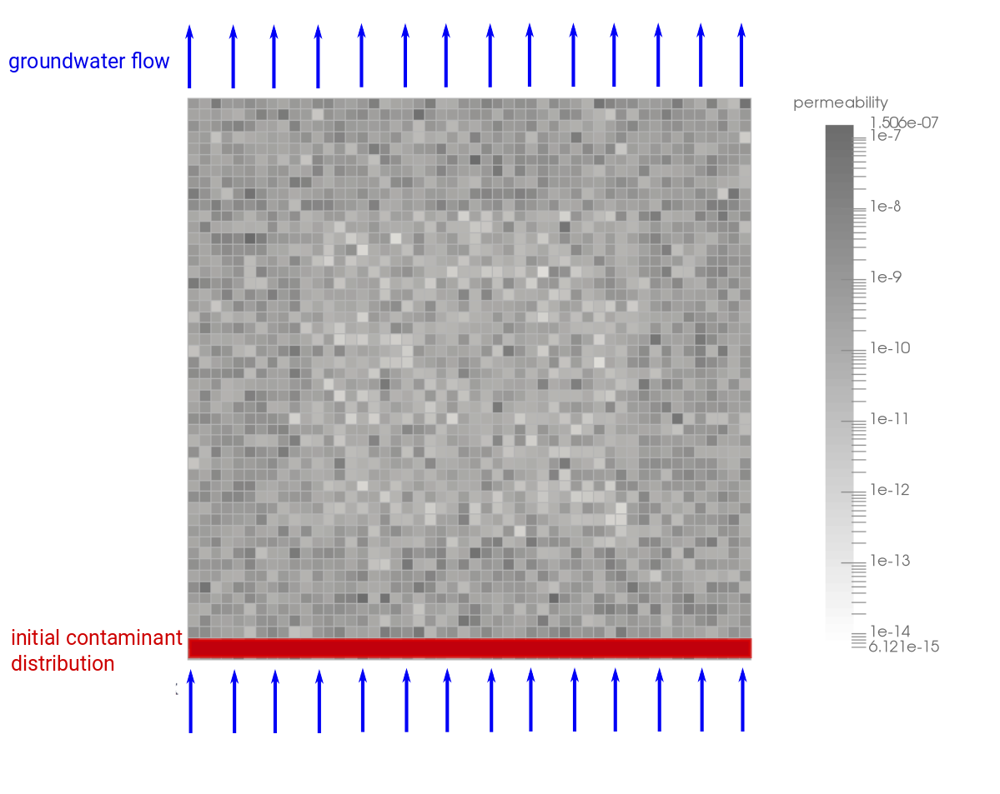

This tutorial was copied from dumux/test/porousmediumflow/tracer/1ptracer.

# One-phase flow with random permeability distribution and a tracer model

## Problem set-up
This example contains a 2d simulation of a stationary groundwater flow. The permeability is distributed randomly. An contaminant initially concentrated at the domain bottom gets transported by the base groundwater flow.

The image below shows the simulation set-up. A pressure gradient between the top an the bottom boundary leads to a groundwater flux from the bottom to the top. Neumann no-flow boundaries are assigned to the left and right boundary. Initially, there is a contaminant concentration at the domain bottom.

 

## Model description
Two different models are applied to simulate the system: In the first step, the groundwater velocity is evaluated under stationary conditions. Therefore the single phase model is applied. In a second step, the contaminant gets transported based on the volume fluxes of the single phase flow. It is assumed, that the dissolved contaminant does not affect density and viscosity of the groundwater. The tracer model is solved instationarily.

### 1p Model
The single phase model uses Darcy's law as the equation for the conservation of momentum:

$` \textbf v = - \frac{\textbf K}{\mu} \left(\textbf{grad}\, p - \varrho {\textbf g} \right) `$

With the darcy velocity $` \textbf v `$, the permeability $` \textbf K`$, the viscosity $` \mu`$, the pressure $`p`$, the density $`\rho`$ and the gravity $`\textbf g`$.
Darcy's law is inserted into the continuity equation:

$` \phi \frac{\partial \varrho}{\partial t} + \text{div} \textbf v = 0`$

with density $`\rho`$. It is solved for the pressure as primary variable. This equation is discretized using a cell-centered finite volume scheme as spatial discretization. For details on the discretization, we refer to the dumux handbook.

### Tracer Model
With the velocity field $`\textbf v`$ the transport of the contaminant component $`\kappa`$ is described by the following equation:

$` \phi \frac{ \partial X^\kappa}{\partial t} - \text{div} \left\lbrace X^\kappa {\textbf v}+ D^\kappa_\text{pm} \frac{M^\kappa}{M_\alpha} \textbf{grad} x^\kappa \right\rbrace = 0 `$

With the porosity $`\phi`$, the mass fraction of the component $`\kappa`$: $`X^\kappa`$, the binary diffusion coefficient in the porous medium $` D^\kappa_\text{pm} `$, the molar masses $` M `$ of the component $`\kappa`$ and the phase $`\alpha`$ and the mole fraction $`x`$.
The primary variable of this model is the mass fraction $`X^\kappa`$.

The porous medium diffusivity is yield out of the diffusion coefficient of the component, the porosity $`\phi `$ and the porous medium tortuosity $`\tau`$ by the following equation:

$` 
D^\kappa_\text{pm}= \phi \tau D^\kappa
`$