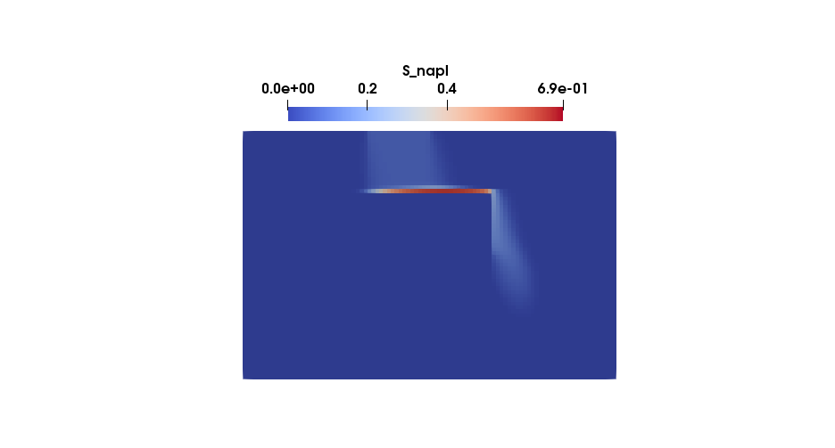

This tutorial is similar to tests/porousmediumflow/2p/adaptive and restricted to the cell-centered finite volume TPFA discretization scheme.
You need [ALUGrid][0] in order to compile and run it.

# Two-phase flow with infiltration and adaptive grid

## Problem set-up
In this example we model a soil contamination problem where DNAPL infiltrates a porous medium. The initial distribution of DNAPL is known and we can read it from a txt-file.

To describe that problem we use a two phase model of two immiscible fluids with the multiphase Darcy's law as the description of momentum, i.e.:

```math
 v_\alpha = - \frac{k_{r\alpha}}{\mu_\alpha} \textbf{K}
 \left(\textbf{grad}\, p_\alpha - \varrho_{\alpha} {\textbf g} \right)
```

If we insert this into the conservation equations for each phase $`\alpha`$ that leads to:

```math
\phi \frac{\partial \varrho_\alpha S_\alpha}{\partial t}
 -\textbf{div} \left\{ \varrho_\alpha \frac{k_{r\alpha}}{\mu_\alpha} \mathbf{K} \left(\textbf{grad}\, p_\alpha - \varrho_{\alpha} \bf g \right)
 \right\} - q_\alpha = 0
```

To reduce the number of unknowns and close the system we need closure relations for this equations. For that, we make use of a $`p_c - S_w`$ as well as a $`k_r - S_w`$ - relationship. In this problem we use a Van-Genuchten parameterization. The parameters for that relationship are specified in the `spatialparams.hh` file.

With the additional constraint that $`S_w + S_n = 1`$ we reduce the number of primary variables to two.
In this example we use the wetting phase pressure $`p_0`$ and the saturation of the non-wetting phase $`S_1`$ as primary variables. It is also possible to switch that formulation to the non-wetting pressure and the wetting saturation.

The two-dimensional model domain is 6m x 4m and contains a lens with a lower permeability and porosity. We read the initial values for the DNAPL saturation and the water pressure from a file.
The lens and the initial saturation can be seen in Figures 1 and 2.




At the left and the right boundary of the domain we set a linear pressure gradient as a Dirichlet boundary condition. On the upper and lower boundary we set Neumann boundary conditions.
DNAPL enters the model domain at the upper boundary between 1.75m ≤ x ≤ 2m with a rate of 0.04 kg/ms. That means that we set the value for the Neumann boundary flux to that rate in between 1.75m and 2m. On the rest of the Neumann boundary we set the flux to zero, which means we define it as a no-flow boundary.
In addition, the DNAPL is injected at a point source at x = 0.502 and y = 3.02 with a rate of 0.1 kg/s.

## Discretization
We discretize the equations with a cell-centered finite volume TPFA scheme in space and an implicit Euler scheme in time. We use Newton's method to solve the system of nonlinear equations. For more information about the discretization please have a look at the [handbook](https://dumux.org/handbook).

## Adaptive grid
The grid is adapitvely refined around the injection. The adaptive behaviour can be changed with input parameters in the `params.input` file.

[0]: https://gitlab.dune-project.org/extensions/dune-alugrid


## The file `spatialparams.hh`


we include the basic spatial parameters for finite volumes file from which we will inherit
```cpp
#include <dumux/material/spatialparams/fv.hh>
```
we include all laws which are needed to define the interaction between the solid matrix and the fluids, e.g. laws for capillary pressure saturation relationships.
```cpp
#include <dumux/material/fluidmatrixinteractions/2p/regularizedvangenuchten.hh>
#include <dumux/material/fluidmatrixinteractions/2p/efftoabslaw.hh>

namespace Dumux {
```
In the TwoPTestSpatialParams class we define all functions needed to describe the porous matrix, e.g. porosity and permeability
```cpp

template<class GridGeometry, class Scalar>
class TwoPTestSpatialParams
: public FVSpatialParams<GridGeometry, Scalar, TwoPTestSpatialParams<GridGeometry, Scalar>>
{
```
we introduce using declarations that are derived from the property system which we need in this class
```cpp
    using GridView = typename GridGeometry::GridView;
    using Element = typename GridView::template Codim<0>::Entity;
    using FVElementGeometry = typename GridGeometry::LocalView;
    using SubControlVolume = typename FVElementGeometry::SubControlVolume;
    using ThisType = TwoPTestSpatialParams<GridGeometry, Scalar>;
    using ParentType = FVSpatialParams<GridGeometry, Scalar, ThisType>;

    static constexpr int dimWorld = GridView::dimensionworld;
    using GlobalPosition = typename Element::Geometry::GlobalCoordinate;

    using EffectiveLaw = RegularizedVanGenuchten<Scalar>;

public:
    using MaterialLaw = EffToAbsLaw<EffectiveLaw>;
    using MaterialLawParams = typename MaterialLaw::Params;
    using PermeabilityType = Scalar;

    TwoPTestSpatialParams(std::shared_ptr<const GridGeometry> gridGeometry)
    : ParentType(gridGeometry)
    {
```
we get the position of the lens from the params.input file. The lens is defined by the position of the lower left and the upper right corner
```cpp
        lensLowerLeft_ = getParam<GlobalPosition>("SpatialParams.LensLowerLeft");
        lensUpperRight_ = getParam<GlobalPosition>("SpatialParams.LensUpperRight");
```
we set the parameters for the material law (here Van-Genuchten Law). First we set the residual saturations for the wetting phase and the non-wetting phase. lensMaterialParams_ define the material parameters for the lens while outerMaterialParams_ define material params for the rest of the domain.
```cpp
        lensMaterialParams_.setSwr(0.18);
        lensMaterialParams_.setSnr(0.0);
        outerMaterialParams_.setSwr(0.05);
        outerMaterialParams_.setSnr(0.0);
```
we set the parameters for the Van Genuchten law alpha and n
```cpp
        lensMaterialParams_.setVgAlpha(0.00045);
        lensMaterialParams_.setVgn(7.3);
        outerMaterialParams_.setVgAlpha(0.0037);
        outerMaterialParams_.setVgn(4.7);
```
here we get the permeabilities from the params.input file. In case that no parameter is set, the default parameters (9.05e-12 and 4.6e-10) are used
```cpp
        lensK_ = getParam<Scalar>("SpatialParams.lensK", 9.05e-12);
        outerK_ = getParam<Scalar>("SpatialParams.outerK", 4.6e-10);
    }
```
We define the (intrinsic) permeability $`[m^2]`$. In this test, we use element-wise distributed permeabilities.
```cpp
    template<class ElementSolution>
    PermeabilityType permeability(const Element& element,
                                  const SubControlVolume& scv,
                                  const ElementSolution& elemSol) const
    {
        if (isInLens_(element.geometry().center()))
            return lensK_;
        return outerK_;
    }
```
We set the porosity $`[-]`$ depending on the position
```cpp
    Scalar porosityAtPos(const GlobalPosition& globalPos) const
    {
         if (isInLens_(globalPos))
            return 0.2;
        return 0.4;
    }
```
We set the parameter object for the Van Genuchten material law.
```cpp
    template<class ElementSolution>
    const MaterialLawParams& materialLawParams(const Element& element,
                                               const SubControlVolume& scv,
                                               const ElementSolution& elemSol) const
    {
        if (isInLens_(element.geometry().center()))
            return lensMaterialParams_;
        return outerMaterialParams_;
    }

```
Here we can define which phase is to be considered as the wetting phase. Here the wetting phase is the the first phase of the fluidsystem. In this case that is water.
```cpp
    template<class FluidSystem>
    int wettingPhaseAtPos(const GlobalPosition& globalPos) const
    {  return FluidSystem::phase0Idx; }

private:
```
we have a convenience definition of the position of the lens
```cpp
    bool isInLens_(const GlobalPosition &globalPos) const
    {
        for (int i = 0; i < dimWorld; ++i) {
            if (globalPos[i] < lensLowerLeft_[i] + eps_ || globalPos[i] > lensUpperRight_[i] - eps_)
                return false;
        }
        return true;
    }

    GlobalPosition lensLowerLeft_;
    GlobalPosition lensUpperRight_;

    Scalar lensK_;
    Scalar outerK_;
    MaterialLawParams lensMaterialParams_;
    MaterialLawParams outerMaterialParams_;

    static constexpr Scalar eps_ = 1.5e-7;
};

} // end namespace Dumux

```


## The file `problem.hh`


## Include files
The grid we use
```cpp
#include <dune/alugrid/grid.hh>
```
The cell centered, two-point-flux discretization scheme is included:
```cpp
#include <dumux/discretization/cctpfa.hh>
```
The fluid properties are specified in the following headers:
```cpp
#include <dumux/material/components/trichloroethene.hh>
#include <dumux/material/components/simpleh2o.hh>
#include <dumux/material/fluidsystems/1pliquid.hh>
#include <dumux/material/fluidsystems/2pimmiscible.hh>
```
This is the porous medium problem class that this class is derived from:
```cpp
#include <dumux/porousmediumflow/problem.hh>
```
The two-phase flow model is included:
```cpp
#include <dumux/porousmediumflow/2p/model.hh>
```
The local residual for incompressible flow is included:
```cpp
#include <dumux/porousmediumflow/2p/incompressiblelocalresidual.hh>
```
We include the header that specifies all spatially variable parameters:
```cpp
#include "spatialparams.hh"
```
A container to read values for the initial condition is included:
```cpp
#include <dumux/io/container.hh>
```
## Define basic properties for our simulation
We enter the namespace Dumux. All Dumux functions and classes are in a namespace Dumux,
to make sure they don't clash with symbols from other libraries you may want to use in conjunction with Dumux.
One could use these functions and classes by prefixing every use of these names by ::,
but that would quickly become cumbersome and annoying.
Rather, we simply import the entire Dumux namespace for general use:
```cpp
namespace Dumux {
```
The problem class is forward declared:
```cpp
  template<class TypeTag>
  class PointSourceProblem;
```
We enter the namespace Properties, which is a sub-namespace of the namespace Dumux:
```cpp
  namespace Properties {
```
A TypeTag for our simulation is created which inherits from the two-phase flow model and the
cell centered, two-point-flux discretization scheme.
```cpp
  namespace TTag {
  struct PointSourceExample { using InheritsFrom = std::tuple<TwoP, CCTpfaModel>; };
  }
```
We use non-conforming refinement in our simulation:
```cpp
  template<class TypeTag>
  struct Grid<TypeTag, TTag::PointSourceExample> { using type = Dune::ALUGrid<2, 2, Dune::cube, Dune::nonconforming>; };
```
The problem class specifies initial and boundary conditions:
```cpp
  template<class TypeTag>
  struct Problem<TypeTag, TTag::PointSourceExample> { using type = PointSourceProblem<TypeTag>; };
```
The local residual contains analytic derivative methods for incompressible flow:
```cpp
  template<class TypeTag>
  struct LocalResidual<TypeTag, TTag::PointSourceExample> { using type = TwoPIncompressibleLocalResidual<TypeTag>; };
```
In the following we define our fluid properties.
```cpp
  template<class TypeTag>
  struct FluidSystem<TypeTag, TTag::PointSourceExample>
  {
```
We define a convenient shortcut to the property Scalar:
```cpp
      using Scalar = GetPropType<TypeTag, Properties::Scalar>;
```
First, we create a fluid system that consists of one liquid water phase. We use the simple
description of water, which means we do not use tabulated values but more general equations of state.
```cpp
      using WettingPhase = FluidSystems::OnePLiquid<Scalar, Components::SimpleH2O<Scalar> >;
```
Second, we create another fluid system consisting of a liquid phase as well, the Trichlorethene (DNAPL) phase:
```cpp
      using NonwettingPhase = FluidSystems::OnePLiquid<Scalar, Components::Trichloroethene<Scalar> >;
```
Third, we combine both fluid systems in our final fluid system which consist of two immiscible liquid phases:
```cpp
      using type = FluidSystems::TwoPImmiscible<Scalar, WettingPhase, NonwettingPhase>;
  };
```
we set the formulation for the primary variables to p0s1. In this case that means that the water pressure and the DNAPL saturation are our primary variables.
```cpp
   template<class TypeTag>
   struct Formulation<TypeTag, TTag::PointSourceExample>
   { static constexpr auto value = TwoPFormulation::p0s1; };
```
We define the spatial parameters for our simulation:
```cpp
  template<class TypeTag>
  struct SpatialParams<TypeTag, TTag::PointSourceExample>
  {
```
We define convenient shortcuts to the properties GridGeometry and Scalar:
```cpp
  private:
      using GridGeometry = GetPropType<TypeTag, Properties::GridGeometry>;
      using Scalar = GetPropType<TypeTag, Properties::Scalar>;
```
Finally we set the spatial parameters:
```cpp
  public:
      using type = TwoPTestSpatialParams<GridGeometry, Scalar>;
  };
```
We enable caching for the grid volume variables, the grid flux variables and the FV grid geometry. The cache
stores values that were already calculated for later usage. This makes the simulation faster.
```cpp
  template<class TypeTag>
  struct EnableGridVolumeVariablesCache<TypeTag, TTag::PointSourceExample> { static constexpr bool value = false; };
  template<class TypeTag>
  struct EnableGridFluxVariablesCache<TypeTag, TTag::PointSourceExample> { static constexpr bool value = false; };
  template<class TypeTag>
  struct EnableGridGeometryCache<TypeTag, TTag::PointSourceExample> { static constexpr bool value = false; };
```
We leave the namespace Properties.
```cpp
  }
```
## The problem class
We enter the problem class where all necessary boundary conditions and initial conditions are set for our simulation.
As this is a porous medium problem, we inherit from the basic PorousMediumFlowProblem.
```cpp
template <class TypeTag >
class PointSourceProblem : public PorousMediumFlowProblem<TypeTag>
{
```
We use convenient declarations that we derive from the property system.
```cpp
    using ParentType = PorousMediumFlowProblem<TypeTag>;
    using GridView = GetPropType<TypeTag, Properties::GridView>;
    using Element = typename GridView::template Codim<0>::Entity;
    using Vertex = typename GridView::template Codim<GridView::dimensionworld>::Entity;
    using Scalar = GetPropType<TypeTag, Properties::Scalar>;
    using FluidSystem = GetPropType<TypeTag, Properties::FluidSystem>;
    using PrimaryVariables = GetPropType<TypeTag, Properties::PrimaryVariables>;
    using GridGeometry = GetPropType<TypeTag, Properties::GridGeometry>;
    using PointSource =  GetPropType<TypeTag, Properties::PointSource>;
    using BoundaryTypes = GetPropType<TypeTag, Properties::BoundaryTypes>;
    using GlobalPosition = typename Element::Geometry::GlobalCoordinate;
    using NumEqVector = GetPropType<TypeTag, Properties::NumEqVector>;
    using Indices = typename GetPropType<TypeTag, Properties::ModelTraits>::Indices;
```
We define some indices for convenient use in the problem class:
```cpp
    enum {
        pressureH2OIdx = Indices::pressureIdx,
        saturationDNAPLIdx = Indices::saturationIdx,
        contiDNAPLEqIdx = Indices::conti0EqIdx + FluidSystem::comp1Idx,
        waterPhaseIdx = FluidSystem::phase0Idx,
        dnaplPhaseIdx = FluidSystem::phase1Idx
    };

public:
```
This is the constructor of our problem class:
```cpp
    PointSourceProblem(std::shared_ptr<const GridGeometry> gridGeometry)
  : ParentType(gridGeometry)
  {
```
We read in the values for the initial condition of our simulation:
```cpp
    initialValues_ = readFileToContainer<std::vector<PrimaryVariables>>("initialsolutioncc.txt");
  }
```
First, we define the type of boundary conditions depending on location. Two types of boundary conditions
can be specified: Dirichlet or Neumann boundary condition. On a Dirichlet boundary, the values of the
primary variables need to be fixed. On a Neumann boundary condition, values for derivatives need to be fixed.
Mixed boundary conditions (different types for different equations on the same boundary) are not accepted.
```cpp
  BoundaryTypes boundaryTypesAtPos(const GlobalPosition &globalPos) const
  {
    BoundaryTypes values;
```
We specify Dirichlet boundaries on the left and right hand side of our domain:
```cpp
    if (onLeftBoundary_(globalPos) || onRightBoundary_(globalPos))
        values.setAllDirichlet();
    else
```
The top and bottom of our domain are Neumann boundaries:
```cpp
        values.setAllNeumann();
    return values;
  }
```
Second, we specify the values for the Dirichlet boundaries, depending on location. As mentioned,
we need to fix values of our two primary variables: the water pressure
and the Trichlorethene saturation.
```cpp
      PrimaryVariables dirichletAtPos(const GlobalPosition &globalPos) const
      {
```
To determine the density of water for a given state, we build a fluid state with the given conditions:
```cpp
          PrimaryVariables values;
          GetPropType<TypeTag, Properties::FluidState> fluidState;
          fluidState.setTemperature(temperature());
          fluidState.setPressure(waterPhaseIdx, /*pressure=*/1e5);
          fluidState.setPressure(dnaplPhaseIdx, /*pressure=*/1e5);
```
The density is then calculated by the fluid system:
```cpp
          Scalar densityW = FluidSystem::density(fluidState, waterPhaseIdx);
```
The water phase pressure is the hydrostatic pressure, scaled with a factor:
```cpp
          Scalar height = this->gridGeometry().bBoxMax()[1] - this->gridGeometry().bBoxMin()[1];
          Scalar depth = this->gridGeometry().bBoxMax()[1] - globalPos[1];
          Scalar alpha = 1 + 1.5/height;
          Scalar width = this->gridGeometry().bBoxMax()[0] - this->gridGeometry().bBoxMin()[0];
          Scalar factor = (width*alpha + (1.0 - alpha)*globalPos[0])/width;

          values[pressureH2OIdx] = 1e5 - factor*densityW*this->spatialParams().gravity(globalPos)[1]*depth;
```
The saturation of the DNAPL Trichlorethene is zero on our Dirichlet boundary:
```cpp
          values[saturationDNAPLIdx] = 0.0;

          return values;
      }
```
Third, we specify the values for the Neumann boundaries.
In our case, we need to specify mass fluxes for our two liquid phases.
The inflow is denoted by a negative sign, and the outflow by a positive sign.
```cpp
      NumEqVector neumannAtPos(const GlobalPosition &globalPos) const
      {
```
We initialize the fluxes with zero:
```cpp
          NumEqVector values(0.0);
```
At the inlet, we specify an inflow for our DNAPL Trichlorethene.
The units are $`kg/(m^2 s)`$.
```cpp
          if (onInlet_(globalPos))
              values[contiDNAPLEqIdx] = -0.04;

          return values;
      }
```
Last, we specify the initial conditions. The initial condition needs to be set for all primary variables.
Here, we take the data from the file that we read in previously.
```cpp
  PrimaryVariables initial(const Element& element) const
  {
```
The input data is written for a uniform grid with discretization length delta.
Accordingly, we need to find the index of our cells, depending on the x and y coordinates,
that corresponds to the indices of the input data set.
```cpp
      const auto delta = 0.0625;
      unsigned int cellsX = this->gridGeometry().bBoxMax()[0]/delta;
      const auto globalPos = element.geometry().center();

      unsigned int dataIdx = std::trunc(globalPos[1]/delta) * cellsX + std::trunc(globalPos[0]/delta);
      return initialValues_[dataIdx];
  }
```
We need to specify a constant temperature for our isothermal problem.
Fluid properties that depend on temperature will be calculated with this value.
```cpp
  Scalar temperature() const
  {
      return 293.15; // 10°C
  }
```
Additionally, we set a point source. The point source can be solution dependent.
It is specified in form of a vector that contains source values for alle phases and positions in space.
The first entry is a tuple containing the position in space, the second entry contains a tuple with the source (with the unit of $`kg/s`$)
for the phases (first phase is the water phase, the second phase is the DNAPL Trichlorethene phase).
```cpp
  void addPointSources(std::vector<PointSource>& pointSources) const
  {
      pointSources.push_back(PointSource({0.502, 3.02}, {0, 0.1}));
  }
```
We define private global functions that are used to determine if a point in space is on the left, right or upper boundary, or
at the inlet.
```cpp
  private:
    bool onLeftBoundary_(const GlobalPosition &globalPos) const
    {
        return globalPos[0] < this->gridGeometry().bBoxMin()[0] + eps_;
    }

    bool onRightBoundary_(const GlobalPosition &globalPos) const
    {
        return globalPos[0] > this->gridGeometry().bBoxMax()[0] - eps_;
    }

    bool onUpperBoundary_(const GlobalPosition &globalPos) const
    {
        return globalPos[1] > this->gridGeometry().bBoxMax()[1] - eps_;
    }

    bool onInlet_(const GlobalPosition &globalPos) const
    {
        Scalar width = this->gridGeometry().bBoxMax()[0] - this->gridGeometry().bBoxMin()[0];
        Scalar lambda = (this->gridGeometry().bBoxMax()[0] - globalPos[0])/width;
        return onUpperBoundary_(globalPos) && 0.5 < lambda && lambda < 2.0/3.0;
    }
```
Our private global variables are the epsilon value and the vector containing the initial values read from file.
```cpp
    static constexpr Scalar eps_ = 1e-6;
    std::vector<PrimaryVariables> initialValues_;
```
This is everything the problem class contains.
```cpp
};
```
We leave the namespace Dumux here, too.
```cpp
}

```


## The file `main.cc`

## The main file
This is the main file for the 2pinfiltration example. Here we can see the programme sequence and how the system is solved using Newton's method
### Includes
```cpp
#include <config.h>

```
Standard header file for C++, to get time and date information.
```cpp
#include <ctime>
```
Standard header file for C++, for in- and output.
```cpp
#include <iostream>
```
Dumux is based on DUNE, the Distributed and Unified Numerics Environment, which provides several grid managers and linear solvers. So we need some includes from that.
```cpp
#include <dune/common/parallel/mpihelper.hh>
#include <dune/common/timer.hh>
#include <dune/grid/io/file/dgfparser/dgfexception.hh>
#include <dune/grid/io/file/vtk.hh>
#include <dune/istl/io.hh>
```
In Dumux, a property system is used to specify the model. For this, different properties are defined containing type definitions, values and methods. All properties are declared in the file properties.hh.
```cpp
#include <dumux/common/properties.hh>
```
The following file contains the parameter class, which manages the definition of input parameters by a default value, the inputfile or the command line.
```cpp
#include <dumux/common/parameters.hh>
```
The file dumuxmessage.hh contains the class defining the start and end message of the simulation.
```cpp
#include <dumux/common/dumuxmessage.hh>
#include <dumux/common/defaultusagemessage.hh>
```
we include the linear solver to be used to solve the linear system
```cpp
#include <dumux/linear/amgbackend.hh>
```
we include the nonlinear Newton's method
```cpp
#include <dumux/nonlinear/newtonsolver.hh>
```
Further, we include assembler, which assembles the linear systems for finite volume schemes (box-scheme, tpfa-approximation, mpfa-approximation).
```cpp
#include <dumux/assembly/fvassembler.hh>
```
The containing class in the following file defines the different differentiation methods used to compute the derivatives of the residual.
```cpp
#include <dumux/assembly/diffmethod.hh>
```
we include the spatial discretization methods available in Dumux
```cpp
#include <dumux/discretization/method.hh>
```
We need the following class to simplify the writing of dumux simulation data to VTK format.
```cpp
#include <dumux/io/vtkoutputmodule.hh>
```
The gridmanager constructs a grid from the information in the input or grid file. There is a specification for the different supported grid managers.
```cpp
#include <dumux/io/grid/gridmanager.hh>
```
We include several files which are needed for the adaptive grid
```cpp
#include <dumux/adaptive/adapt.hh>
#include <dumux/adaptive/markelements.hh>
#include <dumux/adaptive/initializationindicator.hh>
#include <dumux/porousmediumflow/2p/griddatatransfer.hh>
#include <dumux/porousmediumflow/2p/gridadaptindicator.hh>
```
We include the problem file which defines initial and boundary conditions to describe our example problem
```cpp
#include "problem.hh"
```
### Beginning of the main function
```cpp
int main(int argc, char** argv) try
{
    using namespace Dumux;
```
we define the type tag for this problem
```cpp
    using TypeTag = Properties::TTag::PointSourceExample;
```
We initialize MPI, finalize is done automatically on exit
```cpp
    const auto& mpiHelper = Dune::MPIHelper::instance(argc, argv);
```
We print dumux start message
```cpp
    if (mpiHelper.rank() == 0)
        DumuxMessage::print(/*firstCall=*/true);
```
We parse command line arguments and input file
```cpp
    Parameters::init(argc, argv);
```
### Create the grid
A gridmanager tries to create the grid either from a grid file or the input file.
```cpp
    GridManager<GetPropType<TypeTag, Properties::Grid>> gridManager;
    gridManager.init();
```
The instationary non-linear problem is run on this grid.

we compute on the leaf grid view
```cpp
    const auto& leafGridView = gridManager.grid().leafGridView();
```
### Set-up and solving of the problem

#### Set-up
We create and initialize the finite volume grid geometry, the problem, the linear system, including the jacobian matrix, the residual and the solution vector and the gridvariables.

We need the finite volume geometry to build up the subcontrolvolumes (scv) and subcontrolvolume faces (scvf) for each element of the grid partition.
```cpp
    using GridGeometry = GetPropType<TypeTag, Properties::GridGeometry>;
    auto gridGeometry = std::make_shared<GridGeometry>(leafGridView);
    gridGeometry->update();
```
In the problem, we define the boundary and initial conditions.
```cpp
    using Problem = GetPropType<TypeTag, Properties::Problem>;
    auto problem = std::make_shared<Problem>(gridGeometry);
```
We call the `computePointSourceMap` method to compute the point sources. The `computePointSourceMap` method is inherited from the fvproblem and therefore specified in the `dumux/common/fvproblem.hh`. It calls the `addPointSources` method specified in the `problem.hh` file.
```cpp
    problem->computePointSourceMap();
```
We initialize the solution vector,
```cpp
    using SolutionVector = GetPropType<TypeTag, Properties::SolutionVector>;
    SolutionVector x(gridGeometry->numDofs());
    problem->applyInitialSolution(x);
    auto xOld = x;
```
and then use the solution vector to intialize the `gridVariables`.
```cpp
    using GridVariables = GetPropType<TypeTag, Properties::GridVariables>;
    auto gridVariables = std::make_shared<GridVariables>(problem, gridGeometry);
    gridVariables->init(x);
```
We instantiate the indicator for grid adaption & the data transfer, we read some parameters for indicator from the input file.
```cpp
    using Scalar = GetPropType<TypeTag, Properties::Scalar>;
    const Scalar refineTol = getParam<Scalar>("Adaptive.RefineTolerance");
    const Scalar coarsenTol = getParam<Scalar>("Adaptive.CoarsenTolerance");
```
We use an indicator for a two-phase flow problem that is saturation-dependent and defined in the file `dumux/porousmediumflow/2p/gridadaptindicator.hh.` It allows to set the minimum and maximum allowed refinement levels via the input parameters.
```cpp
    TwoPGridAdaptIndicator<TypeTag> indicator(gridGeometry);
```
The data transfer performs the transfer of data on a grid from before to after adaptation and is defined in the file `dumux/porousmediumflow/2p/griddatatransfer.hh`. Its main functions are to store and reconstruct the primary variables.
```cpp
    TwoPGridDataTransfer<TypeTag> dataTransfer(problem, gridGeometry, gridVariables, x);
```
We do an initial refinement around sources/BCs. We use the `GridAdaptInitializationIndicator` defined in `dumux/adaptive/initializationindicator.hh` for that.
```cpp
    GridAdaptInitializationIndicator<TypeTag> initIndicator(problem, gridGeometry, gridVariables);
```
We refine up to the maximum level. For every level, the indicator used for the refinement/coarsening is calculated. If any grid cells have to be adapted, the gridvariables and the pointsourcemap are updated.
```cpp
    const auto maxLevel = getParam<std::size_t>("Adaptive.MaxLevel", 0);
    for (std::size_t i = 0; i < maxLevel; ++i)
    {
```
we calculate the initial indicator for adaption for each grid cell using the initial solution x
```cpp
        initIndicator.calculate(x);
```
and then we mark the elements that were adapted.
```cpp
        bool wasAdapted = false;
        if (markElements(gridManager.grid(), initIndicator))
            wasAdapted = adapt(gridManager.grid(), dataTransfer);
```
In case of a grid adaptation, the gridvariables and the pointsourcemap are updated.
```cpp
        if (wasAdapted)
        {
```
We overwrite the old solution with the new (resized & interpolated) one
```cpp
            xOld = x;
```
We initialize the secondary variables to the new (and "new old") solution
```cpp
            gridVariables->updateAfterGridAdaption(x);
```
we update the point source map after adaption
```cpp
            problem->computePointSourceMap();
        }
    }
```
Depending on the initial conditions, another grid adaptation might be necessary. The gridadaptindicator uses the input parameters `Adaptive.RefineTolerance` and `Adaptive.CoarsenTolerance` for this step.
```cpp
    indicator.calculate(x, refineTol, coarsenTol);
```
we mark the elements that were adapted
```cpp
    bool wasAdapted = false;
    if (markElements(gridManager.grid(), indicator))
        wasAdapted = adapt(gridManager.grid(), dataTransfer);
```
In case of an additional grid adaptation, the gridvariables and the pointsourcemap are updated again.
```cpp
    if (wasAdapted)
    {
```
Overwrite the old solution with the new (resized & interpolated) one
```cpp
        xOld = x;
```
Initialize the secondary variables to the new (and "new old") solution
```cpp
        gridVariables->updateAfterGridAdaption(x);
```
Update the point source map
```cpp
        problem->computePointSourceMap();
    }
```
We get some time loop parameters from the input file params.input
```cpp
    using Scalar = GetPropType<TypeTag, Properties::Scalar>;
    const auto tEnd = getParam<Scalar>("TimeLoop.TEnd");
    const auto maxDt = getParam<Scalar>("TimeLoop.MaxTimeStepSize");
    auto dt = getParam<Scalar>("TimeLoop.DtInitial");
```
and initialize the vtkoutput. Each model has a predefined model specific output with relevant parameters for that model.
```cpp
    using IOFields = GetPropType<TypeTag, Properties::IOFields>;
    VtkOutputModule<GridVariables, SolutionVector> vtkWriter(*gridVariables, x, problem->name());
    using VelocityOutput = GetPropType<TypeTag, Properties::VelocityOutput>;
    vtkWriter.addVelocityOutput(std::make_shared<VelocityOutput>(*gridVariables));
    IOFields::initOutputModule(vtkWriter); // Add model specific output fields
    vtkWriter.write(0.0);
```
we instantiate the time loop
```cpp
    auto timeLoop = std::make_shared<TimeLoop<Scalar>>(0, dt, tEnd);
    timeLoop->setMaxTimeStepSize(maxDt);
```
we set the assembler with the time loop because we have an instationary problem
```cpp
    using Assembler = FVAssembler<TypeTag, DiffMethod::numeric>;
    auto assembler = std::make_shared<Assembler>(problem, gridGeometry, gridVariables, timeLoop);
```
we set the linear solver
```cpp
    using LinearSolver = AMGBackend<TypeTag>;
    auto linearSolver = std::make_shared<LinearSolver>(leafGridView, gridGeometry->dofMapper());
```
additionally we set the non-linear solver.
```cpp
    using NewtonSolver = Dumux::NewtonSolver<Assembler, LinearSolver>;
    NewtonSolver nonLinearSolver(assembler, linearSolver);
```
we start the time loop. In each time step before we start calculating a new solution we check if we have to refine the mesh again based on the solution of the previous time step.
```cpp
    timeLoop->start(); do
    {
```
We only want to refine/coarsen after first time step is finished, not before. The initial refinement was already done before the start of the time loop. This means we only refine when the time is greater than 0.
```cpp
        if (timeLoop->time() > 0)
        {
```
again we compute the refinement indicator with the `TwoPGridAdaptIndicator`
```cpp
            indicator.calculate(x, refineTol, coarsenTol);
```
we mark elements and adapt grid if necessary
```cpp
            wasAdapted = false;
            if (markElements(gridManager.grid(), indicator))
                wasAdapted = adapt(gridManager.grid(), dataTransfer);
```
In case of a grid adaptation, the gridvariables and the pointsourcemap are updated again.
```cpp
            if (wasAdapted)
            {
```
We overwrite the old solution with the new (resized & interpolated) one
```cpp
                xOld = x;
```
We tell the assembler to resize the matrix and set pattern
```cpp
                assembler->setJacobianPattern();
```
We tell the assembler to resize the residual
```cpp
                assembler->setResidualSize();
```
We initialize the secondary variables to the new (and "new old") solution
```cpp
                gridVariables->updateAfterGridAdaption(x);
```
We update the point source map
```cpp
                problem->computePointSourceMap();
            }
```
we leave the refinement step
```cpp
        }
```
Now, we start to calculate the new solution of that time step. First, we define the old solution as the solution of the previous time step for storage evaluations.
```cpp
        assembler->setPreviousSolution(xOld);
```
We solve the non-linear system with time step control.
```cpp
        nonLinearSolver.solve(x, *timeLoop);
```
We make the new solution the old solution.
```cpp
        xOld = x;
        gridVariables->advanceTimeStep();
```
We advance to the time loop to the next step.
```cpp
        timeLoop->advanceTimeStep();
```
We write vtk output for each time step
```cpp
        vtkWriter.write(timeLoop->time());
```
We report statistics of this time step
```cpp
        timeLoop->reportTimeStep();
```
We set a new dt as suggested by the newton solver for the next time step
```cpp
        timeLoop->setTimeStepSize(nonLinearSolver.suggestTimeStepSize(timeLoop->timeStepSize()));

    } while (!timeLoop->finished());

    timeLoop->finalize(leafGridView.comm());
```
### Final Output

print dumux end message
```cpp
    if (mpiHelper.rank() == 0)
    {
        Parameters::print();
        DumuxMessage::print(/*firstCall=*/false);
    }

    return 0;
} // end main
catch (Dumux::ParameterException &e)
{
    std::cerr << std::endl << e << " ---> Abort!" << std::endl;
    return 1;
}
catch (Dune::DGFException & e)
{
    std::cerr << "DGF exception thrown (" << e <<
                 "). Most likely, the DGF file name is wrong "
                 "or the DGF file is corrupted, "
                 "e.g. missing hash at end of file or wrong number (dimensions) of entries."
                 << " ---> Abort!" << std::endl;
    return 2;
}
catch (Dune::Exception &e)
{
    std::cerr << "Dune reported error: " << e << " ---> Abort!" << std::endl;
    return 3;
}
catch (...)
{
    std::cerr << "Unknown exception thrown! ---> Abort!" << std::endl;
    return 4;
}
```

## Results
The 2p-infiltration model computes the water saturation distribution after 500 seconds according tthe following figure:


