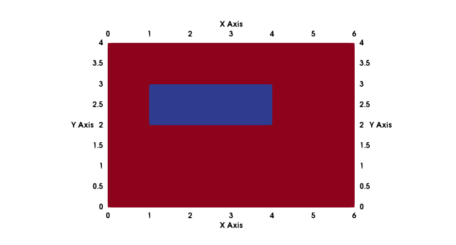

This tutorial is similar to tests/porousmediumflow/2p/adaptive and restricted to the cell-centered finite volume TPFA discretization scheme.
You need [ALUGrid][0] in order to compile and run it.

# Two-phase flow with infiltration and adaptive grid

## Problem set-up
This example models a soil contamination problem where DNAPL infiltrates a porous medium. The initial distribution of DNAPL is known and can be read from a txt-file.

The problem uses a two phase model of two immiscible fluids with the multiphase Darcy's law as the description of momentum, i.e.:

$$
 v_\alpha = - \frac{k_{r\alpha}}{\mu_\alpha} \textbf{K}
 \left(\textbf{grad}\, p_\alpha - \varrho_{\alpha} {\textbf g} \right)
$$

Inserting this into the conservation equations for each phase $$\alpha$$ leads to:

$$\phi \frac{\partial \varrho_\alpha S_\alpha}{\partial t}
 -\textbf{div} \left\{ \varrho_\alpha \frac{k_{r\alpha}}{\mu_\alpha} \mathbf{K} \left(\textbf{grad}\, p_\alpha - \varrho_{\alpha} \mbox{\bf g} \right)
 \right\} - q_\alpha = 0$$

As closure relations for this equations a $$pc - S_w $$ as well as a $$k_r - S_w$$ - relationship are used. This problem uses a Van-Genuchten parameterization for that. The parameters are specified in the `spatialparams.hh` file.

With the constraint that $$S_w + S_n = 1$$ the number of primary variables reduces to two.
This problem uses the wetting phase pressure $$p0$$ and the saturation of the non-wetting phase $$S_1$$ as primary variables. It is also possible to switch that formulation to the non-wetting pressure and the wetting saturation.

The two-dimensional model domain is 6m x 4m and contains a lens with a lower permeability and porosity. The initial values for the DNAPL saturation and the water pressure are read from a file.
The lens and the initial saturation can be seen in Figures 1 and 2.

A linear pressure gradient is given as a Dirichlet boundary condition at the left and the right boundary.
Neumann boundary conditions are set at the upper and lower boundary.
DNAPL enters the model domain at the upper boundary between 1.75m ≤ x ≤ 2m with a rate of 0.04 kg/ms, the rest of the upper and lower boundary are no-flow boundaries.
In addition, the DNAPL is injected at a point source at x = 0.502 and y = 3.02 with a rate of 0.1 kg/s.

## Discretization
The equations are discretized with a cell-centered finete volume TPFA scheme in space and an implicit Euler scheme in time. Newton's method is used to solve the system of nonlinear equations. For more information about the discretization please have a look at the handbook.

## Adaptive grid
The grid is adapitvely refined around the injection. The adaptive behaviour can be changed with input parameters in the `params.input` file.

[0]: https://gitlab.dune-project.org/extensions/dune-alugrid
