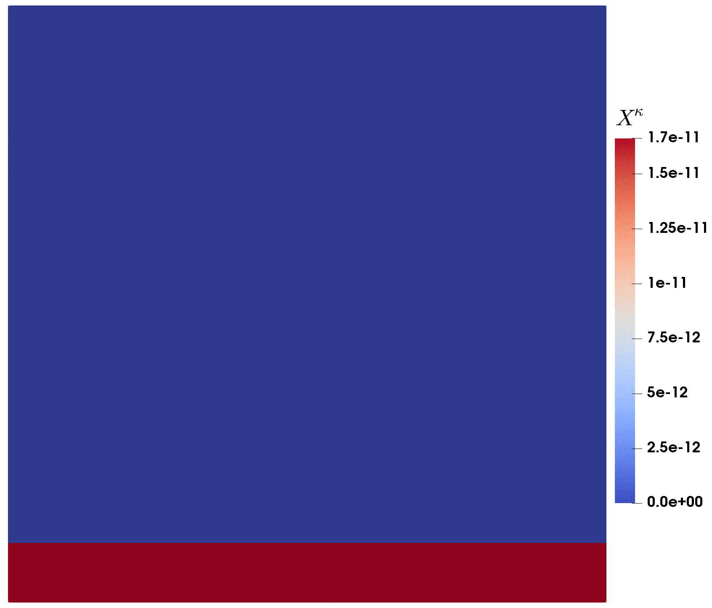
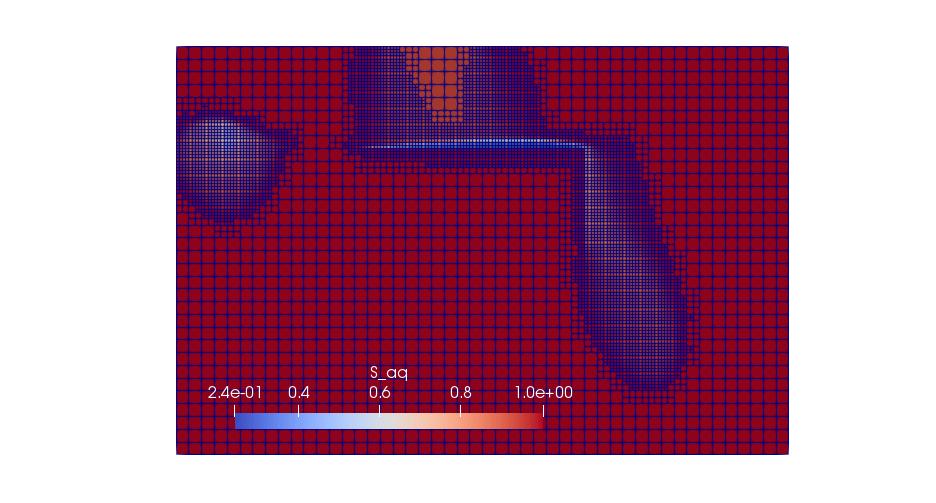
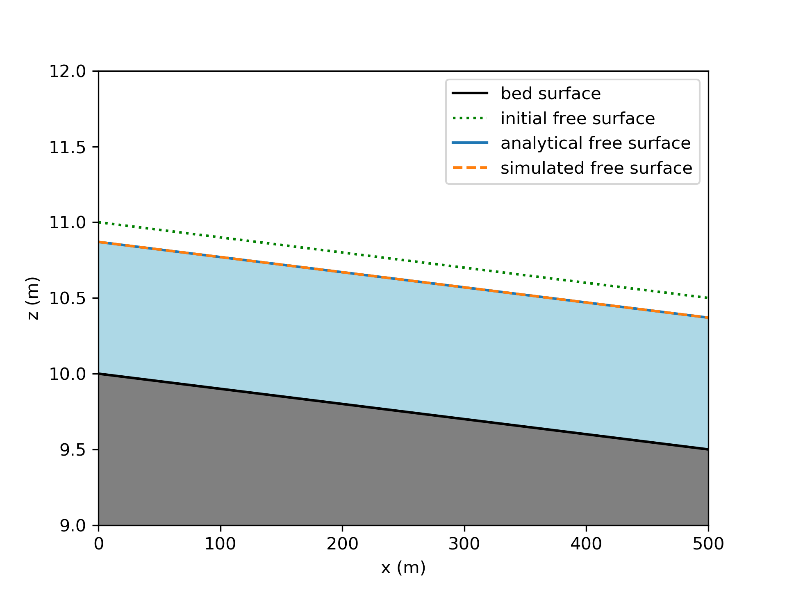
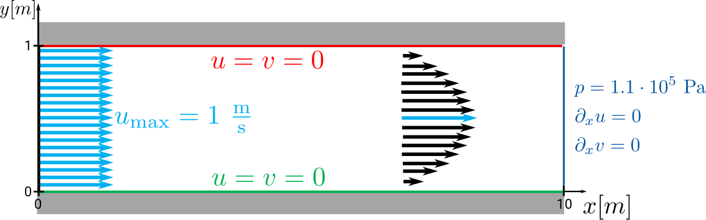
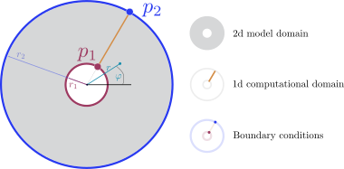
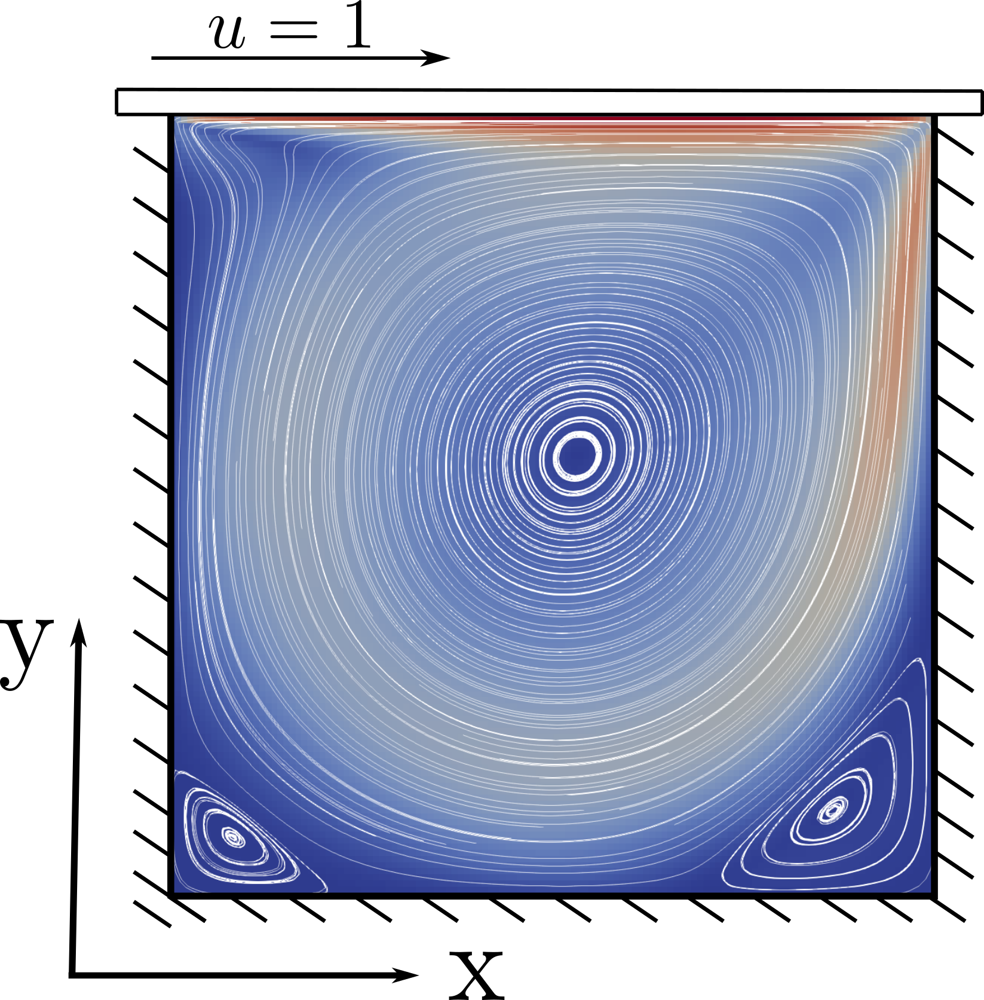

# Examples

To get started with DuMux, we recommend the following documented examples. Each example folder contains a ready-to-use DuMux simulation example.
The description in each folder (best viewed online by following the link) explains each line of the code example.

### [:open_file_folder: Example 1: One-phase flow and tracer transport](1ptracer/README.md)

<table><tr><td>

In this example, we simulate tracer transport through a confined aquifer with a randomly distributed permeability field.
We first solve the pressure field, compute the steady state flow field, and then solve the tracer transport equation.
You learn how to

* generate a randomly distributed permeability field
* sequentially solve two types of problems after each other:
    * solve a one-phase flow in porous media problem
    * compute the flow field from a pressure solution to pass to a tracer problem
    * solve an instationary tracer transport problem with a given flow field

</td>
<td width="20%"><a href="1ptracer/README.md">
<figure></figure>
</a></td>
</tr></table>

### [:open_file_folder: Example 2: Two-phase flow with infiltration and adaptive grid](2pinfiltration/README.md)

<table><tr><td>

In this example we model a soil contamination problem where DNAPL infiltrates a water-saturated porous medium (two-phase flow).
The initial distribution of DNAPL is read in from a txt-file.
The grid is adapitvely refined where DNAPL enters the domain, around the plume, and around an injection well.
You learn how to

* solve a two-phase flow in porous media problem with two immiscible phases
* set boundary conditions and a simple injection well
* implement a problem with heterogenous material parameters
* use adaptive grid refinement around the saturation front

</td>
<td width="30%"><a href="2pinfiltration/README.md">
<figure></figure>
</a></td>
</tr></table>

### [:open_file_folder: Example 3: Shallow water model](shallowwaterfriction/README.md)

<table><tr><td>

The shallow water flow model is applied to simulate steady subcritical flow in a channel including a bottom friction model.
You learn how to

* solve a shallow water flow problem including bottom friction
* computate and output (VTK) an analytical reference solution

</td>
<td width="20%"><a href="shallowwaterfriction/README.md">
<figure></figure></td>
</a></td>
</tr></table>

### [:open_file_folder: Example 4: Freeflow channel](freeflowchannel/README.md)

<table><tr><td>

In this example, we simulate a free flow between two plates in two dimensions.
You learn how to

* solve a free flow problem
* set outflow boundary conditions in the free-flow context

</td>
<td width="40%"><a href="freeflowchannel/README.md">
<figure></figure></td>
</a></td>
</tr></table>

### [:open_file_folder: Example 5: One-phase flow with rotation-symmetric solution](1protationsymmetry/README.md)

<table><tr><td>

In this example, a rotation-symmetric solution for the single-phase flow equation is discussed.
You learn how to

* solve a rotation-symmetric problem
* perform a convergence test against an analytical solution
* do post-processing in [ParaView](https://www.paraview.org/)

</td>
<td width="30%"><a href="1protationsymmetry/README.md">
<figure></figure></td>
</a></td>
</tr></table>

### [:open_file_folder: Example 6: Biomineralization](biomineralization/README.md)

<table><tr><td>

In this example, we simulate microbially-induced calcite precipitation
You learn how to

* solve a reactive transport model including
    * biofilm growth
    * mineral precipitation and dissolution
    * changing porosity and permeability
* use complex fluid and solid systems
* set a complex time loop with checkpoints, reading the check points from a file
* set complex injection boundary conditions, reading the injection types from a file

</td>
<td width="20%"><a href="biomineralization/README.md">
<figure></figure></td>
</a></td>
</tr></table>

### [:open_file_folder: Example 7: Lid-driven cavity](liddrivencavity/README.md)

<table><tr><td>

In this example, we simulate laminar incompressible flow in a cavity with the Navier-Stokes equations.
You learn how to

* solve a single-phase Navier-Stokes flow problem
* compare the results of Stokes flow (Re = 1) and Navier-Stokes flow (Re = 1000)
* compare the numerical results with the reference data using the plotting library `matplotlib`

</td>
<td width="20%"><a href="liddrivencavity/README.md">
<figure></figure></td>
</a></td>
</tr></table>
