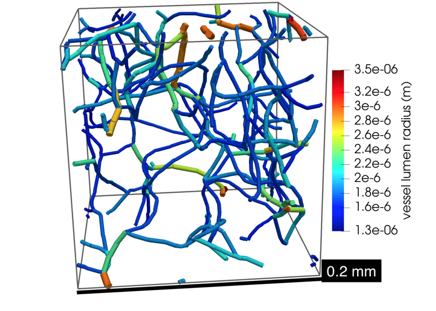

# Examples

To get started with DuMux, we recommend the following documented examples. Each example folder contains a ready-to-use DuMux simulation example.
Click on the respective example to get to a detailed documentation of the example code (best viewed in a browser).
For each example in this overview, the model equations and discretization method are described in words
and the DuMux name of the model is given in parenthesis: e.g. (`OneP`) / (`CCTpfaModel`).

### [:open_file_folder: Example 1: Diffusion equation](diffusion/README.md)
<table><tr><td>

In this example we create a diffusion equation model and then simulate a diffusive process.

You learn how to

* setup a new simple model equation (diffusion equation)
* read parameters from a configuration file
* create a type tag and specialize properties for it
* generate a randomly distributed initial field (with MPI parallelism)
* solve a time-dependent diffusion problem in parallel

__Model equations:__ A diffusion equation model fully developed and contained within the example 
__Discretization method:__ Vertex-centered finite volumes / control-volume finite elements (Lagrange, P1) (`BoxModel`)

</td>
<td width="25%"><a href="diffusion/README.md">
<figure></figure></td>
</a></td>
</tr></table>

### [:open_file_folder: Example 2: Cahn-Hilliard equation](cahn_hilliard/README.md)

<table><tr><td>

In this example we simulate the separation of two immiscible phases using the Cahn-Hilliard equation.

You learn how to

* setup a new nonlinear model equation (Cahn-Hilliard equation)
* setup a model with two governing equations
* implement a custom volume variables class to name variables
* generate a randomly distributed vector-valued initial field (with MPI parallelism)
* solve a time-dependent diffusion problem in parallel

__Model equations:__ A Cahn-Hilliard equation model fully developed and contained within the example 
__Discretization method:__ Vertex-centered finite volumes / control-volume finite elements (Lagrange, P1) (`BoxModel`)

</td>
<td width="25%"><a href="cahn_hilliard/README.md">
<figure></figure></td>
</a></td>
</tr></table>

### [:open_file_folder: Example 3: One-phase flow and tracer transport](1ptracer/README.md)

<table><tr><td>

In this example, we simulate tracer transport through a confined aquifer with a randomly distributed permeability field.
We first solve the pressure field, compute the steady state flow field, and then solve the tracer transport equation.

You learn how to

* generate a randomly distributed permeability field
* sequentially solve two types of problems after each other:
    * solve a one-phase flow in porous media problem
    * compute the flow field from a pressure solution to pass to a tracer problem
    * solve an unsteady tracer transport problem with a given flow field

__Model equations:__ Single-phase flow Darcy equation and advection-diffusion equation in porous media (`OneP` and `Tracer`) 
__Discretization method:__ Cell-centered finite volumes with two-point flux approximation (`CCTpfaModel`)

</td>
<td width="35%"><a href="1ptracer/README.md">
<figure></figure>
</a></td>
</tr></table>

### [:open_file_folder: Example 4: Two-phase flow with infiltration and adaptive grid](2pinfiltration/README.md)

<table><tr><td>

In this example we model a soil contamination problem where a
DNAPL (dense non-aqueous phase liquid) infiltrates a water-saturated porous medium (two-phase flow).
The initial distribution of DNAPL is read in from a txt-file.
The grid is adaptively refined where DNAPL enters the domain, around the plume, and around an injection well.

You learn how to

* solve a two-phase flow in porous media problem with two immiscible phases
* set boundary conditions and a simple injection well
* implement a problem with heterogeneous material parameters
* use adaptive grid refinement around the saturation front

__Model equations:__ Immiscible two-phase flow Darcy equations in porous media (`TwoP`) 
__Discretization method:__ Cell-centered finite volumes with two-point flux approximation (`CCTpfaModel`)
</td>
<td width="35%"><a href="2pinfiltration/README.md">
<figure></figure>
</a></td>
</tr></table>

### [:open_file_folder: Example 5: Shallow water model](shallowwaterfriction/README.md)

<table><tr><td>

The shallow water flow model is applied to simulate steady subcritical flow in a channel including a bottom friction model.

You learn how to

* solve a shallow water flow problem including bottom friction
* compute and output (VTK) an analytical reference solution

__Model equations:__ 2D shallow water equations (`ShallowWater`) 
__Discretization method:__ Cell-centered finite volumes with Riemann solver (`CCTpfaModel`)

</td>
<td width="35%"><a href="shallowwaterfriction/README.md">
<figure></figure></td>
</a></td>
</tr></table>

### [:open_file_folder: Example 6: Freeflow channel](freeflowchannel/README.md)

<table><tr><td>

In this example, we simulate a free flow between two plates in two dimensions.

You learn how to

* solve a free flow problem
* set outflow boundary conditions in the free-flow context

__Model equations:__ 2D Stokes equations (`NavierStokes`) 
__Discretization method:__ Finite volumes with staggered grid arrangement (`StaggeredFreeFlowModel`)

</td>
<td width="40%"><a href="freeflowchannel/README.md">
<figure></figure></td>
</a></td>
</tr></table>

### [:open_file_folder: Example 7: One-phase flow with rotation-symmetric solution](1protationsymmetry/README.md)

<table><tr><td>

In this example, a rotation-symmetric solution for the single-phase flow equation is discussed.

You learn how to

* solve a rotation-symmetric problem
* perform a convergence test against an analytical solution
* do post-processing in [ParaView](https://www.paraview.org/)

__Model equations:__ (rotation-symmetric) single-phase flow Darcy equation (`OneP`) 
__Discretization method:__ Vertex-centered finite volumes / control-volume finite elements (Lagrange, P1) (`BoxModel`)

</td>
<td width="35%"><a href="1protationsymmetry/README.md">
<figure></figure></td>
</a></td>
</tr></table>

### [:open_file_folder: Example 8: Biomineralization](biomineralization/README.md)

<table><tr><td>

In this example, we simulate microbially-induced calcite precipitation

You learn how to

* solve a reactive transport model including
    * biofilm growth
    * mineral precipitation and dissolution
    * changing porosity and permeability
* use complex fluid and solid systems
* set a complex time loop with checkpoints, reading the check points from a file
* set complex injection boundary conditions, reading the injection types from a file

__Model equations:__ Miscible two-phase multi-component flow Darcy equations with precipitation and reaction (`TwoPNCMin`) 
__Discretization method:__ Vertex-centered finite volumes / control-volume finite elements (Lagrange, P1) (`BoxModel`)

</td>
<td width="35%"><a href="biomineralization/README.md">
<figure></figure></td>
</a></td>
</tr></table>

### [:open_file_folder: Example 9: Lid-driven cavity](liddrivencavity/README.md)

<table><tr><td>

In this example, we simulate laminar incompressible flow in a cavity with the Navier-Stokes equations.

You learn how to

* solve a single-phase Navier-Stokes flow problem
* compare the results of Stokes flow (Re = 1) and Navier-Stokes flow (Re = 1000)
* compare the numerical results with the reference data using the plotting library `matplotlib`

__Model equations:__ Navier-Stokes equations (`NavierStokes`) 
__Discretization method:__ Finite volumes with staggered grid arrangement (`StaggeredFreeFlowModel`)

</td>
<td width="35%"><a href="liddrivencavity/README.md">
<figure></figure></td>
</a></td>
</tr></table>

### [:open_file_folder: Example 10: Permeability estimation using a pore-network model](porenetwork_upscaling/README.md)

<table><tr><td>

In this example, we use a single-phase flow pore-network model to estimate the upscaled Darcy permeability of a randomly
generated grid.

You learn how to

* solve a single-phase-flow pore-network problem
* use the total mass flow rate to estimate $`K_{xx}`$, $`K_{yy}`$, $`K_{zz}`$

__Model equations:__ Single-phase flow pore-network model (`PNMOneP`) 
__Discretization method:__ Pore-network (`PoreNetworkModel`)

</td>
<td width="35%"><a href="porenetwork_upscaling/README.md">
<figure></figure></td>
</a></td>
</tr></table>

### [:open_file_folder: Example 11: Embedded network 1D-3D model (tissue perfusion)](embedded_network_1d3d/README.md)

<table><tr><td>

In this example, we compute the spread of a tracer in the blood stream and the embedding tissue (porous medium).
We couple a 1D advection-diffusion equation on the network with a 3D diffusion equation in the embedding porous medium.

You learn how to

* setup a multi-domain with domains of different dimension
* read data from a grid file
* specify input parameters in multi-domain simulations

__Model equations:__ 1D and 3D advection-diffusion equations (`Tracer`) 
__Discretization method:__ Cell-centered finite volumes with two-point flux approximation (`CCTpfaModel`)

</td>
<td width="35%"><a href="embedded_network_1d3d/README.md">
<figure></figure></td>
</a></td>
</tr></table>
