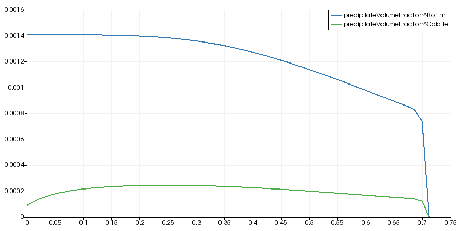
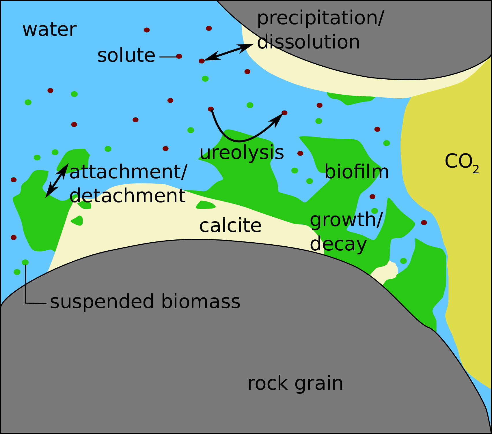

<!-- Important: This file has been automatically generated by generate_example_docs.py. Do not edit this file directly! -->

# Biomineralization

We simulate microbially-induced calcite precipitation in a vertical sand-column.
The problem is considered radially-symmetric so that a one-dimensional problem can be simulated.

__The main points illustrated in this example are__
* solving a reactive transport model including
    * biofilm growth
    * mineral precipitation and dissolution
    * changing porosity and permeability
* using complex fluid and solid systems
* setting a complex time loop with checkpoints, reading the check points from a file
* set complex injection boundary conditions, reading the injection types from a file

__Table of contents__. This description is structured as follows:

[[_TOC_]]

__Result__. The result will look like below.
You see the volume fractions of the solid components after 100000s over the column.

<figure>
    <center>
        
        <figcaption> <b> Fig.1 </b> - Biofilm and calcite volume fractions.</figcaption>
    </center>
</figure>

## Problem set-up
A vertical, sand-filled column is biomineralized by repeated injections of various aqueous solutions
from its bottom end. The setup will be explained in more detail in [Part 3: Example Setup](doc/setup.md).
For more information, see the description of _column experiment D1_ in Section 4.2 of [@Hommel2016].

## What is microbially-induced calcite precipitation?
Microbially-induced calcite precipitation (MICP) is an engineering technology for targeted biomineralization.
It can be used in the context of sealing possible leakage pathways of subsurface gas or oil reservoirs as well as other applications.
The governing processes are two-phase multi-component reactive transport including precipitation and dissolution
of calcite, as well as biomass-related processes:
* attachment of biomass to surfaces,
* detachment of biomass from a biofilm,
* growth and decay of biomass.

Additionally, the reduction in porosity and permeability has to be considered.
This results from the presence of the solid phases biofilm and calcite in the pore space.

In subsurface applications, MICP is typically
associated with a reduction of porosity, which, even more importantly, corresponds to a
reduction of permeability.
MICP can be used to alter hydraulic flow conditions, for example, by filling highly permeable pathways such as
fractures, faults, or behind-casing defects in boreholes within a geological
formation, e.g. [@Phillips2013a].

The bacterium _Sporosarcina pasteurii_
expresses the enzyme urease that catalyzes the hydrolysis reaction of
urea (CO(NH<sub>2</sub>)<sub>2</sub>) into ammonia (NH<sub>3</sub>) and carbon
dioxide (CO<sub>2</sub>):

```math
\mathrm{CO(NH_2)_2} + 2\mathrm{H_2O} \xrightarrow{urease}
2\mathrm{NH_{3}} + \mathrm{H_2CO_{3}}.
\tag{1}
```

Aqueous solutions of ammonia become alkaline until the equilibrium of ammonium and ammonia is reached.
Thus, the ureolysis reaction leads to an increase in pH until the pH is equal to the pKa of ammonia.
This shifts the
carbonate balance in an aqueous solution toward higher concentrations of
dissolved carbonate.
Adding calcium to the system results then in the precipitation of calcium carbonate:

```math
\mathrm{CO_{3}^{2-}} + \mathrm{Ca^{2+}} \longrightarrow \mathrm{CaCO_3 \downarrow}.
```

The resulting overall MICP reaction equation is:

```math
\mathrm{CO(NH_2)_2} + 2\mathrm{H_2O} + \mathrm{Ca^{2+}} \xrightarrow{urease}
2\mathrm{NH_{4}^{+}} + \mathrm{CaCO_{3}} \downarrow.
```

In a porous medium, biofilm growth, fluid dynamics,
and reaction rates are strongly interacting.
A pore-scale sketch of the most important processes of MICP is shown
in Fig.2.

<figure>
    <center>
        
        <figcaption> <b> Fig.2 </b> - Schematic pore-scale sketch of the processes during biomineralization.</figcaption>
    </center>
</figure>

A major difficulty for practical engineering applications of MICP is the predictive planning of a scenario and its impact.
While the basic chemistry and the flow processes are known, it is mainly the quantitative description
of the influence of the biofilm and the developing precipitates on hydraulic parameters that poses challenges to achieving predictability.
More details on modeling biomineralization are given in [Part 1: Model Concept](doc/modelconcept.md).

# The code documentation

In the following, we take a closer look at the source files for this example.
The setup is rather complex in comparison to the other examples.
We will discuss the different parts of the code in detail subsequently.

```
└── biomineralization/
    ├── CMakeLists.txt          -> build system file
    ├── main.cc                 -> main program flow
    ├── params.input            -> runtime parameters
    ├── injections.dat          -> runtime injection strategy input file
    ├── properties.hh           -> compile time settings for the simulation
    ├── problem.hh              -> boundary & initial conditions for the simulation
    ├── spatialparams.hh        -> parameter distributions for the simulation
    └── material/               -> components, fluid- and solidsystems
        ├── components/
        │   ├── biofilm.hh
        │   └── suspendedbiomass.hh
        ├── fluidsystems/
        │   ├── biominsimplechemistry.hh
        │   └── icpcomplexsalinitybrine.hh
        ├── solidsystems/
        │   └── biominsolids.hh
        └── co2tableslaboratory.hh
```

In order to define a simulation setup in DuMu<sup>x</sup>, you need to implement compile-time settings,
where you specify the classes and compile-time options that DuMu<sup>x</sup> should use for the simulation.
Moreover, a `Problem` class needs to be implemented, in which the initial and boundary conditions
are specified. Finally, spatially-distributed values for the parameters required by the used model
are implemented in a `SpatialParams` class.

__Part 1__ discusses the mathematical model in more detail.

__Part 2__ takes a close look at the main file.
`main.cc` controlling the simulation, and containing the time loop management,
A special feature of this example, which might be interesting also for non-biomineralization modelers,
is that it uses the class `CheckPointTimeLoop` extensively to set the injections of the various consecutive
biomineralization solution injections based on a separate input file `injections_checkpoints.dat`.
Similar strategies might be useful when simulating experimental setups with boundary conditions changing over time.

__Part 3__ takes a close look at the problem set-up.
`problem.hh` featuring the reactive source and sink terms discussed in the model concept and the time-dependent injection boundary conditions, and
`spatialparams.hh` with the spatially distributed parameters, most importantly the porosity and permeability changing due to the reactions.
A special feature of this example, which might be interesting also for non-biomineralization modelers,
is that `problem.hh`, determines the Neumann boundary condition, more specifically which type of solution is currently injected, (the `injectionType_`) based on a separate input file `injections_type.dat`.
Similar strategies might be useful when simulating experimental setups with boundary conditions changing over time.

__Part 4__ discusses the code concerned with the fluid (files in the folder `material/`),
especially the multi-component fluidsystems.
The CO<sub>2</sub> properties are stored in the CO<sub>2</sub> tables in the subfolder `material` (`co2tableslaboratory.hh`,`co2valueslaboratory.inc`).

__Part 5__ discusses the code concerned with the solid properties (files in the folder `material/`),
especially the multi-component solidsystems and variable solid volume fractions.


[@Ebigbo2012]: https://agupubs.onlinelibrary.wiley.com/doi/full/10.1029/2011WR011714 "Darcy-scale modeling of microbially induced carbonate mineral precipitation in sand columns"
[@Hommel2015]: https://agupubs.onlinelibrary.wiley.com/doi/full/10.1002/2014WR016503 "A revised model for microbially induced calcite precipitation: Improvements	and new insights based on recent experiments"
[@Hommel2016]: https://elib.uni-stuttgart.de/handle/11682/8787 "Modelling biogeochemical and mass transport processes in the subsurface: investigation of microbially induced calcite precipitation"
[@Phillips2013a]: https://pubs.acs.org/doi/abs/10.1021/es301294q "Potential CO<sub>2</sub> leakage reduction through biofilm-induced calcium carbonate precipitation"

## Part 1: Model concept

| [:arrow_right: Click to continue with part 1 of the documentation](doc/modelconcept.md) |
|---:|


## Part 2: Main file

| [:arrow_right: Click to continue with part 2 of the documentation](doc/mainfile.md) |
|---:|


## Part 3: Simulation setup

| [:arrow_right: Click to continue with part 3 of the documentation](doc/setup.md) |
|---:|


## Part 4: Specific fluid material files

| [:arrow_right: Click to continue with part 4 of the documentation](doc/fluidmaterial.md) |
|---:|


## Part 5: Specific solid material files

| [:arrow_right: Click to continue with part 5 of the documentation](doc/solidmaterial.md) |
|---:|
