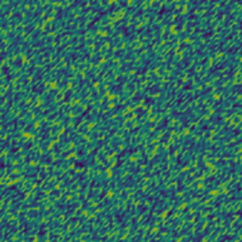

<!-- Important: This file has been automatically generated by generate_example_docs.py. Do not edit this file directly! -->

# Diffusion equation

In this example, we create an application solving the diffusion equation.
This example is implemented in three files, [`model.hh`](model.hh), [`params.input`](params.input), [`main.cc`](main.cc).
The [`model.hh`](model.hh) header implements a simple self-contained diffusion equation model
to be used with a control-volume finite element discretization like the Box method.
The [`main.cc`](main.cc) source file contains the main program and [`params.input`](params.input) contains
runtime parameters. The executable is configured in [`CMakeLists.txt`](CMakeLists.txt) and created with CMake.
The source code will be discussed in Part 1 and Part 2 after an introduction to the equations and the problem description.

__The main points illustrated in this example are__

* setting up a simple model
* creating a random initial solution in parallel
* solving a time-dependent diffusion problem
* using a linear PDE solver instance
* reusing the Jacobian matrix for all time steps

__Results__. The simulation result will look something like this:

<figure>
    <center>
        
        <figcaption> <b> Fig.1 </b> - Evolution of an initially random concentration field according to the diffusion equation.</figcaption>
    </center>
</figure>

__Table of contents__. This description is structured as follows:

[TOC]

## Equation and problem description

The scalar diffusion equation on a domain $\Omega \subset \mathbb{R}^2$ and time interval $(0,T]$
with boundary $\partial\Omega = \Gamma_D \cup \Gamma_N$ composed of Dirichlet and Neumann boundaries,
where for a position $x \in \Omega$ and time $t$, $c(x,t)$ denotes the unknown evolving concentration field, reads

```math
\begin{aligned}
\frac{\partial c}{\partial t} - \nabla \cdot (D \nabla c) &= 0    && \mathrm{in}\; \Omega \times (0,T] \\
                                                        c &= c_D  && \mathrm{on}\; \Gamma_D \times (0,T] \\
                         -D \nabla c \cdot \boldsymbol{n} &= g_N  && \mathrm{on}\; \Gamma_N \times (0,T] \\
                                                        c &= c^0  && \mathrm{for}\; t = 0,
\end{aligned}
```

with diffusion coefficient $D$, Dirichlet data $c_D$, Neumann data $g_N$,
and $\boldsymbol{n}$ denoting the outward-oriented unit normal vector on $\partial\Omega$.
In this example, we will use homogenenous Neumann boundary conditions
on all of $\partial\Omega$ such that $\Gamma_D = \emptyset$ and $g_N = 0$.
The initial concentration field $c^0$ is a random field (the discrete control volume
averages $c^0_{h,B}$ are sampled from a uniform distribution, $c^0_{h,B} \sim U(0,1)$).

We partition $\Omega$ into control volumes $B$ (sometimes called "boxes").
Integrating our equation over a control volume $B$ and applying the divergence theorem yields

```math
\begin{aligned}
\int_B \frac{\partial c}{\partial t} \,\mathrm{d}V - \int_{\partial B} D \nabla c \cdot \boldsymbol{n} \,\mathrm{d}A &= 0.
\end{aligned}
```

We discretize in time using an implicit Euler method

```math
\begin{aligned}
\int_B \frac{c^{n+1}-c^{n}}{\Delta t} \,\mathrm{d}V - \int_{\partial B} D \nabla c^{n+1} \cdot \boldsymbol{n} \,\mathrm{d}A &= 0.
\end{aligned}
```

For the Box method, the control volumes are centered at grid vertices. We partition the control volume boundary
into sub control volume faces $\sigma$ such that each $\sigma$ belongs to exactly one grid element. The discrete solution
$c_{h}$ is a piece-wise linear polynomial, and its restriction on an element $K$, denoted by $c_{h,K}$,
is represented by a linear basis such that

```math
c_{h,K}(x) = \sum\limits_{B \in \mathcal{B}_K} c_{h,B} N_B(x)
```

where $\mathcal{B}_K$ is the set of control volumes intersecting element $K$ and $N_B$ are the basis functions associated
with the vertex corresponding to the center of control volume $B$. Insertion of this ansatz yields the discrete equation

```math
\begin{aligned}
\vert B \vert \frac{c_B^{n+1}-c_B^{n}}{\Delta t} - \sum_{\sigma \in \Sigma_{B}} \left[ D \nabla c_h^{n+1} \cdot \boldsymbol{n}_{B,\sigma} \vert \sigma \vert \right] &= 0,
\end{aligned}
```

for each control volume $B$, where $\Sigma_{B}$ is the set of sub control volume faces on $\partial B$ and $\boldsymbol{n}_{B,\sigma}$ is the outward-oriented
unit normal vector on $\partial B$. When assembling the discrete equation, we take an element-centered view. This means that we iterate
over all elements $K$ in the mesh and for each element add the partial contributions

```math
\begin{aligned}
\vert B \cap K \vert \frac{c_B^{n+1}-c_B^{n}}{\Delta t} - \sum_{\sigma \in \Sigma_{BK}} \left[ D \sum\limits_{B \in \mathcal{B}_K} \left\lbrace c_{h,B}^{n+1} \nabla N_B(x) \cdot \boldsymbol{n}_{B,\sigma} \vert \sigma \vert \right\rbrace \right] &= 0,
\end{aligned}
```

to the control volume residual of control volume $B$, where $B \cap K$ is the sub control volume given by the intersection of $B$ and $K$
and $\Sigma_{BK} \subset \Sigma_{B}$ is the set of sub control volume faces in $K$ belonging to $\partial B$.
Computing the element-local contributions is described in Part 1.

### Model parameters

* $\Omega = [0,1]\times[0,1]$ (unit square)
* End time $T = 5$ and time step size $\Delta t = 0.1$
* $100 \times 100$ cells (structured Cartesian grid)
* $D = 0.0001$
* $c^0_{h,B} \sim U(0,1)$

### Running the example in parallel

By default Dumux will try to speed up the assembly by using shared memory parallelism if a suitable
backend has been found on your system (one of TBB, OpenMP, Kokkos, C++ parallel algorithms).
You can limit the number of threads by prepending your executable with `DUMUX_NUM_THREADS=<number>`.
If you also want to use distributed memory parallelism with MPI (works better for solvers at the moment),
run the executable with your MPI environment. Each MPI process will use multi-threading if
`DUMUX_NUM_THREADS` is larger than $1$.

Running the example with four MPI processes (distribution memory parallelism)
each with two threads (shared memory parallelism):

```sh
DUMUX_NUM_THREADS=2 mpirun -np 4 ./example_diffusion
```

You can set the parameter `Grid.Overlap` to some non-zero integer in [`params.input`](params.input)
to turn the domain decomposition into an overlapping decomposition where
`Grid.Overlap` specifies the number of grid cells in the overlap between processes.
This can help to increase the convergence speed of the linear solver.

__Tip__: To see the number of linear solver iteration, you can increase the solver verbosity level
by adding to [`params.input`](params.input) the lines:

```ini
[LinearSolver]
Verbosity = 1
```

or alternatively, run (here for an overlap size of $3$ elements):

```sh
DUMUX_NUM_THREADS=2 mpirun -np 4 ./example_diffusion -LinearSolver.Verbosity 1 -Grid.Overlap 3
```

# Implementation

For the code implementation see Part 1 and Part 2.

## Part 1: Model implementation

| [:arrow_right: Click to continue with part 1 of the documentation](doc/model.md) |
|---:|


## Part 2: Main program

| [:arrow_right: Click to continue with part 2 of the documentation](doc/main.md) |
|---:|
