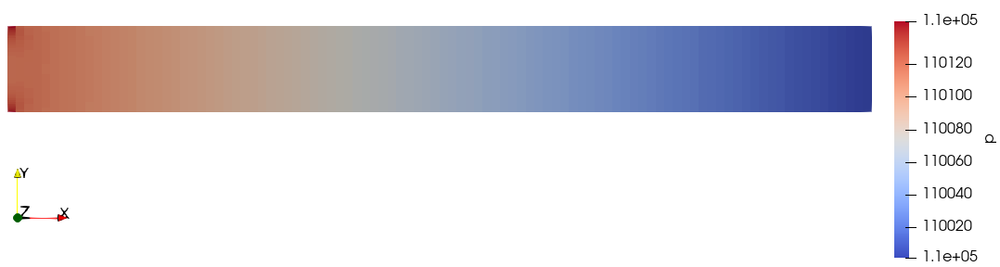

This example is based on dumux/test/freeflow/navierstokes/channel/2d.

# Freeflow through a channel

## Problem set-up
This example contains a stationary free flow of a fluid through two parallel solid plates in two dimensions from left to right. The figure below shows the simulation set-up. The fluid flows into the system at the left with a constant velocity of $` v = 1~\frac{\text{m}}{\text{s}} `$. The inflow velocity profile is a block profile. Due to the no-slip, no-flow boundary conditions at the top and bottom plate, the velocity profile gradually assumes a parabolic shape along the channel. At the outlet, the pressure is fixed and a zero velocity gradient in x-direction is assumed. The physical domain, which is modeled is the rectangular domain $`x\in[0,10],~y\in[0,1]`$.


## Model description
The Stokes model without gravitation and without sources or sinks for a stationary, incompressible, laminar, single phase, one-component, isothermal ($`T=10^\circ C`$) flow is considered assuming a Newtonian fluid of constant density $` \varrho = 1~\frac{\text{kg}}{\text{m}^3} `$ and constant kinematic viscosity $` \nu = 1~\frac{\text{m}^2}{\text{s}} `$. The momentum balance
```math
\nabla \cdot (\varrho\boldsymbol{u} \boldsymbol{u}^{\text{T}}) - \nabla\cdot\left(\mu\left(\nabla\boldsymbol{u}+\nabla\boldsymbol{u}^{\text{T}}\right)\right)+ \nabla p = 0
```
with density  $`\varrho`$, velocity $`\boldsymbol{u}`$, dynamic viscosity  $`\mu=\varrho\nu`$ and pressure $`p`$ and the mass balance
```math
\nabla \cdot \left(\varrho\boldsymbol{u}\right) =0
```
are discretized using a staggered-grid finite-volume scheme as spatial discretization with pressures and velocity components as primary variables. For details on the discretization scheme, have a look at the dumux [handbook](https://dumux.org/handbook).

In the following, we take a close look at the files containing the set-up: At first, boundary conditions are set in `problem.hh` for the Navier-Stokes model. Afterwards, we show the different steps for solving the model in the source file `main.cc`. At the end, we show some simulation results.


## The file `problem.hh`


Before we enter the problem class containing initial and boundary conditions, we include necessary files and introduce properties.
### Include files
The dune grid interface (from YASP) is included, as are the staggered grid discretization scheme, the freeflow model
and the freeflow Navier-Stokes problem class that this class is derived from. The material (fluid) properties are specified.
<details>
<summary>Click to toggle details</summary>

```cpp
#include <dune/grid/yaspgrid.hh>

#include <dumux/discretization/staggered/freeflow/properties.hh>

#include <dumux/freeflow/navierstokes/model.hh>
#include <dumux/freeflow/navierstokes/problem.hh>

#include <dumux/material/components/constant.hh>
#include <dumux/material/fluidsystems/1pliquid.hh>
```
</details>

### Define basic properties for our simulation
Basis properties of the simulation are defined, e.g. the model, discretization scheme, grid, fluid properties, caching.
<details>
<summary>Click to toggle details</summary>

We enter the namespace Dumux in order to import the entire Dumux namespace for general use
```cpp
namespace Dumux {
```
The problem class is forward declared:
```cpp
template <class TypeTag>
class ChannelExampleProblem;
```
We enter the namespace Properties, which is a sub-namespace of the namespace Dumux:
```cpp
namespace Properties {
```
Create new type tags
```cpp
namespace TTag {
```
A `TypeTag` for our simulation is created which inherits from the Navier-Stokes flow model and the staggered-grid discretization scheme.
```cpp
struct ChannelExample { using InheritsFrom = std::tuple<NavierStokes, StaggeredFreeFlowModel>; };
} // end namespace TTag
```
We use a structured 2D grid:
```cpp
template<class TypeTag>
struct Grid<TypeTag, TTag::ChannelExample> { using type = Dune::YaspGrid<2>; };
```
The problem class specifies initial and boundary conditions:
```cpp
template<class TypeTag>
struct Problem<TypeTag, TTag::ChannelExample> { using type = Dumux::ChannelExampleProblem<TypeTag> ; };
```
In the following we define our fluid properties.
```cpp
template<class TypeTag>
struct FluidSystem<TypeTag, TTag::ChannelExample>
{
```
We define a convenient shortcut to the property Scalar:
```cpp
    using Scalar = GetPropType<TypeTag, Properties::Scalar>;
```
We create a fluid system that consists of an incompressible fluid of constant visosity
```cpp
    using type = FluidSystems::OnePLiquid<Scalar, Components::Constant<1, Scalar> >;
};
```
We enable caching for the grid volume variables.
```cpp
template<class TypeTag>
struct EnableGridVolumeVariablesCache<TypeTag, TTag::ChannelExample> { static constexpr bool value = true; };
```
We enable caching for the grid flux variables.
```cpp
template<class TypeTag>
struct EnableGridFluxVariablesCache<TypeTag, TTag::ChannelExample> { static constexpr bool value = true; };
```
We enable caching for the FV grid geometry
```cpp
template<class TypeTag>
struct EnableGridGeometryCache<TypeTag, TTag::ChannelExample> { static constexpr bool value = true; };
```
The cache stores values that were already calculated for later usage. This makes the simulation faster.
We leave the namespace Properties.
```cpp
}
```
</details>

### The problem class
We enter the problem class where all necessary initial and boundary conditions are set for our simulation.

<details>
<summary>Click to toggle details</summary>

As this is a Stokes problem, we inherit from the basic `NavierStokesProblem`.
```cpp
template <class TypeTag>
class ChannelExampleProblem : public NavierStokesProblem<TypeTag>
{
```
We use convenient declarations that we derive from the property system.
<details>
<summary>Click to toggle details</summary>

```cpp
    using ParentType = NavierStokesProblem<TypeTag>;
    using BoundaryTypes = GetPropType<TypeTag, Properties::BoundaryTypes>;
    using GridGeometry = GetPropType<TypeTag, Properties::GridGeometry>;
    using FVElementGeometry = typename GridGeometry::LocalView;
    using SubControlVolumeFace = typename GridGeometry::SubControlVolumeFace;
    using Indices = typename GetPropType<TypeTag, Properties::ModelTraits>::Indices;
    using NumEqVector = GetPropType<TypeTag, Properties::NumEqVector>;
    using PrimaryVariables = GetPropType<TypeTag, Properties::PrimaryVariables>;
    using Scalar = GetPropType<TypeTag, Properties::Scalar>;

    using Element = typename GridGeometry::GridView::template Codim<0>::Entity;
    using GlobalPosition = typename Element::Geometry::GlobalCoordinate;

public:
```
</details>

There follows the constructor of our problem class:
Within the constructor, we set the inlet velocity to a run-time specified value.
As no run-time value is specified, we set the outlet pressure to 1.1e5 Pa.
<details>
<summary>Click to toggle details</summary>

```cpp
    ChannelExampleProblem(std::shared_ptr<const GridGeometry> gridGeometry)
    : ParentType(gridGeometry)
    {
        inletVelocity_ = getParam<Scalar>("Problem.InletVelocity");
        outletPressure_ = getParam<Scalar>("Problem.OutletPressure", 1.1e5);
    }
```
</details>

Now, we define the type of initial and boundary conditions depending on location.
Two types of boundary conditions can be specified: Dirichlet and Neumann. On a Dirichlet boundary,
the values of the primary variables need to be fixed.
On a Neumann boundary condition, values for derivatives need to be fixed.
When Dirichlet conditions are set for the pressure, the derivative of the velocity
vector with respect to the direction normal to the boundary is automatically set to
zero. This boundary condition is called in-/outflow boundary condition in Dumux.
In the following we specify Dirichlet boundaries for velocity on the left of our domain
if isInlet_ is true, Dirichlet boundaries for pressure on the right of our domain
if isOutlet_ is true and specify Dirichlet boundaries for velocity on the top and bottom
of our domain else.
<details>
<summary>Click to toggle details</summary>

```cpp
    BoundaryTypes boundaryTypesAtPos(const GlobalPosition &globalPos) const
    {
        BoundaryTypes values;

        if(isInlet_(globalPos))
        {
            values.setDirichlet(Indices::velocityXIdx);
            values.setDirichlet(Indices::velocityYIdx);
        }
        else if(isOutlet_(globalPos))
        {
            values.setDirichlet(Indices::pressureIdx);
        }
        else
        {
            values.setDirichlet(Indices::velocityXIdx);
            values.setDirichlet(Indices::velocityYIdx);
        }

        return values;
    }
```
</details>

Second, we specify the values for the Dirichlet boundaries. We need to fix the values of our primary variables.
To ensure a no-slip boundary condition at the top and bottom of the channel, the Dirichlet velocity
in x-direction is set to zero if not at the inlet.
<details>
<summary>Click to toggle details</summary>

```cpp
    PrimaryVariables dirichletAtPos(const GlobalPosition &globalPos) const
    {
        PrimaryVariables values = initialAtPos(globalPos);

        if(!isInlet_(globalPos))
        {
            values[Indices::velocityXIdx] = 0.0;
        }

        return values;
    }
```
</details>

We specify the values for the initial conditions.
We assign constant values for pressure and velocity components.
<details>
<summary>Click to toggle details</summary>

```cpp
    PrimaryVariables initialAtPos(const GlobalPosition &globalPos) const
    {
        PrimaryVariables values;

        values[Indices::pressureIdx] = outletPressure_;
        values[Indices::velocityXIdx] = inletVelocity_;
        values[Indices::velocityYIdx] = 0.0;

        return values;
    }
```
</details>

We need to specify a constant temperature for our isothermal problem.
We set it to 10°C.
<details>
<summary>Click to toggle details</summary>

```cpp
    Scalar temperature() const
    { return 273.15 + 10; }
private:
```
</details>

The inlet is at the left side of the physical domain.
<details>
<summary>Click to toggle details</summary>

```cpp
    bool isInlet_(const GlobalPosition& globalPos) const
    {
        return globalPos[0] < eps_;
    }
```
</details>

The outlet is at the right side of the physical domain.
<details>
<summary>Click to toggle details</summary>

```cpp
    bool isOutlet_(const GlobalPosition& globalPos) const
    {
        return globalPos[0] > this->gridGeometry().bBoxMax()[0] - eps_;
    }
```
</details>

Finally, private variables are declared:
<details>
<summary>Click to toggle details</summary>

```cpp
    static constexpr Scalar eps_=1e-6;
    Scalar inletVelocity_;
    Scalar outletPressure_;
```
</details>

This is everything the freeflow channel problem class contains.
```cpp
};
```
We leave the namespace Dumux.
```cpp
} // end namespace Dumux
#endif
```
</details>


## The file `main.cc`


We look now at the main file for the channel problem.
### Includes
Necessary files are included.
<details>
<summary>Click to toggle details</summary>

First, the configuration file is include, then the problem, followed by the standard header file for C++ to get time and date information
and another standard header for in- and output.

<details>
<summary>Click to toggle details</summary>

```cpp
#include <config.h>

#include "problem.hh"

#include <ctime>
#include <iostream>
```
</details>

Dumux is based on DUNE, the Distributed and Unified Numerics Environment, which provides several grid managers and
linear solvers. So we need some includes from that.
<details>
<summary>Click to toggle details</summary>

```cpp
#include <dune/common/parallel/mpihelper.hh>
#include <dune/common/timer.hh>
#include <dune/grid/io/file/dgfparser/dgfexception.hh>
#include <dune/grid/io/file/vtk.hh>
#include <dune/istl/io.hh>
```
</details>

In Dumux, a property system is used to specify the model. For this, different properties are defined containing
type definitions, values and methods. All properties are declared in the file `properties.hh`.
The file parameters.hh contains the parameter class, which manages the definition of input parameters by a default
value, the inputfile or the command line.
The file `dumuxmessage.hh` contains the class defining the start and end message of the simulation.
The file valgrind.hh contains debugging funcionality.
<details>
<summary>Click to toggle details</summary>

```cpp
#include <dumux/common/properties.hh>
#include <dumux/common/parameters.hh>
#include <dumux/common/dumuxmessage.hh>
#include <dumux/common/valgrind.hh>
```
</details>

The file seqsolverbackend.hh contains the class, which defines the sequential linear solver backends.
The nonlinear Newton's method is included, as well as the assembler, which assembles the linear systems for staggered-grid finite volume schemes.
The containing class in the file diffmethod.hh defines the different differentiation methods used to compute the derivatives of the residual.
<details>
<summary>Click to toggle details</summary>

```cpp
#include <dumux/linear/seqsolverbackend.hh>
#include <dumux/nonlinear/newtonsolver.hh>
#include <dumux/assembly/staggeredfvassembler.hh>
#include <dumux/assembly/diffmethod.hh>
```
</details>

We need the class in staggeredvtkoutputmodule.hh to simplify the writing of dumux simulation data to VTK format.
The gridmanager constructs a grid from the information in the input or grid file. There is a specification for the
different supported grid managers.
<details>
<summary>Click to toggle details</summary>

```cpp
#include <dumux/io/staggeredvtkoutputmodule.hh>
#include <dumux/io/grid/gridmanager.hh>
```
</details>

The following class contains functionality for additional flux output to the console.
<details>
<summary>Click to toggle details</summary>

```cpp
#include <dumux/freeflow/navierstokes/staggered/fluxoversurface.hh>
```
</details>

</details>

### Beginning of the main function
We begin the main function by defining the type tag for this problem, initializing MPI (finalizing is done automatically on exit),
printing the dumux start message and parsing the command line arguments and input file in the init function.
<details>
<summary>Click to toggle details</summary>

```cpp
int main(int argc, char** argv) try
{
    using namespace Dumux;

    using TypeTag = Properties::TTag::ChannelExample;

    const auto& mpiHelper = Dune::MPIHelper::instance(argc, argv);

    if (mpiHelper.rank() == 0)
        DumuxMessage::print(/*firstCall=*/true);

    Parameters::init(argc, argv);
```
</details>

### Create the grid
A gridmanager tries to create the grid either from a grid file or the input file.
Then, we compute on the leaf grid view.
<details>
<summary>Click to toggle details</summary>

```cpp
    GridManager<GetPropType<TypeTag, Properties::Grid>> gridManager;
    gridManager.init();

    const auto& leafGridView = gridManager.grid().leafGridView();
```
</details>

### Set-up and solving of the problem

We create and initialize the finite volume grid geometry, the problem, the linear system, including the jacobian matrix, the residual and the solution vector and the gridvariables.
#### Set-up

We need the finite volume geometry to build up the subcontrolvolumes (scv) and subcontrolvolume faces (scvf) for each element of the grid partition.
In the problem, we define the boundary and initial conditions.
We initialize the solution vector
and then use the solution vector to intialize the `gridVariables`.
We then initialize the vtkoutput. Each model has a predefined model-specific output with relevant parameters
for that model.
<details>
<summary>Click to toggle details</summary>

```cpp
    using GridGeometry = GetPropType<TypeTag, Properties::GridGeometry>;
    auto gridGeometry = std::make_shared<GridGeometry>(leafGridView);
    gridGeometry->update();

    using Problem = GetPropType<TypeTag, Properties::Problem>;
    auto problem = std::make_shared<Problem>(gridGeometry);

    using SolutionVector = GetPropType<TypeTag, Properties::SolutionVector>;
    SolutionVector x;
    x[GridGeometry::cellCenterIdx()].resize(gridGeometry->numCellCenterDofs());
    x[GridGeometry::faceIdx()].resize(gridGeometry->numFaceDofs());
    problem->applyInitialSolution(x);

    using GridVariables = GetPropType<TypeTag, Properties::GridVariables>;
    auto gridVariables = std::make_shared<GridVariables>(problem, gridGeometry);
    gridVariables->init(x);

    using IOFields = GetPropType<TypeTag, Properties::IOFields>;
    StaggeredVtkOutputModule<GridVariables, SolutionVector> vtkWriter(*gridVariables, x, problem->name());
    IOFields::initOutputModule(vtkWriter); // Add model specific output fields
    vtkWriter.write(0.0);
```
</details>

We set up two surfaces over which fluxes are calculated.
We determine the extensions [xMin,xMax]x[yMin,yMax] of the physical domain.
The first surface (added by the first call of addSurface) shall be placed at the middle of the channel.
If we have an odd number of cells in x-direction, there would not be any cell faces
at the position of the surface (which is required for the flux calculation).
In this case, we add half a cell-width to the x-position in order to make sure that
the cell faces lie on the surface. This assumes a regular cartesian grid.
The second surface (second call of addSurface) is placed at the outlet of the channel.
<details>
<summary>Click to toggle details</summary>

```cpp
    FluxOverSurface<GridVariables,
                    SolutionVector,
                    GetPropType<TypeTag, Properties::ModelTraits>,
                    GetPropType<TypeTag, Properties::LocalResidual>> flux(*gridVariables, x);

    using Scalar = GetPropType<TypeTag, Properties::Scalar>;

    const Scalar xMin = gridGeometry->bBoxMin()[0];
    const Scalar xMax = gridGeometry->bBoxMax()[0];
    const Scalar yMin = gridGeometry->bBoxMin()[1];
    const Scalar yMax = gridGeometry->bBoxMax()[1];

    const Scalar planePosMiddleX = xMin + 0.5*(xMax - xMin);
    int numCellsX = getParam<std::vector<int>>("Grid.Cells")[0];

    const unsigned int refinement = getParam<unsigned int>("Grid.Refinement", 0);
    numCellsX *= (1<<refinement);

    const Scalar offsetX = (numCellsX % 2 == 0) ? 0.0 : 0.5*((xMax - xMin) / numCellsX);

    using GridView = GetPropType<TypeTag, Properties::GridView>;
    using Element = typename GridView::template Codim<0>::Entity;
    using GlobalPosition = typename Element::Geometry::GlobalCoordinate;

    const auto p0middle = GlobalPosition{planePosMiddleX + offsetX, yMin};
    const auto p1middle = GlobalPosition{planePosMiddleX + offsetX, yMax};
    flux.addSurface("middle", p0middle, p1middle);

    const auto p0outlet = GlobalPosition{xMax, yMin};
    const auto p1outlet = GlobalPosition{xMax, yMax};
    flux.addSurface("outlet", p0outlet, p1outlet);
```
</details>

</details>

#### Assembling the linear system
We set the assembler.
<details>
<summary>Click to toggle details</summary>

```cpp
    using Assembler = StaggeredFVAssembler<TypeTag, DiffMethod::numeric>;
    auto assembler = std::make_shared<Assembler>(problem, gridGeometry, gridVariables);
```
</details>

#### Solution
We set the linear and non-linear solver, solve the non-linear system and calculate mass and volume fluxes over the planes.
<details>
<summary>Click to toggle details</summary>

```cpp
    using LinearSolver = Dumux::UMFPackBackend;
    auto linearSolver = std::make_shared<LinearSolver>();

    using NewtonSolver = Dumux::NewtonSolver<Assembler, LinearSolver>;
    NewtonSolver nonLinearSolver(assembler, linearSolver);

    nonLinearSolver.solve(x);

    flux.calculateMassOrMoleFluxes();
    flux.calculateVolumeFluxes();
```
</details>

### Final Output
We write the vtk output and print the mass/energy/volume fluxes over the planes.
We conclude by printing the dumux end message. After the end of the main function,
possible catched error messages are printed.
<details>
<summary>Click to toggle details</summary>

```cpp
    vtkWriter.write(1.0);

    if(GetPropType<TypeTag, Properties::ModelTraits>::enableEnergyBalance())
    {
        std::cout << "mass / energy flux at middle is: " << flux.netFlux("middle") << std::endl;
        std::cout << "mass / energy flux at outlet is: " << flux.netFlux("outlet") << std::endl;
    }
    else
    {
        std::cout << "mass flux at middle is: " << flux.netFlux("middle") << std::endl;
        std::cout << "mass flux at outlet is: " << flux.netFlux("outlet") << std::endl;
    }

    std::cout << "volume flux at middle is: " << flux.netFlux("middle")[0] << std::endl;
    std::cout << "volume flux at outlet is: " << flux.netFlux("outlet")[0] << std::endl;

    if (mpiHelper.rank() == 0)
    {
        Parameters::print();
        DumuxMessage::print(/*firstCall=*/false);
    }

    return 0;
} // end main
catch (Dumux::ParameterException &e)
{
    std::cerr << std::endl << e << " ---> Abort!" << std::endl;
    return 1;
}
catch (Dune::DGFException & e)
{
    std::cerr << "DGF exception thrown (" << e <<
                 "). Most likely, the DGF file name is wrong "
                 "or the DGF file is corrupted, "
                 "e.g. missing hash at end of file or wrong number (dimensions) of entries."
                 << " ---> Abort!" << std::endl;
    return 2;
}
catch (Dune::Exception &e)
{
    std::cerr << "Dune reported error: " << e << " ---> Abort!" << std::endl;
    return 3;
}
catch (...)
{
    std::cerr << "Unknown exception thrown! ---> Abort!" << std::endl;
    return 4;
}
```
</details>


## Results
This example computes the following stationary velocity profile:


and stationary pressure profile:


