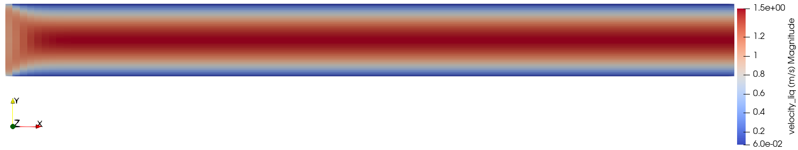

<!-- Important: This file has been automatically generated by generate_example_docs.py. Do not edit this file directly! -->

# Free flow through a channel

__You learn how to__

* solve a free-flow channel problem
* set outflow boundary conditions in the free-flow context

__Results__. In this example we will obtain the following stationary velocity profile:



__Table of contents__. This description is structured as follows:

[[_TOC_]]

## Mathematical model
In this example, the Stokes model for stationary and incompressible single phase flow is considered.
Thus, the momentum balance equations

```math
- \nabla\cdot\left(\mu\left(\nabla\boldsymbol{u}+\nabla\boldsymbol{u}^{\text{T}}\right)\right)+ \nabla p = 0
```

and the mass balance

```math
\nabla \cdot \left(\boldsymbol{u}\right) =0
```

are solved, where $`\varrho`$ and $`\mu`$ are the density and viscosity of the fluid,
$`\boldsymbol{u}`$ is the fluid velocity and $`p`$ is the pressure. Here, we use constant fluid
properties with $`\varrho = 1~\frac{\text{kg}}{\text{m}^3}`$ and $`\mu = 1~\text{Pa}\text{s}`$.
Furthermore, isothermal conditions with a homogeneous temperature distribution of $`T=10^\circ C`$ are assumed.

All equations are discretized with the staggered-grid finite-volume scheme as spatial discretization
with pressures and velocity components as primary variables. For details on the discretization scheme,
have a look at the Dumux [handbook](https://dumux.org/handbook).

## Problem set-up
This example considers stationary flow of a fluid between two parallel solid plates in two dimensions.
Flow is enforced from left to right by prescribing an inflow velocity of $` v = 1~\frac{\text{m}}{\text{s}} `$
on the left boundary, while a fixed pressure of $`p = 1.1 \text{bar}`$ and a zero velocity gradient
in x-direction are prescribed on the right boundary. On the top and bottom boundaries, no-slip
conditions are applied, which cause a parabolic velocity profile to develop along the channel.
Take a look at Figure 1 for an illustration of the domain and the boundary conditions.

<figure>
    <center>
        
        <figcaption> <b> Fig.1 </b> - Setup for the free flow problem.</figcaption>
    </center>
</figure>

# Implementation

## Folder layout and files

```
└── freeflowchannel/
    ├── CMakeLists.txt          -> build system file
    ├── main.cc                 -> main program flow
    ├── params.input            -> runtime parameters
    ├── properties.hh           -> compile time configuration
    └── problem.hh              -> boundary & initial conditions
```


## Compile-time settings (`properties.hh`)

In this file, the type tag used for this simulation is defined,
for which we then specialize properties (compile time options) to the needs of the desired setup.


<details open>
<summary><b>Click to hide/show the file documentation</b> (or inspect the [source code](properties.hh))</summary>


### Includes
<details><summary> Click to show includes</summary>

The `NavierStokes` type tag specializes most of the properties required for Navier-
Stokes single-phase flow simulations in DuMuX. We will use this in the following to inherit the
respective properties and subsequently specialize those properties for our
type tag, which we want to modify or for which no meaningful default can be set.

```cpp
#include <dumux/freeflow/navierstokes/model.hh>
```

We want to use `YaspGrid`, an implementation of the dune grid interface for structured grids:

```cpp
#include <dune/grid/yaspgrid.hh>
```

In this example, we want to discretize the equations with the staggered-grid
scheme which is so far the only available option for free-flow models in DuMux:

```cpp
#include <dumux/discretization/staggered/freeflow/properties.hh>
```

The fluid properties are specified in the following headers (we use a liquid with constant properties as the fluid phase):

```cpp
#include <dumux/material/fluidsystems/1pliquid.hh>
#include <dumux/material/components/constant.hh>
```

We include the problem header used for this simulation.

```cpp
#include "problem.hh"
```

</details>

### Type tag definition

We define a type tag for our simulation with the name `ChannelExample`
and inherit the properties specialized for the type tags `NavierStokes` and `StaggeredFreeFlowModel`.
This way, most of the properties required for Navier-Stokes single-phase flow simulations
using the staggered-grid scheme are conveniently specialized for our new type tag.
However, some properties depend on user choices and no meaningful default value can be set.
Those properties will be addressed later in this file.
Please note that, in this example, we actually want to solve the Stokes instead of the
Navier-Stokes equations. This can be achieved at runtime by setting the parameter
`Problem.EnableInertiaTerms = false`. Have a look at the input file `params.input`
to see how this is done in this example.

```cpp
// We enter the namespace Dumux::Properties in order to import the entire Dumux namespace for general use:
namespace Dumux::Properties {

// declaration of the `ChannelExample` type tag for the single-phase flow problem
namespace TTag {
struct ChannelExample { using InheritsFrom = std::tuple<NavierStokes, StaggeredFreeFlowModel>; };
} // namespace TTag
```

### Property specializations

In the following piece of code, mandatory properties for which no meaningful
default can be set, are specialized for our type tag `ChannelExample`.

```cpp
// This sets the grid type used for the simulation. Here, we use a structured 2D grid.
template<class TypeTag>
struct Grid<TypeTag, TTag::ChannelExample> { using type = Dune::YaspGrid<2>; };

// This sets our problem class (see problem.hh) containing initial and boundary conditions.
template<class TypeTag>
struct Problem<TypeTag, TTag::ChannelExample> { using type = Dumux::ChannelExampleProblem<TypeTag> ; };

// This sets the fluid system to be used. Here, we use a liquid with constant properties as fluid phase.
template<class TypeTag>
struct FluidSystem<TypeTag, TTag::ChannelExample>
{
    using Scalar = GetPropType<TypeTag, Properties::Scalar>;
    using type = FluidSystems::OnePLiquid<Scalar, Components::Constant<1, Scalar> >;
};
```

We also set some properties related to memory management
throughout the simulation.
<details><summary> Click to show caching properties</summary>

In Dumux, one has the option to activate/deactivate the grid-wide caching of
geometries and variables. If active, the CPU time can be significantly reduced
as less dynamic memory allocation procedures are necessary. Per default, grid-wide
caching is disabled to ensure minimal memory requirements, however, in this example we
want to active all available caches, which significantly increases the memory
demand but makes the simulation faster.


```cpp
// This enables grid-wide caching of the volume variables.
template<class TypeTag>
struct EnableGridVolumeVariablesCache<TypeTag, TTag::ChannelExample> { static constexpr bool value = true; };
//This enables grid wide caching for the flux variables.
template<class TypeTag>
struct EnableGridFluxVariablesCache<TypeTag, TTag::ChannelExample> { static constexpr bool value = true; };
// This enables grid-wide caching for the finite volume grid geometry
template<class TypeTag>
struct EnableGridGeometryCache<TypeTag, TTag::ChannelExample> { static constexpr bool value = true; };
} // end namespace Dumux::Properties
```

</details>

</details>


## Initial and boundary conditions (`problem.hh`)

This file contains the __problem class__ which defines the initial and boundary
conditions for the Navier-Stokes single-phase flow simulation.


<details open>
<summary><b>Click to hide/show the file documentation</b> (or inspect the [source code](problem.hh))</summary>


### Include files

Include the `NavierStokesProblem` class, the base
class from which we will derive.

```cpp
#include <dumux/freeflow/navierstokes/problem.hh>
```

Include the `NavierStokesBoundaryTypes` class which specifies the boundary types set in this problem.

```cpp
#include <dumux/freeflow/navierstokes/boundarytypes.hh>
```

### The problem class
We enter the problem class where all necessary boundary conditions and initial conditions are set for our simulation.
As we are solving a problem related to free flow, we inherit from the base class `NavierStokesProblem`.

```cpp
namespace Dumux {

template <class TypeTag>
class ChannelExampleProblem : public NavierStokesProblem<TypeTag>
{
    // A few convenience aliases used throughout this class.
    using ParentType = NavierStokesProblem<TypeTag>;
    using GridGeometry = GetPropType<TypeTag, Properties::GridGeometry>;
    using FVElementGeometry = typename GridGeometry::LocalView;
    using SubControlVolumeFace = typename GridGeometry::SubControlVolumeFace;
    using Indices = typename GetPropType<TypeTag, Properties::ModelTraits>::Indices;
    using PrimaryVariables = GetPropType<TypeTag, Properties::PrimaryVariables>;
    using BoundaryTypes = Dumux::NavierStokesBoundaryTypes<PrimaryVariables::size()>;
    using Scalar = GetPropType<TypeTag, Properties::Scalar>;

    using Element = typename GridGeometry::GridView::template Codim<0>::Entity;
    using GlobalPosition = typename Element::Geometry::GlobalCoordinate;

public:
    // This is the constructor of our problem class:
    // Within the constructor, we set the inlet velocity to a run-time specified value.
    // If no run-time value is specified, we set the outlet pressure to 1.1e5 Pa.
    ChannelExampleProblem(std::shared_ptr<const GridGeometry> gridGeometry)
    : ParentType(gridGeometry)
    {
        inletVelocity_ = getParam<Scalar>("Problem.InletVelocity");
        outletPressure_ = getParam<Scalar>("Problem.OutletPressure", 1.1e5);
    }
```

#### Boundary conditions
With the following function we define the __type of boundary conditions__ depending on the location.
Three types of boundary conditions can be specified: Dirichlet, Neumann or outflow boundary conditions. On
Dirichlet boundaries, the values of the primary variables need to be fixed. On a Neumann boundaries,
values for derivatives need to be fixed. Outflow conditions set a gradient of zero in normal direction towards the boundary
for the respective primary variables (excluding pressure).
When Dirichlet conditions are set for the pressure, the velocity gradient
with respect to the direction normal to the boundary is automatically set to zero.

```cpp
    BoundaryTypes boundaryTypesAtPos(const GlobalPosition& globalPos) const
    {
        BoundaryTypes values;

        if (isInlet_(globalPos))
        {
            // We specify Dirichlet boundary conditions for the velocity on the left of our domain
            values.setDirichlet(Indices::velocityXIdx);
            values.setDirichlet(Indices::velocityYIdx);
        }
        else if (isOutlet_(globalPos))
        {
            // We fix the pressure on the right side of the domain
            values.setDirichlet(Indices::pressureIdx);
        }
        else
        {
            // We specify Dirichlet boundary conditions for the velocity on the remaining boundaries (lower and upper wall)
            values.setDirichlet(Indices::velocityXIdx);
            values.setDirichlet(Indices::velocityYIdx);
        }

        return values;
    }
```

The following function specifies the __values on Dirichlet boundaries__.
We need to define values for the primary variables (velocity and pressure).

```cpp
    PrimaryVariables dirichletAtPos(const GlobalPosition& globalPos) const
    {
        // Use the initial values as default Dirichlet values
        PrimaryVariables values = initialAtPos(globalPos);

        // Set a no-slip condition at the top and bottom wall of the channel
        if (!isInlet_(globalPos))
            values[Indices::velocityXIdx] = 0.0;

        return values;
    }
```

The following function defines the initial conditions.

```cpp
    PrimaryVariables initialAtPos(const GlobalPosition& globalPos) const
    {
        PrimaryVariables values;

        // Set the pressure and velocity values
        values[Indices::pressureIdx] = outletPressure_;
        values[Indices::velocityXIdx] = inletVelocity_;
        values[Indices::velocityYIdx] = 0.0;

        return values;
    }
```

#### Temperature distribution
We need to specify a constant temperature for our isothermal problem.
Fluid properties that depend on temperature will be calculated with this value.
This would be important if another fluidsystem was used.

```cpp
    Scalar temperature() const
    { return 273.15 + 10; }
```

The inlet is on the left side of the physical domain.

```cpp
private:
    bool isInlet_(const GlobalPosition& globalPos) const
    { return globalPos[0] < eps_; }
```

The outlet is on the right side of the physical domain.

```cpp
    bool isOutlet_(const GlobalPosition& globalPos) const
    { return globalPos[0] > this->gridGeometry().bBoxMax()[0] - eps_; }
```

Finally, private variables are declared:

```cpp
    static constexpr Scalar eps_ = 1e-6;
    Scalar inletVelocity_;
    Scalar outletPressure_;

}; // end class definition of ChannelExampleProblem
} // end namespace Dumux
```


</details>


## The main file (`main.cc`)

<details open>
<summary><b>Click to hide/show the file documentation</b> (or inspect the [source code](main.cc))</summary>


### Included header files
<details><summary> Click to show includes</summary>
These are DUNE helper classes related to parallel computations and file I/O

```cpp
#include <dune/common/parallel/mpihelper.hh>
#include <dune/grid/io/file/dgfparser/dgfexception.hh>
```

The following headers include functionality related to property definition or retrieval, as well as
the retrieval of input parameters specified in the input file or via the command line.

```cpp
#include <dumux/common/properties.hh>
#include <dumux/common/parameters.hh>
```

The following files contain the non-linear Newton solver, the available linear solver backends and the assembler for the linear
systems arising from the staggered-grid discretization.

```cpp
#include <dumux/nonlinear/newtonsolver.hh>
#include <dumux/linear/seqsolverbackend.hh>
#include <dumux/assembly/staggeredfvassembler.hh>
#include <dumux/assembly/diffmethod.hh> // analytic or numeric differentiation
```

The following class provides a convenient way of writing of dumux simulation results to VTK format.

```cpp
#include <dumux/io/staggeredvtkoutputmodule.hh>
```

The gridmanager constructs a grid from the information in the input or grid file.
Many different Dune grid implementations are supported, of which a list can be found
in `gridmanager.hh`.

```cpp
#include <dumux/io/grid/gridmanager.hh>
```

This class contains functionality for additional flux output.

```cpp
#include <dumux/freeflow/navierstokes/staggered/fluxoversurface.hh>
```

In this header, a `TypeTag` is defined, which collects
the properties that are required for the simulation.
It also contains the actual problem with initial and boundary conditions.
For detailed information, please have a look
at the documentation provided therein.

```cpp
#include "properties.hh"
```

</details>

### The main function
We will now discuss the main program flow implemented within the `main` function.
At the beginning of each program using Dune, an instance of `Dune::MPIHelper` has to
be created. Moreover, we parse the run-time arguments from the command line and the
input file:

```cpp
int main(int argc, char** argv) try
{
    using namespace Dumux;

    // The Dune MPIHelper must be instantiated for each program using Dune
    const auto& mpiHelper = Dune::MPIHelper::instance(argc, argv);

    // parse command line arguments and input file
    Parameters::init(argc, argv);
```

We define a convenience alias for the type tag of the problem. The type
tag contains all the properties that are needed to define the model and the problem
setup. Throughout the main file, we will obtain types defined for this type tag
using the property system, i.e. with `GetPropType`.

```cpp
    using TypeTag = Properties::TTag::ChannelExample;
```

#### Step 1: Create the grid
The `GridManager` class creates the grid from information given in the input file.
This can either be a grid file, or in the case of structured grids, one can specify the coordinates
of the corners of the grid and the number of cells to be used to discretize each spatial direction.

```cpp
    GridManager<GetPropType<TypeTag, Properties::Grid>> gridManager;
    gridManager.init();

    // We compute on the leaf grid view.
    const auto& leafGridView = gridManager.grid().leafGridView();
```

#### Step 2: Setting up and solving the problem
First, a finite volume grid geometry is constructed from the grid that was created above.
This builds the sub-control volumes (scv) and sub-control volume faces (scvf) for each element
of the grid partition.

```cpp
    using GridGeometry = GetPropType<TypeTag, Properties::GridGeometry>;
    auto gridGeometry = std::make_shared<GridGeometry>(leafGridView);
    gridGeometry->update();
```

We now instantiate the problem, in which we define the boundary and initial conditions.

```cpp
    using Problem = GetPropType<TypeTag, Properties::Problem>;
    auto problem = std::make_shared<Problem>(gridGeometry);
```

We set a solution vector which consist of two parts: one part (indexed by `cellCenterIdx`)
is for the pressure degrees of freedom (`dofs`) living in grid cell centers. Another part
(indexed by `faceIdx`) is for degrees of freedom defining the normal velocities on grid cell faces.
We initialize the solution vector by what was defined as the initial solution of the the problem.

```cpp
    using SolutionVector = GetPropType<TypeTag, Properties::SolutionVector>;
    SolutionVector x;
    x[GridGeometry::cellCenterIdx()].resize(gridGeometry->numCellCenterDofs());
    x[GridGeometry::faceIdx()].resize(gridGeometry->numFaceDofs());
    problem->applyInitialSolution(x);
```

The grid variables are used store variables (primary and secondary variables) on sub-control volumes and faces (volume and flux variables).

```cpp
    using GridVariables = GetPropType<TypeTag, Properties::GridVariables>;
    auto gridVariables = std::make_shared<GridVariables>(problem, gridGeometry);
    gridVariables->init(x);
```

We then initialize the predefined model-specific output vtk output.

```cpp
    using IOFields = GetPropType<TypeTag, Properties::IOFields>;
    StaggeredVtkOutputModule<GridVariables, SolutionVector> vtkWriter(*gridVariables, x, problem->name());
    IOFields::initOutputModule(vtkWriter); // Add model specific output fields
    vtkWriter.write(0.0);
```

<details><summary> Click to show calculation of surface fluxes</summary>
We set up two surfaces over which fluxes are calculated.
We determine the extensions [xMin,xMax]x[yMin,yMax] of the physical domain.
The first surface (added by the first call of addSurface) shall be placed at the middle of the channel.
If we have an odd number of cells in x-direction, there would not be any cell faces
at the position of the surface (which is required for the flux calculation).
In this case, we add half a cell-width to the x-position in order to make sure that
the cell faces lie on the surface. This assumes a regular cartesian grid.
The second surface (second call of addSurface) is placed at the outlet of the channel.

```cpp
    FluxOverSurface<GridVariables,
                    SolutionVector,
                    GetPropType<TypeTag, Properties::ModelTraits>,
                    GetPropType<TypeTag, Properties::LocalResidual>> flux(*gridVariables, x);

    using Scalar = GetPropType<TypeTag, Properties::Scalar>;

    const Scalar xMin = gridGeometry->bBoxMin()[0];
    const Scalar xMax = gridGeometry->bBoxMax()[0];
    const Scalar yMin = gridGeometry->bBoxMin()[1];
    const Scalar yMax = gridGeometry->bBoxMax()[1];

    const Scalar planePosMiddleX = xMin + 0.5*(xMax - xMin);
    int numCellsX = getParam<std::vector<int>>("Grid.Cells")[0];

    const unsigned int refinement = getParam<unsigned int>("Grid.Refinement", 0);
    numCellsX *= (1<<refinement);

    const Scalar offsetX = (numCellsX % 2 == 0) ? 0.0 : 0.5*((xMax - xMin) / numCellsX);

    using GridView = typename GridGeometry::GridView;
    using Element = typename GridView::template Codim<0>::Entity;
    using GlobalPosition = typename Element::Geometry::GlobalCoordinate;

    const auto p0middle = GlobalPosition{planePosMiddleX + offsetX, yMin};
    const auto p1middle = GlobalPosition{planePosMiddleX + offsetX, yMax};
    flux.addSurface("middle", p0middle, p1middle);

    const auto p0outlet = GlobalPosition{xMax, yMin};
    const auto p1outlet = GlobalPosition{xMax, yMax};
    flux.addSurface("outlet", p0outlet, p1outlet);
```

</details>
We create and initialize the assembler for the stationary problem.
This is where the Jacobian matrix for the Newton solver is assembled.

```cpp
    using Assembler = StaggeredFVAssembler<TypeTag, DiffMethod::numeric>;
    auto assembler = std::make_shared<Assembler>(problem, gridGeometry, gridVariables);
```

We use UMFPack as direct linear solver within each Newton iteration.

```cpp
    using LinearSolver = Dumux::UMFPackBackend;
    auto linearSolver = std::make_shared<LinearSolver>();
```

This example considers a linear problem (incompressible Stokes flow), therefore
the non-linear Newton solver is not really necessary.
For sake of generality, we nevertheless use it here such that the example can be easily
changed to a non-linear problem by switching on the inertia terms in the input file or by choosing a compressible fluid.
In the following piece of code we instantiate the non-linear newton solver and let it solve
the problem.

```cpp
    // alias for and instantiation of the newton solver
    using NewtonSolver = Dumux::NewtonSolver<Assembler, LinearSolver>;
    NewtonSolver nonLinearSolver(assembler, linearSolver);

    // Solve the (potentially non-linear) system.
    nonLinearSolver.solve(x);
```

In the following we calculate mass and volume fluxes over the planes specified above
(you have to click to unfold the code showing how to set up the surface fluxes).

```cpp
    flux.calculateMassOrMoleFluxes();
    flux.calculateVolumeFluxes();
```

#### Final Output
We write the VTK output and print the mass/energy/volume fluxes over the planes.
We conclude by printing the dumux end message.

```cpp
    vtkWriter.write(1.0);

    if (GetPropType<TypeTag, Properties::ModelTraits>::enableEnergyBalance())
    {
        std::cout << "mass / energy flux at middle is: " << flux.netFlux("middle") << std::endl;
        std::cout << "mass / energy flux at outlet is: " << flux.netFlux("outlet") << std::endl;
    }
    else
    {
        std::cout << "mass flux at middle is: " << flux.netFlux("middle") << std::endl;
        std::cout << "mass flux at outlet is: " << flux.netFlux("outlet") << std::endl;
    }

    std::cout << "volume flux at middle is: " << flux.netFlux("middle")[0] << std::endl;
    std::cout << "volume flux at outlet is: " << flux.netFlux("outlet")[0] << std::endl;

    if (mpiHelper.rank() == 0)
        Parameters::print();

    return 0;
} // end main
```

#### Exception handling
In this part of the main file we catch and print possible exceptions that could
occur during the simulation.
<details><summary> Click to show exception handler</summary>

```cpp
// errors related to run-time parameters
catch (Dumux::ParameterException &e)
{
    std::cerr << std::endl << e << " ---> Abort!" << std::endl;
    return 1;
}
// errors related to the parsing of Dune grid files
catch (Dune::DGFException & e)
{
    std::cerr << "DGF exception thrown (" << e <<
                 "). Most likely, the DGF file name is wrong "
                 "or the DGF file is corrupted, "
                 "e.g. missing hash at end of file or wrong number (dimensions) of entries."
                 << " ---> Abort!" << std::endl;
    return 2;
}
// generic error handling with Dune::Exception
catch (Dune::Exception &e)
{
    std::cerr << "Dune reported error: " << e << " ---> Abort!" << std::endl;
    return 3;
}
// other exceptions
catch (...)
{
    std::cerr << "Unknown exception thrown! ---> Abort!" << std::endl;
    return 4;
}
```

</details>

</details>

