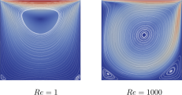
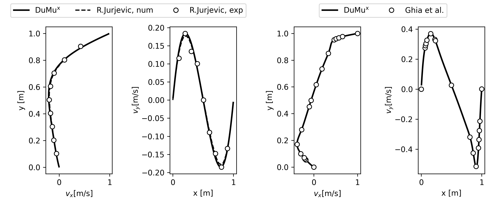

# Part 2: Post processing
In this part we first visualize our simulation result and then a verification and validation of the Navier-Stokes model implemented in DuMux is conducted.

## Step 1. Visualize results with Paraview

After building the executable, run it with `./example_ff_liddrivencavity params_re1.input` for the low Reynolds number case and
`./example_ff_liddrivencavity params_re1000.input` for the high Reynolds number case, respectively.

The result files (`.vtu` and `.pvd` files) can be opened with [ParaView](https://www.paraview.org/).
To obtain a visualization as shown in the introduction of this documented example, after loading the result file(s), choose `Filters`>`Common`>`Stream Tracer`.
For Re = 1 and Re = 1000, the result should look like this:

<figure>
    

        
        <figcaption> <b> Fig.1 </b> - Steady velocity field for Stokes (left) and Navier-Stokes flow for the lid-driven cavity problem.</figcaption>
    

</figure>

## Step 2. Compare our data with reference

The verification and validation are essential to guarantee the accuracy and credibility of the numerical models.
The velocity components for the velocity components at x = 0.5m and y = 0.5m are obtained as we run the test cases. 

We compare our results with the reference data reconstructed from [Ghia et al.](https://doi.org/10.1016/0021-9991(82)90058-4) and [Jurjević](https://doi.org/10.1002/(SICI)1097-0363(19991015)31:3<601::AID-FLD892>3.0.CO;2-Z).
For convenience, we placed the reference data in the folder named `reference_data`. For instance, the files `ghia_x.csv` and `ghia_y.csv` represent the reference vertical velocity component $`v_x`$ at x = 0.5 m and $`v_y`$ at y = 0.5 m for the scenario Re = 1000, respectively.

The other files in the folder `reference_data` represent the numerical and experimental data for the scenario Re = 1.
Assuming that you have `python3` with `matplotlib` installed on your device, this comparison process can be done via the script `run_and_plot.py`. Type `python3 run_and_plot.py` in the command and you should see the following plot:

<figure>
    

        
    

    <figcaption> <b> Fig.2 </b> - Horizontal and vertical velocity profiles at x = 0.5 m and y = 0.5 m for Re = 1 (left) and Re = 1000 (right).</figcaption>
</figure>

It can be seen that the numerical results calculated by DuMux are in good agreement with the reference data.
