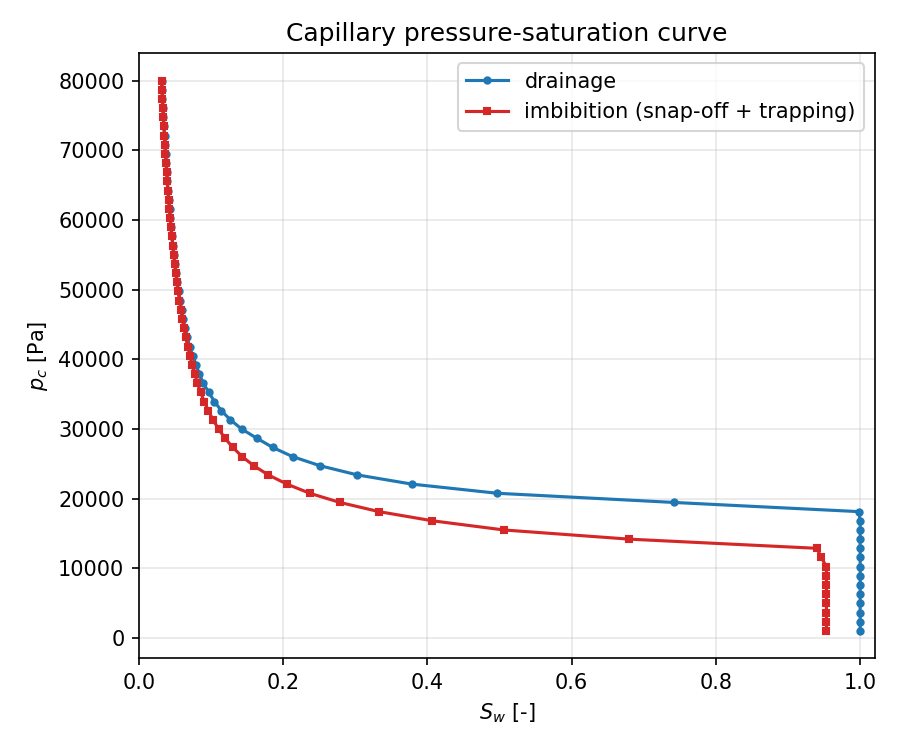
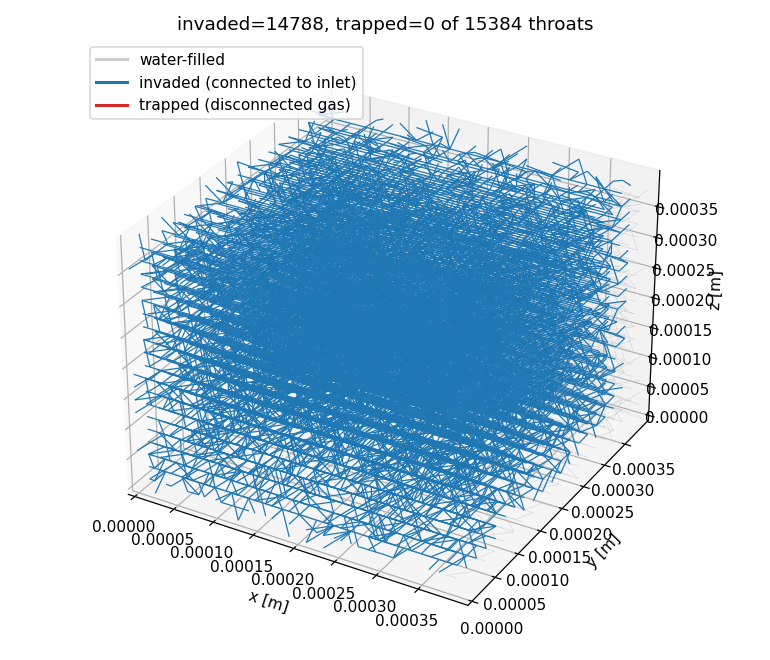
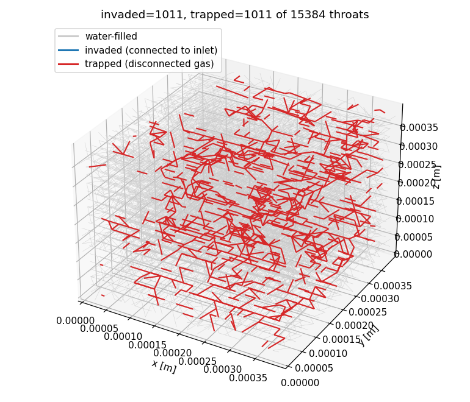
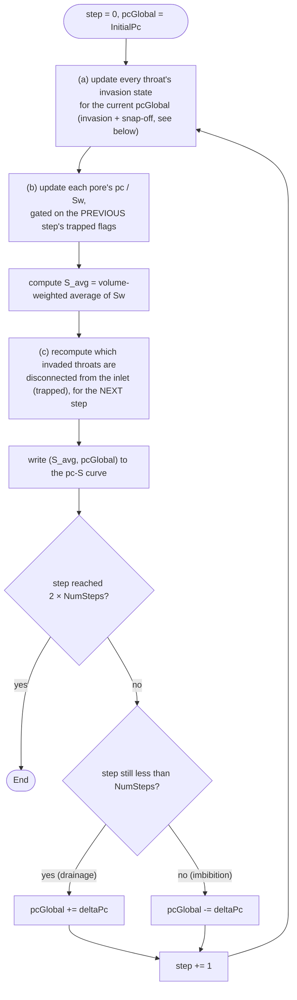
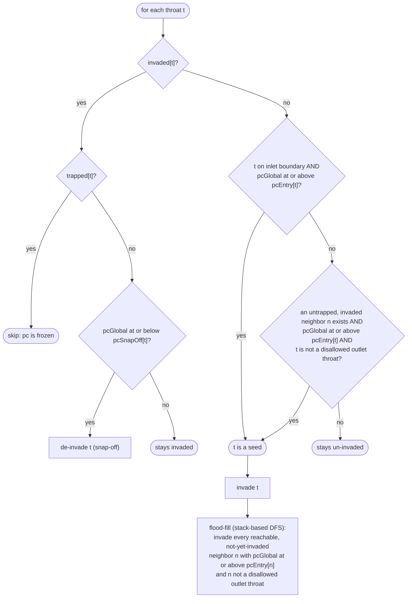
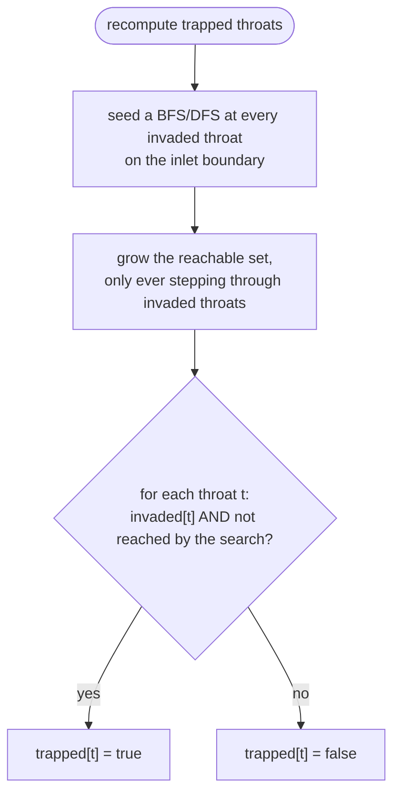

<!-- Important: This file has been automatically generated by generate_example_docs.py. Do not edit this file directly! -->

# Determining the capillary pressure-saturation curve of a pore network

__In this example, you will learn how to__

* simulate quasi-static drainage and imbibition on a pore network using invasion percolation with snap-off and non-wetting-phase trapping
* determine the capillary pressure-saturation ($`p_c`$-$`S_w`$) curve of the network, including the residual (trapped) non-wetting-phase saturation caused by hysteresis

__Result__.
Running the simulation produces a hysteresis loop: a drainage leg (increasing $`p_c`$, non-wetting phase invading from the inlet) followed by an imbibition leg (decreasing $`p_c`$, wetting phase retreating via snap-off). Because some of the invaded non-wetting phase becomes trapped -- disconnected from the inlet, and therefore unable to respond further to $`p_c`$ -- the imbibition leg does not retrace the drainage leg, but plateaus at a residual non-wetting-phase saturation, as shown in Fig. 1.

<figure>
    <center>
        
        <figcaption> <b> Fig.1 </b> - Capillary pressure-saturation curve: drainage (blue) and imbibition (red), showing hysteresis due to trapping. </figcaption>
    </center>
</figure>

The invasion/trapping state of every throat is also written to a `.vtp`/`.pvd` sequence that can be viewed with ParaView. Figures 2 and 3 show the network near the end of drainage and at the end of imbibition, respectively: blue throats are invaded and still connected to the inlet, red throats are invaded but **trapped** (disconnected from the inlet, so their local capillary pressure is frozen), and grey throats are still water-filled.

<figure>
    <center>
        
        <figcaption> <b> Fig.2 </b> - Network near the deepest drainage step: almost fully invaded, essentially no trapping yet. </figcaption>
    </center>
</figure>

<figure>
    <center>
        
        <figcaption> <b> Fig.3 </b> - Network at the end of the imbibition leg: red throats are non-wetting-phase clusters that became disconnected from the inlet (trapped) as neighboring throats snapped off, and are therefore excluded from further invasion/snap-off checks. </figcaption>
    </center>
</figure>

After building the executable, run the simulation with `./example_pnm_pcsaturation`. The resulting $`p_c`$-$`S_w`$ data is written to `pcsaturation_pnm_pc-s-curve.txt` and, if `Problem.PlotPcS = true` in `params.input` and Gnuplot is available, plotted directly.

__Table of contents__. This description is structured as follows:

[[_TOC_]]


## Problem setup

We consider a two-phase (wetting/non-wetting) drainage-imbibition problem within a randomly generated pore network of 20x20x20 pores, using the same [network-generation parameters](params.input) as the [pore-network upscaling example](../porenetwork_upscaling/README.md) (log-normally distributed pore radii, [randomly deleted throats](https://doi.org/10.1029/2010WR010180)). Instead of solving for viscous flow, this example assumes the **quasi-static, capillary-dominated limit**: no pressure gradients act within either phase, and a single scalar global capillary pressure $`p_{c,\text{global}}`$ is applied to the whole network at each step. The parameter `Problem.NumSteps` sets the number of discrete $`p_c`$ increments from `Problem.InitialPc` up to `Problem.FinalPc` (drainage), followed by the same number of decrements back down (imbibition).

## Mathematical and numerical model

At each capillary-pressure step, throat-by-throat invasion percolation decides whether the non-wetting phase can enter a not-yet-invaded throat, or whether the wetting phase reconnects behind an already-invaded throat (snap-off):

* **Drainage (invasion).** A throat is invaded once the global capillary pressure $`p_{c,\text{global}}`$ reaches its entry (threshold) capillary pressure $`p_{c,\text{entry}}`$, *and* the throat is topologically connected to the inlet through already-invaded throats (or sits on the inlet boundary itself).
* **Imbibition (snap-off).** An already-invaded throat is de-invaded once $`p_{c,\text{global}}`$ drops to or below its snap-off capillary pressure $`p_{c,\text{snapoff}}`$ (Roof snap-off, driven by wetting-phase corner films).
* **Trapping.** Snap-off can disconnect part of the invaded cluster from the inlet -- the only true non-wetting-phase pressure source in this model. Once disconnected, that cluster's local capillary pressure can no longer respond to changes in $`p_{c,\text{global}}`$: it is *trapped*, and is excluded from further invasion and snap-off checks. This is what produces the residual non-wetting-phase saturation and the hysteresis between the drainage and imbibition legs of the $`p_c`$-$`S_w`$ curve.

The saturation of each pore body is obtained by inverting its own local $`p_c`$-$`S_w`$ relation (a closed-form expression for "platonic body" pore shapes, see `dumux/material/fluidmatrixinteractions/porenetwork/pore/2p`) at whatever capillary pressure it currently carries, and pore-volume-averaging over the network gives the network-averaged saturation reported in the $`p_c`$-$`S_w`$ curve.

### Threshold capillary pressures

Both threshold pressures are Mayer-Stowe-Princen (MS-P)-type expressions evaluated from each throat's inscribed radius $`r`$, cross-sectional shape factor $`G`$ (drainage) or corner half-angle $`\beta`$ (snap-off), surface tension $`\sigma`$ and contact angle $`\theta`$; both are implemented in [`dumux/material/fluidmatrixinteractions/porenetwork/throat/thresholdcapillarypressures.hh`](../../dumux/material/fluidmatrixinteractions/porenetwork/throat/thresholdcapillarypressures.hh).

**Entry capillary pressure** (drainage). Following Mason and Morrow's MS-P theory as given in Eq. 11 of Rabbani et al. (2016)[^rabbani2016] (equivalently Eq. A-7 of Øren et al. (1998)[^oren1998]):

```math
D = \pi - 3\theta + 3\sin\theta\cos\theta - \frac{\cos^2\theta}{4G},
```
```math
F = \frac{1 + \sqrt{1 + \dfrac{4GD}{\cos^2\theta}}}{1 + 2\sqrt{\pi G}},
```
```math
p_{c,\text{entry}} = \frac{\sigma \cos\theta}{r}\left(1 + 2\sqrt{\pi G}\right) F .
```

**Snap-off capillary pressure** (imbibition), for a throat with regular cross section (equal corner half-angles $`\beta`$), Eq. 4.8 of Blunt (2017)[^blunt2017]:

```math
p_{c,\text{snapoff}} = \frac{\sigma}{r}\left(\cos\theta - \sin\theta \tan\beta\right),
```
valid only while $`\beta + \theta < \pi/2`$ (otherwise snap-off cannot occur and $`p_{c,\text{snapoff}} \to -\infty`$ is used so the throat never snaps off).

Symbols used above:

| Symbol | Meaning | Set from |
|---|---|---|
| $`p_{c,\text{entry}}`$ | entry (threshold) capillary pressure of a throat: the $`p_c`$ at which the non-wetting phase can first displace the wetting phase through it | computed, drives drainage |
| $`p_{c,\text{snapoff}}`$ | snap-off (threshold) capillary pressure of a throat: the $`p_c`$ at or below which the wetting phase reconnects and displaces the non-wetting phase back out | computed, drives imbibition |
| $`\sigma`$ | interfacial surface tension between the wetting and non-wetting phase | `Problem.SurfaceTension` |
| $`\theta`$ | contact angle | `Problem.ContactAngle` |
| $`r`$ | inscribed radius of the throat's cross section | pore-network geometry (`Grid` parameters) |
| $`G`$ | cross-sectional shape factor of the throat (area / perimeter$`^2`$; enters the entry-pressure formula only) | pore-network geometry, from `Grid.ThroatCrossSectionShape` |
| $`\beta`$ | corner half-angle of the throat's (regular) cross section (enters the snap-off formula only) | pore-network geometry, from `Grid.ThroatCrossSectionShape` |
| $`D`$, $`F`$ | dimensionless intermediate quantities of the MS-P entry-pressure formula (no independent physical meaning on their own) | computed from $`\theta`$, $`G`$ |

### Algorithm

**Workflow.** The driver loop in `main.cc` runs one capillary-pressure step at a time. Each step calls into `TwoPStatic` (`updateInvasionState`, then, after the saturation update, `updateTrappedState`) and then advances `pcGlobal` -- up while draining, back down while imbibing:



The ordering (a) &rarr; (b) &rarr; (c) matters: gating the saturation update (b) on the *previous* step's trapped flags lets a pore that becomes newly trapped in this very step still receive its last legitimate update before being frozen. Swapping (b) and (c) would silently discard that last increment.

**Per-throat invasion/snap-off decision.** This is the decision applied to every throat `t` at the current `pcGlobal`:



A trapped neighbor is deliberately excluded from the seed search (`Q5`): its non-wetting phase is disconnected from the inlet, so it must not be allowed to "restart" invasion elsewhere.

**Trapped-state connectivity search.** After the saturation update, every invaded throat that has lost its connected path back to the inlet is marked trapped:



[^rabbani2016]: Rabbani, H.S., Joekar-Niasar, V., Shokri, N. (2016). *Effects of intermediate wettability on entry capillary pressure in angular pores.* Journal of Colloid and Interface Science, 473, 34-43. Eq. 11. https://doi.org/10.1016/j.jcis.2016.03.053
[^oren1998]: Øren, P.E., Bakke, S., Arntzen, O.J. (1998). *Extending Predictive Capabilities to Network Models.* SPE Journal, 3(4), 324-336. Eq. A-7. https://doi.org/10.2118/52052-PA
[^blunt2017]: Blunt, M.J. (2017). *Multiphase Flow in Permeable Media: A Pore-Scale Perspective.* Cambridge University Press. Eq. 4.8. https://doi.org/10.1017/9781316145098

# Implementation & Post processing

In the following, we take a closer look at the source files for this example.

```
└── porenetwork_pcsaturation/
    ├── CMakeLists.txt          -> build system file
    ├── main.cc                 -> main program flow
    └── params.input            -> runtime parameters
```

## Part 1: Main program flow

| [:arrow_right: Click to continue with part 1 of the documentation](doc/main.md) |
|---:|


## Part 2: Postprocessing/Visualization of a pore-network model

| [:arrow_right: Click to continue with part 2 of the documentation](doc/postprocessing.md) |
|---:|
