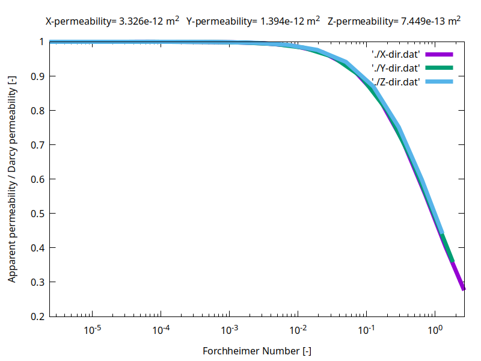
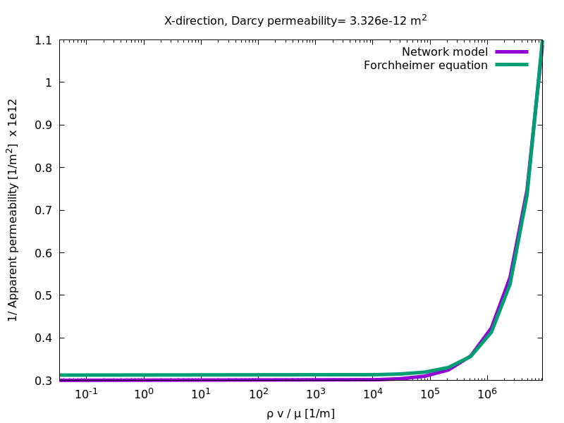

<!-- Important: This file has been automatically generated by generate_example_docs.py. Do not edit this file directly! -->

# Determining the upscaled properties of a pore network

__In this example, you will learn how to__

* simulate creeping/non-creeping flow on a pore network by applying a pressure gradient in a given direction
* perform an upscaling in order to determine the flow properties of the porous medium such as:
the Darcy (intrinsic) single-phase permeability $`\mathbf{K}`$ [m$`^2`$] using the creeping flow simulation, the Forchheimer permeability $`\mathbf{K}`$ [m$`^2`$] and the Forchheimer coefficient $`\mathbf{\beta}`$ [m$`^{-1}`$] using the non-creeping flow simulation.


__Result__.
As a result of the creeping flow simulation of this example, you will get the Darcy (intrinsic) single-phase permeabilities for each spatial direction requested by the user $`K_{xx}`$, $`K_{yy}`$, $`K_{zz}`$ [m$`^2`$] as a direct output on your terminal as the following example for the x-direction:

```
X-direction:
-- Darcy (intrinsic) permeability = 3.326e-12 m^2

```

The pressure distribution throughout the pore network as well as pore-network characteristics will also be written to a vtp output file that can be viewed with ParaView.
Figure 1 shows the pressure distribution within the pore network for the case of flow in x-direction.

<figure>
    <center>
        
        <figcaption> <b> Fig.1 </b> - Pressure distribution within the pore network for flow in x-direction. </figcaption>
    </center>
</figure>

The non-creeping flow simulation additionally gives you the Forchheimer permeability and coefficient for each spatial direction as in the example below for the x-direction:

```
X-direction:
-- Darcy (intrinsic) permeability = 3.326e-12 m^2
-- Forchheimer permeability = 3.196e-12 m^2
-- Forchheimer coefficient = 8.553e+04 m^-1
```

Furthermore, the ratio of apparent permeability to Darcy permeability is plotted versus the Forchheimer number for the spatial dimensions specified by the user, see Fig. 2.

<figure>
    <center>
        
        <figcaption> <b> Fig.2 </b> - Variation of apparent to Darcy permeability ratio versus Forchheimer number. </figcaption>
    </center>
</figure>

In addition, in Fig. 3, the inverse of the apparent permeability versus $`\varrho v /\mu`$ is plotted to compare the data from the pore-network model simulation and the data obtained by applying the Forchheimer equation using the Forchheimer permeability and coefficient. As evident in the figure, the Forchheimer equation is not able to accurately predict the flow behavior in the low-velocity regime.
<figure>
    <center>
        
        <figcaption> <b> Fig.3 </b> - Inverse of apparent permeability versus &#961v / &#956.
        </figcaption>
    </center>
</figure>

After building the executable, use the parameter `Problem.AssumeCreepingFlow` in the `params.input` file to select the flow regime to be simulated (i.e. set it to `true` for creeping flow and to `false` for non-creeping flow simulations). Then, run the simulation with `./example_pnm1p_upscaling`.

__Table of contents__. This description is structured as follows:

[[_TOC_]]


## Problem setup

We consider a single-phase problem within a randomly generated pore network of 20x20x20 pores cubed from which some of the pore throats were [deleted randomly](https://doi.org/10.1029/2010WR010180).
The inscribed pore body radii follow a truncated log-normal distribution.
To calculate the upscaled properties, $`10`$ pressure differences in the range of $`10`$ to $`10^{10}`$ Pa/m are applied sequentially in directions specified by the user by setting the parameter `Problem.Directions` in the `params.input` file, while all lateral sides are closed.
The resulting mass flow rates are then used to determine upscaled properties as described [later](doc/upscalinghelper.md).

## Mathematical and numerical model

In this example, we are using the single-phase pore-network model of DuMu<sup>x</sup>. We require mass conservation at each pore body $`i`$:

```math
 \sum_j Q_{ij} = 0,
```
where $`Q_{ij}`$ is the discrete volume flow rate in a throat connecting pore bodies $`i`$ and $`j`$. In case of creeping flow, the pore network model considers a Hagen-Poiseuille-type law to relate the volume flow from on pore body to another to discrete pressure drops $`\Delta p = p_i - p_j`$ between the pore bodies using throat conductance, $`g_{ij}`$.

```math
 Q_{ij} = g_{ij} (p_i - p_j),
```
or

```math
 (p_i - p_j) = Q_{ij} / g_{ij} .
```

In the simulation of non-creeping flow, to capture inertial effects in fluid flow, an extension of the Hagen-Poiseuille-type law which includes the expansion and contraction of the pore space when moving from a throat to a pore and vice versa.

```math
  (p_i - p_j) = Q_{ij} / g_{ij}  + (C_{exp} + C_{cont})Q^2,
```

where $`C_{exp}`$ and $`C_{cont}`$ are the expansion and the contraction coefficient, respectively.

# Implementation & Post processing

In the following, we take a closer look at the source files for this example.
We will discuss the different parts of the code in detail subsequently.

```
└── pnmpermeabilityupscaling/
    ├── CMakeLists.txt          -> build system file
    ├── main.cc                 -> main program flow
    ├── params.input            -> runtime parameters
    ├── properties.hh           -> compile time settings for the simulation
    ├── problem.hh              -> boundary & initial conditions for the simulation
    ├── spatialparams.hh        -> parameter distributions for the simulation
    └── upscalinghelper.hh      -> helper for the upscaling calculations and writing the results
```

## Part 1: Permeability upscaling with a pore-network model

| [:arrow_right: Click to continue with part 1 of the documentation](doc/problem.md) |
|---:|


## Part 2: Main program flow

| [:arrow_right: Click to continue with part 2 of the documentation](doc/main.md) |
|---:|


## Part 3: Upscaling

| [:arrow_right: Click to continue with part 3 of the documentation](doc/upscalinghelper.md) |
|---:|
