<!-- Important: This file has been automatically generated by generate_example_docs.py. Do not edit this file directly! -->

| [:arrow_left: Back to the main documentation](../README.md) | [:arrow_left: Go back to part 3](upscalinghelper.md) |
|---|---:|

# Part 4: Postprocessing/Visualization of a pore-network model

After compiling and running the code for a pore-network model, it is useful to visualize the results. Especially representing the pore bodies and throats by idealized geometries may help for interpreting the data (such as e.g. pressure distribution). Visulizing the pore-network and it's data can be done with the open source visualization application paraview. In the following we will show how to show the pore bodies and throats by spheres or boxes and tubes.

Before starting, make sure you loaded your results into paraview (_File_ -> _Open_ -> Select your .pvd or your *.vtp file).

## Change representation of pore bodies
### Representation as spheres

For showing the pore bodies as spheres, the _Glyph_ filter can be used:
1. Select your input file (.pvd or .vtp) in the Pipeline Browser 
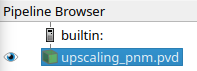
1. Choose the _Glyph_ filter either by clicking on the respective icon (the name will appear if the cursor is moving over it) 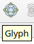 
or go to the _Filters_ -> _Common_ OR _Alphabetical_ -> _Glyph_
1. Within the _Properties_ panel, go to the _Glyph Source_ section and choose the _Glyph Type_ as _Spheres_. Once the _Spheres_ are selected as the representation type, parameters for the sphere will appear. Increase the _Theta Resolution_ and _Phi Resolution_ to e.g. 15 (such that the sphere will be more smooth as it is approximated as polygons).
2. In the _Scale_ section, you can modify how large the spheres should be displayed. 
   - For showing all spheres with the same size, choose for the _Scale Array_ -> _No scale array_, then adapt the _Scale factor_ by clicking on the icon  for resetting the value using current data values. You can also give a concrete value, but make sure it is not too small and not too large. Otherwise you won't be able to see something.
   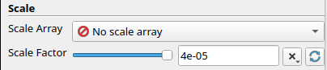
   - For showing the actual size of the pore bodies, choose e.g. _poreInscribedRadius_ as the _Scale Array_. Again choose to _Scale Factor_ appropriate (easiest way is to click on the respective icon as described above).
   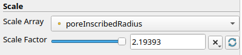
3. Within the section _Masking_, select under _Glyph Mode_ to apply the sphere filter to _All Points_. 
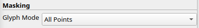
1. Apply this filter with the properties defined before by clicking _Apply_. 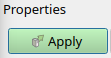

This should lead to something like the following:
<figure>
    

        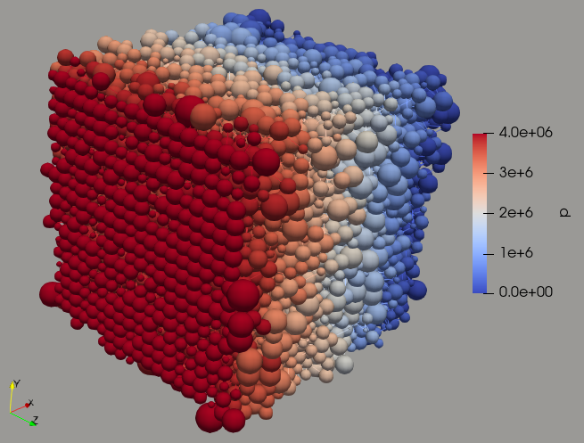
        <figcaption> <b> Fig.1 </b> - Visualized pore-network with represented pore bodies as spheres. The size of the spheres is scaled by the pore inscribed radius.
        </figcaption>
    

</figure>

### Representation as cubes/boxes
1. (see 1. from [above](#representation-as-spheres))
2. (see 2. from [above](#representation-as-spheres))
3. Within the _Properties_ panel, go to the _Glyph Source_ section and choose the _Glyph Type_ as _Box_.
4. In the _Scale_ section, you can modify how large the cubes should be displayed. 
   - For showing all pore bodies with the same size, choose for the _Scale Array_ -> _No scale array_, then adapt the _Scale factor_ as described [above](#representation-as-spheres).
   - For showing the actual size of the pore bodies, choose e.g. _poreInscribedRadius_ as the _Scale Array_. Again choose to _Scale Factor_ appropriate.
5. Continue for step 5 and 6 from [above](#representation-as-spheres)
<figure>
    

        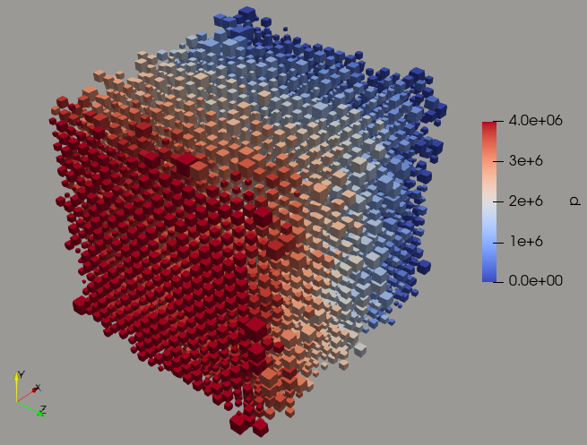
        <figcaption> <b> Fig.2 </b> - Visualized pore-network with represented pore bodies as cubes (_Box_ filter). The size of the spheres is scaled by the pore inscribed radius.
        </figcaption>
    

</figure>

## Change representation of pore throats
### Representation as cylinders/tubes
For showing the pore throats as cylinders instead of lines, we use apply the tube filter in the following.
1. Select your input file (.pvd or .vtp) in the Pipeline Browser 

1. Choose the _Tube_ filter by going to the _Filters_ -> _Alphabetical_ -> _Tube_
2. In the _Properties_ panel: increase the _Number of Sides_ to e.g. 10 for a smoother reprentation of the tubes. 
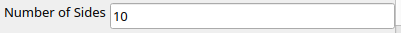
1. Leave everything else and click _Apply_.

Just showing the pore throats of the network will look e.g. like
<figure>
    

        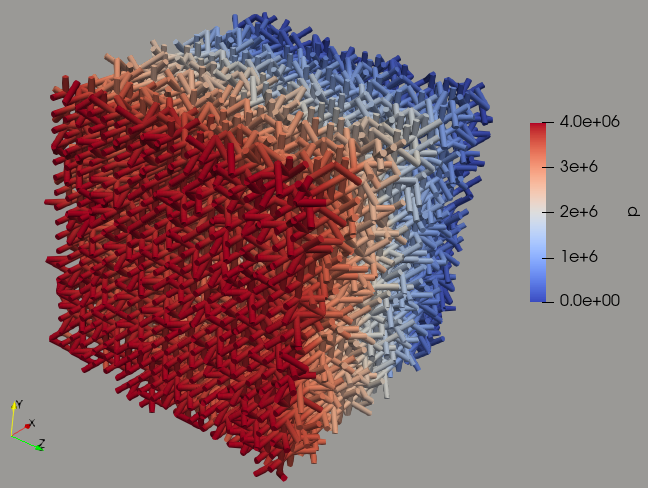
        <figcaption> <b> Fig.3 </b> - Visualized pore-network only showing the pore throats represented as tubes.
        </figcaption>
    

</figure>

>Note: The size of the tubes can only be scaled by _Point Data_ (e.g. pore inscribed radius), but not by cell data as e.g. throat inscribed radius. To do so, the cell data first has be to transformed to point data. This can be done with the filter _CellDatatoPointData_. Subsequently applying the _Tube_ filter to the applyed _CellDatatoPointData_ filter (select _CellDatatoPointData_ in the _Pipeline Browser_ before using the _Tube_ filter). 
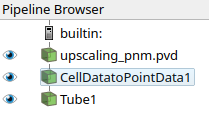

| [:arrow_left: Back to the main documentation](../README.md) | [:arrow_left: Go back to part 3](upscalinghelper.md) |
|---|---:|

