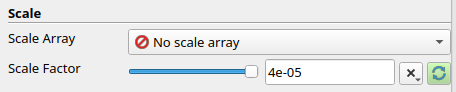

<!-- Important: This file has been automatically generated by generate_example_docs.py. Do not edit this file directly! -->


| [:arrow_left: Back to the main documentation](../README.md) | [:arrow_left: Go back to part 3](upscalinghelper.md) |
|---|---:|

# Part 4: Postprocessing/Visualization of a pore-network model

After compiling and running the code for a pore-network model, it is useful to visualize the results. Especially representing the pore bodies and throats by idealized geometries may help for interpreting the data (such as, e.g., pressure distribution). Visualizing the pore network and it's data can be done with the open source visualization application ParaView. In the following we will show how to show the pore bodies and throats by spheres or boxes and tubes.

Before starting, make sure you loaded your results into ParaView. For loading your results, go to
`File` -> `Open` -> Select your .pvd or your *.vtp file (e.g., `/build-cmake/examples/porenetwork_upscaling/upscaling_pnm.pvd`). You can also open ParaView from the terminal and directly load your results via the command:
```bash
paraview build-cmake/examples/porenetwork_upscaling/upscaling_pnm-00000.vtp &
```

> Note: This description of how to postprocess the results with ParaView relies on the version `ParaView 5.10.0-RC1`. It is as well tested with `ParaView 5.11.0`. For other ParaView versions the procedure is similar, however it can be that it slightly deviates.

## Table of content
1. [Change representation of pore bodies](#change-representation-of-pore-bodies)
    1.1 [Representation as spheres](#representation-as-spheres)
    1.2 [Representation as cubes/boxes](#representation-as-cubesboxes)
2. [Change representation of pore throats](#change-representation-of-pore-throats)
    2.1 [Representation as lines or cylinders/tubes with fixed radii](#representation-as-lines-or-cylinderstubes-with-fixed-radii)
    2.2 [Representation as cylinders/tubes with scaled radii](#representation-as-cylinderstubes-with-scaled-radii)

## Change representation of pore bodies
### Representation as spheres

To show the pore bodies as spheres, the `Glyph` filter can be used:
1. Select your input file (.pvd or .vtp) in the Pipeline Browser by clicking on it (it should appear blue) <br>

2. Choose the `Glyph` filter either by clicking on the respective icon (the name will appear if the cursor is moving over it)  
or go to the `Filters` -> `Common` OR `Alphabetical` -> `Glyph`
3. Within the `Properties` panel, go to the `Glyph Source` section and choose the `Glyph Type` as `Sphere`. Once `Sphere` is selected as the representation type, parameters for the sphere will appear. Increase the `Theta Resolution` and `Phi Resolution` to, e.g., 15 (such that the sphere will be more smooth as it is approximated as polygons). <br> 
4. In the `Scale` section, you can modify how large the spheres should be displayed. 
   - To show all spheres with the same size, choose for the `Scale Array` -> `No scale array`, then adapt the `Scale factor` by clicking on the icon  for resetting the value using current data values. You can also give a concrete value, but make sure it is not too small and not too large. Otherwise you won't be able to see something.<br>
   
   - To visualize the pore bodies proportionally to their actual size, choose, e.g., `poreInscribedRadius` as the `Scale Array`. Again choose to `Scale Factor` appropriate (easiest way is to click on the respective icon as described above to get a first reasonable factor). You can adapt this then manually or choose the `x` icon to multiply the initial factor e.g. by `0.5`.<br>
   
5. Within the section `Masking`, under `Glyph Mode`, select `All Points` to apply the sphere filter to all pore bodies. <br>

6. Apply this filter with the properties defined before by clicking `Apply`. <br>


This should lead to something like the following:
<figure>
    <center>
        
        <figcaption> <b> Fig.1 </b> - Visualized pore-network with represented pore bodies as spheres. The size of the spheres is scaled by the pore inscribed radius.
        </figcaption>
    </center>
</figure>

### Representation as cubes/boxes
The only difference with [above](#representation-as-spheres) is in the step 3. 

After doing steps 1 and 2 in [above](#representation-as-spheres), for step 3, within the `Properties` panel, go to the `Glyph Source` section and choose the `Glyph Type` as `Box`. Then, do the steps 4 and 5 in [above](#representation-as-spheres).

<figure>
    <center>
        
        <figcaption> <b> Fig.2 </b> - Visualized pore-network with represented pore bodies as cubes (`Box` filter). The size of the spheres is scaled by the pore inscribed radius with a `Scale Factor` of `1.09697`.
        </figcaption>
    </center>
</figure>

## Change representation of pore throats
### Representation as lines or cylinders/tubes with a fixed radius
We can represent the throats with a uniform fixed radius either through thick lines or through tubes with a fixed radius.
**Option 1 - lines:**
To use thick lines, we do the following:
1. Select your input file (.pvd or .vtp) in the Pipeline Browser. <br>

2. Select in the `Properties` panel within the section `Styling`, to `Render Lines As Tubes` and choose the `Line Width` as e.g. `10`. Click on `Apply`. <br>


**Option 2 - tubes:**
To show the pore throats as cylinders instead of lines, we use the tube filter in the following.
1. Select your input file (.pvd or .vtp) in the Pipeline Browser.
2. Choose the `Tube` filter by going to the `Filters` -> `Alphabetical` -> `Tube`
3. In the `Properties` panel: increase the `Number of Sides` to, e.g., 10 for a smoother representation of the tubes. <br>

4. Leave everything else and click `Apply`.

Just showing the pore throats of the network looks like the following:
<figure>
    <center>
        
        <figcaption> <b> Fig.3 </b> - Visualized pore-network only showing the pore throats represented as tubes. All tubes have the same radius.
        </figcaption>
    </center>
</figure>

>Note: When applying the tubes filter directly to the `.pvd` or `.vtp` files, the size of the tubes can only be scaled by `Point Data` (e.g., pore inscribed radius), but not by cell data, e.g., throat inscribed radius. To do so, follow the next section. 

### Representation as cylinders/tubes with scaled radii
To be able to scale the tubes based on the throat inscribes radius, the cell data first has to be transformed to point data. This can be done in the following steps:

1. Select your input file (.pvd or .vtp) in the Pipeline Browser. (see above)
2. Apply the `Shrink` filter: Go to `Filters` -> `Alphabetical` -> `Shrink` and choose in the `Properties` panel a `Shrink Factor` of `1`. Click `Apply`.
3. Use the filter `Cell Data to Point Data` to transform the cell data to point data: Select the `Shrink1` in your Pipeline Browser and choose `Filters` -> `Alphabetical` -> `Cell Data to Point Data`. Leave the everything in the properties panel as suggested and click on `Apply`.
4. Click on  `CelltoPointData1` within your Pipeline Browser and choose the `Extract Surface` filter (as done for the previous filters). `Apply` this again.
5. Now choose `ExtractSurface1` within the pipeline browser and choose the filter `Tube`. Within the `Properties` section, choose as `Scalars` the `throatInscribedRadius`, set the `Radius` to, e.g., `5e-07` and `Vary Radius` to `By Scalar`. As `Coloring` you can, e.g., choose to visualize the pressure `p`. After applying this (click `Apply`), the tubes should be scaled with the radius of the throats and colored according to the pressure. 

The pipeline browser and the properties panel should in the end look something like this: <br> 


<figure>
    <center>
        
        <figcaption> <b> Fig.4 </b> - Pore network showing the pore throats, which are represented as tubes. The radii of the tubes are scaled with the throat inscribed radius.
        </figcaption>
    </center>
</figure>

| [:arrow_left: Back to the main documentation](../README.md) | [:arrow_left: Go back to part 3](upscalinghelper.md) |
|---|---:|

