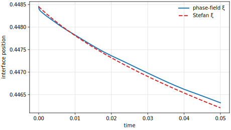

# Stefan Evaporation Test

This test is the Case A verification draft from `BENCHMARKS_TWOP.md`: a
planar liquid-gas phase-field evaporation problem compared to the
sharp-interface Stefan limit.

The implementation is intentionally small and one-dimensional in spirit.  It
uses a thin 2D strip so it can reuse the existing two-phase Navier-Stokes mass
model with vapor transport and the same AMR/data-transfer machinery as the
pore-scale demonstrator.

## Setup

The domain is a thin strip

$$
\Omega = [0, L] \times [0, H]
$$

with $L = 1.0$ and $H = 0.05$ in `params.input`. The liquid occupies the left
part of the domain and the gas occupies the right part. The parameter
`Problem.InterfacePosition` is the virtual sharp-interface origin $x_i(0)$ of
the similarity solution. The numerical initial condition is evaluated at
$t_0 =$ `Problem.AnalyticTimeOffset` to avoid the singular start.

The phase-field sign convention is

$$
\phi = +1 \quad \text{liquid}, \qquad
\phi = -1 \quad \text{gas},
$$

$$
\alpha_\ell = \frac{1+\phi}{2}, \qquad
\alpha_g = \frac{1-\phi}{2}.
$$

The initial phase field is

$$
\phi(x,0) =
\tanh\!\left(
    \frac{x_i(t_0)-x}{\sqrt{2}\,\varepsilon}
\right),
$$

where $\varepsilon =$ `Problem.InterfaceThickness`.
The initial vapor concentration is initialized with the analytical Stefan
profile at the same $t_0$.

The left boundary pins liquid ($\phi = +1$). The right boundary pins gas
($\phi = -1$) and imposes the far-field vapor concentration
$c_v =$ `Problem.VaporFarFieldConc`. Top and bottom are no-flux boundaries. The
momentum block is kept at rest with homogeneous Dirichlet velocity everywhere,
so the test isolates diffusion-limited evaporation rather than hydrodynamic
motion.

## Equations

The full two-phase free-flow model is a Navier-Stokes/Cahn-Hilliard system. In
the momentum block the mixture density and viscosity are interpolated from the
phase field,

$$
\rho(\phi)
= \frac{1+\phi}{2}\rho_\ell
+ \frac{1-\phi}{2}\rho_g,
\qquad
\eta(\phi)
= \frac{1+\phi}{2}\eta_\ell
+ \frac{1-\phi}{2}\eta_g.
$$

The incompressible Navier-Stokes equations in convective form are

$$
\nabla \cdot \mathbf{u} = 0,
$$

$$
\rho(\phi)
\left(
    \partial_t\mathbf{u}
    + (\mathbf{u}\cdot\nabla)\mathbf{u}
\right)
=
\nabla \cdot \left(
    \eta(\phi)(\nabla\mathbf{u} + \nabla\mathbf{u}^\mathsf{T})
\right)
- \nabla p
+ \rho(\phi)\mathbf{g}.
$$

For this Stefan verification, `EnableInertiaTerms = false`,
`EnableGravity = false`, and all velocity boundaries are homogeneous
Dirichlet. No capillary/Korteweg momentum force is assembled in this test:
`StefanEvaporationProblem::interfaceFlux()` returns zero. The momentum block
therefore reduces to the homogeneous Stokes problem

$$
\nabla \cdot \mathbf{u} = 0,
\qquad
0 =
\nabla \cdot \left(
    \eta(\phi)(\nabla\mathbf{u} + \nabla\mathbf{u}^\mathsf{T})
\right)
- \nabla p,
\qquad
\mathbf{u}|_{\partial\Omega} = 0.
$$

This gives $\mathbf{u}=0$ up to solver tolerance and deliberately isolates the
diffusion-limited evaporation model from hydrodynamic motion.

The mass model solves the primary variables $(p, \phi, \mu, c_v)$, where
$c_v$ is the vapor mass concentration in the gas phase.

The phase-field equation is

$$
\partial_t \phi
+ \nabla \cdot (\mathbf{u}\phi)
- \nabla \cdot (M \nabla \mu)
= -\frac{2\dot{m}}{\rho_\ell}.
$$

The factor 2 converts liquid volume-fraction loss into phase-field loss because
$\alpha_\ell = (1+\phi)/2$.

The chemical-potential equation is

$$
\mu
- \frac{\gamma}{\varepsilon}\phi(\phi^2 - 1)
+ \gamma\varepsilon \Delta \phi
= 0
$$

with

$$
\gamma = \frac{3\sigma}{2\sqrt{2}},
$$

so that the diffuse-interface surface energy recovers the requested surface
tension $\sigma =$ `Problem.SurfaceTension`.

The vapor equation is

$$
\partial_t c_v
+ \nabla \cdot (\mathbf{u}c_v)
- \nabla \cdot (D_\mathrm{eff}\nabla c_v)
= \dot{m}
$$

with gas-weighted diffusivity in the model residual

$$
D_\mathrm{eff} = D_v \max(0, \alpha_g).
$$

The diffuse evaporation source is concentrated at the interface:

$$
\dot{m}
= k_\mathrm{evap}\max(0, c_\mathrm{sat}-c_v)\,\delta_\varepsilon(\phi),
$$

$$
\delta_\varepsilon(\phi)
= \frac{\max(0, 1-\phi^2)}{2\sqrt{2}\,\varepsilon}.
$$

The classical diffusion-limited Stefan problem is the large-$k_\mathrm{evap}$,
small-$\varepsilon$ limit where the vapor concentration is pinned to
$c_\mathrm{sat}$ at the interface.

## Analytical Reference

The reference is the planar, diffusion-limited Stefan solution for a
semi-infinite gas region. In the code's sign convention the evaporating
interface moves left:

$$
x_i(t) = x_i(0) - 2\lambda\sqrt{D_v t}.
$$

The similarity parameter $\lambda$ is computed in `problem.hh` from

$$
\lambda\left(1+\operatorname{erf}(\lambda)\right)\exp(\lambda^2)
= \frac{c_\mathrm{sat}-c_\infty}{\rho_\ell\sqrt{\pi}},
$$

where $c_\infty =$ `Problem.VaporFarFieldConc`.

The corresponding vapor profile in the gas is

$$
c_v(x,t)
= c_\infty
+ (c_\mathrm{sat}-c_\infty)
  \frac{
    1-\operatorname{erf}\!\left(
        \frac{x-x_i(0)}{2\sqrt{D_v t}}
    \right)
  }{
    1+\operatorname{erf}(\lambda)
  }.
$$

The analytical evaporation mass flux per unit interface area is

$$
j(t) = \rho_\ell \lambda \sqrt{\frac{D_v}{t}}.
$$

The formula is singular at $t = 0$; the implementation reports zero analytical
mass flux there.

## Curved-Interface Extension

This test is intentionally planar, so the interface curvature is
$\kappa = 0$. Since the momentum problem is pinned to
$\mathbf{u}=0$, the relevant curved-interface follow-up is not the
Frank cylinder/sphere solution. A better reduced analytical target for this
evaporation path is the Stefan-tube, or slit-capillary, solution.

For a 2D slit capillary of height $H$, with a circular-arc meniscus at distance
$\ell(t)$ from the opening, the cross-section-averaged solution applies when

$$
\ell \gg H,
$$

so vapor transport is essentially axial, quasi-steady, and isothermal. If the
meniscus keeps a circular-arc shape and a constant contact angle, the
classical Stefan-diffusion tube law gives

$$
\ell\dot{\ell} = K,
\qquad
\ell(t)^2 = \ell_0^2 + 2Kt,
$$

with

$$
K =
\frac{D M_v P}{\rho_\ell R T}
\ln\!\left(
    \frac{1-y_\infty}{1-y_i}
\right).
$$

Here $y_i$ is the vapor mole fraction at the meniscus and $y_\infty$ is the
vapor mole fraction at the capillary opening. The current test uses a Fickian
vapor balance with $\mathbf{u}=0$, so the matching reduced reference is the
dilute limit

$$
K_\mathrm{Fick} =
\frac{D M_v P}{\rho_\ell R T}
\left(y_i-y_\infty\right),
$$

unless a Stefan-flow or Maxwell-Stefan vapor correction is added. Meniscus
curvature can enter through Kelvin equilibrium,

$$
y_i =
\frac{p_\mathrm{sat}^0(T_i)}{P}
\exp\!\left(
    \frac{\gamma V_m\kappa}{R T_i}
\right),
\qquad
|\kappa| = \frac{2|\cos\theta|}{H},
$$

with signed curvature; a concave wetting meniscus reduces the equilibrium
vapor pressure.

This is a global, cross-section-averaged reference. In the full 2D problem,

$$
\nabla^2 y = 0,
\qquad
j(s) \propto -\partial_n y,
\qquad
\rho_\ell V_n(s) = j(s),
$$

the flux generally varies along the curved meniscus, often most strongly near
the contact lines. A rigidly translating circular arc therefore cannot usually
satisfy the local Stefan condition pointwise. That makes the slit-capillary
law suitable as a reduced QoI benchmark for $\ell(t)$ and the global evaporation
rate, while a fully local curved-meniscus benchmark needs numerical or
semi-analytical reference data. See the Stefan-tube discussion by
[Mitrovic](https://www.sciencedirect.com/science/article/abs/pii/S0009250912002047)
and numerical 2D treatments such as
[Mills and Chang](https://www.sciencedirect.com/science/article/abs/pii/S0009250912007099).

## Output and QoIs

The executable writes VTK output for the numerical fields and a CSV file named

```text
test_ff_stokes_2p_stefan_qoi.csv
```

with columns

```text
time,xi,xi_stefan,xi_error,xi_time_l2,evap_rate,evap_rate_stefan,liquid_mass,vapor_l2_rel
```

Here $\xi$ is reconstructed from the liquid volume,

$$
\xi = x_\mathrm{min} + \frac{1}{H}\int_\Omega \alpha_\ell\,dV.
$$

The `vapor_l2_rel` column is the relative L2 error of the vapor concentration in the
gas region against the analytical profile.

## Result and Convergence

The comparison to the Stefan solution is a convergence check, not a parameter
fit.  The evaporation coefficient is kept fixed at
$k_\mathrm{evap}=500$ so the diffuse source is close to the
diffusion-limited Stefan boundary condition. The mobility is scaled as
$M = 10^{-3}\varepsilon$, and the mesh is refined together with the
diffuse-interface width. The figure shows the finest row of the table.



A short run to $t=0.05$ gives:

| $\varepsilon$ | $h_\mathrm{min}$ | $M$ | $\xi$ time-L2 | $\xi(t)-\xi_\mathrm{Stefan}(t)$ | vapor rel. L2 |
| ---: | ---: | ---: | ---: | ---: | ---: |
| $2.0\times10^{-2}$ | $1.25\times10^{-3}$ | $2.0\times10^{-5}$ | $3.50\times10^{-3}$ | $-2.92\times10^{-3}$ | $2.54\times10^{-1}$ |
| $1.0\times10^{-2}$ | $6.25\times10^{-4}$ | $1.0\times10^{-5}$ | $1.12\times10^{-3}$ | $-6.69\times10^{-4}$ | $1.00\times10^{-1}$ |
| $5.0\times10^{-3}$ | $3.125\times10^{-4}$ | $5.0\times10^{-6}$ | $2.82\times10^{-4}$ | $1.89\times10^{-5}$ | $3.37\times10^{-2}$ |
| $2.5\times10^{-3}$ | $1.5625\times10^{-4}$ | $2.5\times10^{-6}$ | $8.97\times10^{-5}$ | $1.20\times10^{-4}$ | $8.17\times10^{-3}$ |
| $1.25\times10^{-3}$ | $7.8125\times10^{-5}$ | $1.25\times10^{-6}$ | $6.86\times10^{-5}$ | $1.12\times10^{-4}$ | $3.26\times10^{-3}$ |

The first two rows are dominated by the finite diffuse-interface/source width.
The last two rows show the expected decay toward the Stefan limit once both
$h$ and $\varepsilon$ are small enough.

## Running

From the build directory:

```bash
cmake --build . --target test_ff_stokes_2p_stefan
./test/freeflow/navierstokes/2p/stefan/test_ff_stokes_2p_stefan \
  test/freeflow/navierstokes/2p/stefan/params.input
```

From the repository root, the convergence table can be reproduced with:

```bash
python3 test/freeflow/navierstokes/2p/stefan/run_convergence.py
```

The default parameters are non-dimensional and chosen to make interface
recession visible in a short run. For a physical water-air verification, adjust
`Density1`, `VaporDiffusivity`, `VaporSatConc`, `VaporFarFieldConc`, and the
time scale together, then run the intended `eps` and mesh-size convergence
study.
