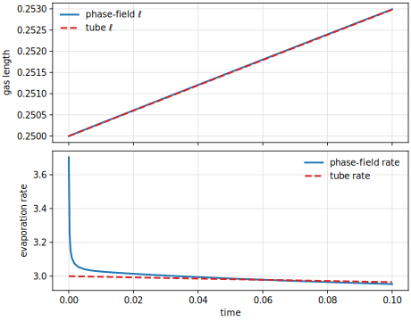
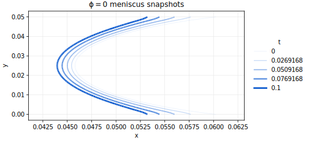

# Stefan-Tube Evaporation Test

This test is a reduced curved-interface follow-up to the planar Stefan case.
It verifies the evaporation kernel against the cross-section-averaged
Stefan-tube law in a short-reservoir slit capillary, while solving a one-way
coupled Stokes response.

## Setup

The domain is a 2D slit

$$
\Omega = [0,L]\times[0,H],
$$

with the capillary opening at $x=L$. Liquid occupies the left part of the
domain and gas occupies the right part. The meniscus is initialized as a
circular arc with mean position

$$
x_i(0)=L-\ell_0,
$$

where $\ell_0 =$ `Problem.InitialGasLength`. The phase-field sign convention is

$$
\phi = +1 \quad \text{liquid}, \qquad
\phi = -1 \quad \text{gas}.
$$

The contact angle $\theta$ is prescribed as a wall wetting parameter and is
measured through the liquid phase. It is not determined by the reduced
Stefan-tube solution. For a circular arc in a slit, the curvature magnitude is

$$
|\kappa| = \frac{2|\cos\theta|}{H}.
$$

For the present convention, liquid on the left and gas on the right,
$\theta < 90^\circ$ means that the contact lines are ahead of the centerline.
The top and bottom walls use the diffuse-interface wetting condition

$$
\gamma_\varepsilon \nabla\phi\cdot n
=
-\tilde{\gamma}\cos\theta\,\frac{3}{4}\left(1-\phi^2\right),
\qquad
\gamma_\varepsilon = \tilde{\gamma}\varepsilon,
$$

with $\phi=+1$ in the liquid. For $\theta=90^\circ$ this reduces to the
natural no-wetting condition $\nabla\phi\cdot n=0$.

The arc is shifted so its cross-section average is exactly $x_i(t)$; therefore
the liquid volume gives the reduced gas length

$$
\ell_h(t) = L - \frac{1}{H}\int_\Omega \alpha_\ell\,dV,
\qquad
\alpha_\ell = \frac{1+\phi}{2}.
$$

The default geometry uses $L=0.30$, $H=0.05$, and $\ell_0=0.25$, so only a
short liquid reservoir remains on the left. Inertia and gravity are off. The
phase field is advected with zero velocity, while the Stokes problem is solved
one-way with a capillary body force $\mu\nabla\phi$; the right boundary is the
open outflow and the remaining velocity boundaries are no-slip. Thus the
benchmark tests diffusion-limited phase change with a curved diffuse interface
while still exposing the induced Stokes response.

## Reduced Reference

For $\ell \gg H$, quasi-steady isothermal vapor transport is essentially axial.
In the Fickian form used by the current vapor equation,

$$
\ell\dot{\ell} = K,
\qquad
\ell(t)^2 = \ell_0^2 + 2Kt,
$$

with

$$
K = \frac{D_v(c_i-c_\infty)}{\rho_\ell}.
$$

Here $c_i$ is the vapor concentration at the meniscus and $c_\infty$ is the
concentration at the opening. The analytical evaporation flux per unit slit
height is

$$
j(t) = \rho_\ell\dot{\ell}
     = \frac{\rho_\ell K}{\ell(t)}
     = \frac{D_v(c_i-c_\infty)}{\ell(t)}.
$$

The classical Stefan-diffusion tube law can be used instead once the vapor
transport model includes the Stefan-flow or Maxwell-Stefan correction:

$$
K =
\frac{D M_v P}{\rho_\ell R T}
\ln\!\left(
    \frac{1-y_\infty}{1-y_i}
\right).
$$

Curvature can be included through Kelvin equilibrium,

$$
y_i =
\frac{p_\mathrm{sat}^0(T_i)}{P}
\exp\!\left(
    \frac{\gamma V_m\kappa}{R T_i}
\right),
$$

or, in this concentration-based test, through the scalar parameter
`Problem.KelvinFactor` multiplying `Problem.VaporSatConc`.

The tube law assumes the vapor field is quasi-steady, i.e. that it re-linearizes
instantaneously as the meniscus recedes. That assumption is only valid when the
diffusive relaxation time $\ell^2/D_v$ is much shorter than the recession time
$\ell/\dot\ell$. Since $\ell\dot\ell=K$, that ratio reduces to exactly the
evaporation (Stefan) number

$$
\mathrm{Sc} = \frac{K}{D_v} = \frac{c_i-c_\infty}{\rho_\ell},
$$

which must be $\ll 1$. `Problem.Density1` and `Problem.VaporDiffusivity` are chosen
together in `params.input`/`params_3d.input` so that $K$ (and hence the $\ell(t)$
trajectory) stays fixed while $\mathrm{Sc}\approx 1.5\times10^{-3}$; the earlier,
more concentrated defaults had $\mathrm{Sc}=0.75$ (order 1) and reproduced only
~83% of the tube-law rate even in the $\varepsilon,h\to0$ limit, because the
simulated, genuinely transient concentration field was compared against a
reference that isn't quasi-steady at that $\mathrm{Sc}$. `Problem.EvaporationRateCoeff`
is scaled up by the same factor as `VaporDiffusivity` for a parallel reason: the
interfacial reaction resistance $\sim 1/k_\mathrm{evap}$ only stays negligible
relative to the diffusive resistance $\sim\ell/D_v$ if $k_\mathrm{evap}\ell/D_v$ is
held fixed; pushing $\mathrm{Sc}$ down via $D_v$ alone eventually makes the finite
reaction rate the new bottleneck instead.

This is a global reduced reference. In the full 2D problem,

$$
\nabla^2 y = 0,
\qquad
j(s)\propto -\partial_n y,
\qquad
\rho_\ell V_n(s)=j(s),
$$

the flux varies along the curved meniscus. A circular arc generally cannot
translate rigidly while satisfying the local Stefan condition pointwise. The
QoI here is therefore the reduced length $\ell(t)$ and the global evaporation
rate.

## Output

The executable writes VTK output and a CSV file named

```text
test_ff_stokes_2p_stefantube_qoi.csv
```

with columns

```text
time,ell,ell_tube,ell_error,ell_time_l2,evap_rate,evap_rate_tube,liquid_mass,vapor_l2_rel
```

The `vapor_l2_rel` column compares the gas concentration against the reduced
axial linear profile.

## Result

A reference check on the shortened default geometry to $t=0.1$ with the shipped
`params.input` defaults ($\varepsilon=2.5\times10^{-3}$, $h_\mathrm{min}=6.25\times10^{-4}$,
mobility $M=10^{-3}\varepsilon$, $\theta=30^\circ$, $\mathrm{Sc}\approx1.5\times10^{-3}$,
`VaporAdvectionVelocityScale=0`) gives:



| $t$ | $\ell_h$ | $\ell_\mathrm{tube}$ | error | $\ell$ time-L2 | rate | tube rate | rate ratio |
| ---: | ---: | ---: | ---: | ---: | ---: | ---: | ---: |
| $10^{-4}$ | $0.250003$ | $0.250003$ | $-2.72\times10^{-7}$ | $2.72\times10^{-7}$ | $3.519$ | $3.000$ | $1.173$ |
| $2.49\times10^{-2}$ | $0.250755$ | $0.250746$ | $8.14\times10^{-6}$ | $5.78\times10^{-6}$ | $3.009$ | $2.991$ | $1.006$ |
| $4.89\times10^{-2}$ | $0.251474$ | $0.251463$ | $1.05\times10^{-5}$ | $7.94\times10^{-6}$ | $2.987$ | $2.983$ | $1.001$ |
| $7.49\times10^{-2}$ | $0.252248$ | $0.252237$ | $1.02\times10^{-5}$ | $8.93\times10^{-6}$ | $2.969$ | $2.973$ | $0.998$ |
| $10^{-1}$ | $0.252990$ | $0.252982$ | $7.96\times10^{-6}$ | $8.98\times10^{-6}$ | $2.953$ | $2.965$ | $0.996$ |

At $t=0.1$ the instantaneous rate is $99.6\%$ of the tube-law reference, and
$\ell_h$ tracks $\ell_\mathrm{tube}$ to within $8\times10^{-6}$ throughout the run
(previously an error of $-2.38\times10^{-4}$ at $t=0.1$). This came from three changes together,
none sufficient alone:

- lowering $\mathrm{Sc}$ from $0.75$ (order 1) to $\approx 1.5\times10^{-3}$, scaling
  `EvaporationRateCoeff` by the same factor to avoid trading the quasi-steady bias
  for a reaction-rate-limited one (see "Reduced Reference" above) — the single
  largest effect, closing most of the gap on its own;
- setting `VaporAdvectionVelocityScale=0` so vapor transport matches the reduced
  reference's pure-diffusion assumption instead of also being advected by the
  induced one-way capillary Stokes velocity;
- seeding the vapor field with the quasi-steady profile
  `analyticalVaporConcentration(pos, 0)` itself as the initial condition, instead
  of an ad hoc plateau-plus-ramp guess — this greatly reduced the early-time
  transient (rate ratio now overshoots by $\sim$17% at the first output step and
  decays within $\Delta t\approx0.02$, versus $>3\times$ before).

None of these were discretization fixes: a prior $\varepsilon,h,M$ convergence
study on the old parameters plateaued around 85-91% instead of converging to
100%, which is what motivated looking at the reduced reference's own assumptions
rather than the numerics.

The zero level set $\phi=0$ can be extracted from the VTU output. The following
overlay shows output snapshots from the same run; later interfaces are darker,
less transparent, more saturated, and thicker.



## 3D (Quarter-Domain)

`params_3d.input` extends the benchmark to a square $H\times H$ tube
cross-section. The wetting condition is identical on all four tube walls, so
the true solution is symmetric under reflection through both the $y=H/2$ and
$z=H/2$ centerlines. The 3D grid therefore covers only the one quarter
$y,z\in[0,H/2]$ (`LowerLeft = 0 0 0`, `UpperRight = L H/2 H/2`), with
`LowerLeft`'s $y=0,z=0$ faces as the two mirror-symmetry planes and only the
$y=H/2,z=H/2$ faces as the true, physical tube wall -- a 4x reduction in
simulated volume for the same mesh spacing, with no change to the represented
physics. The symmetry planes carry the standard DuMux symmetry-axis momentum
condition (zero normal velocity/no penetration, free-slip/natural tangential
momentum) via `Indices::velocity(dir)`/`Indices::momentumBalanceIdx(dir)`, the
same pattern used in
`test/freeflow/navierstokes/channel/pipe/momentum/problem.hh`. The mass
problem needs no special handling at the symmetry planes: `boundaryTypes()`
already defaults to natural (zero-flux) Neumann there, which is exactly the
symmetry condition for the phase field, chemical potential, and vapor
concentration. `liquid_mass` in the QoI output is the simulated quarter's mass,
not the full tube's, while `ell`/`evap_rate` (ratios of volume integrals to the
domain's own cross-section area) come out correctly scaled to the full tube
automatically.

The meniscus (`interfacePositionAt` in `problem.hh`) is a genuine spherical
cap in 3D (curved in $y$ *and* $z$ jointly, radius $\mathrm{arcRadius} =
H/(2|\cos\theta|)$, centered on the tube axis), not a $y$-only arc extruded
along $z$: a sphere of this radius is, by symmetry, the unique surface that
meets all four flat tube walls at the prescribed contact angle
simultaneously.

### The corner is only well-posed above the Concus-Finn threshold

That sphere provably only reaches the tube wall's *midpoints* correctly, not
the corners. Concus & Finn (1969, PNAS 63(2):292-299, see the PDF in this
directory, and `corner-meniscus-notes.md` for the closed-form corner-filament
formulas and full discussion) prove that for a wedge of half-angle $\alpha$
and contact angle $\theta$, **no bounded equilibrium meniscus exists near the
vertex when $\theta+\alpha<90^\circ$** -- for our square corner
($\alpha=45^\circ$), that means $\theta<45^\circ$. Below that threshold the
liquid genuinely wicks the corner (volume $\sim O(r)$, height $\sim O(1/r)$
approaching the vertex) rather than settling into any finite shape the sphere
(or any bounded surface) could represent -- confirmed here with a diagnostic
relaxation phase (`Problem.EnableCornerRelaxation=true`, evaporation forced
off to isolate the static limit): after 200 pseudo-steps the corner region
was still slowly advancing, never converging.

This splits the 3D case into two separate, deliberately different scenarios:

**Scenario 1 -- quantitative benchmark, `params_3d.input`, $\theta=50^\circ$.**
Above the Concus-Finn threshold, so the spherical cap is provably the exact
bounded equilibrium meniscus everywhere, including the corner -- comparable in
spirit to the 2D benchmark. Reference check to $t=0.1$: rate ratio
$1.0019$ (99.8%, tighter than 2D's 99.6%), `ell_error` $\sim2\times10^{-5}$
throughout, and `vapor_l2_rel` *decays* monotonically ($2.3\%\to1.4\%$) rather
than plateauing -- the qualitative signature of a well-posed corner
relaxing toward its true equilibrium.

**Scenario 2 -- corner-filament recession, `params_3d_filament.input`,
$\theta=30^\circ$.** Deliberately *below* the threshold, to watch what a
corner filament actually does once evaporation is switched on, rather than to
verify against a reduced reference. In a real (finite, non-idealized) tube the
Concus-Finn "unbounded" result doesn't mean literal infinity: the corner wall
is finite (only $x\in[0,L]$), and evaporation itself is a stabilizing,
finite-tube effect the idealized static wedge problem doesn't have -- a
filament that has wicked close to the opening sits over a very short
remaining vapor-diffusion path, and since evaporation flux scales like
$\sim1/\ell$, a far-advanced thin filament should evaporate fast and recede.
The scenario starts with the corner already pre-wicked to near the opening
(`Problem.CornerFilamentInitialCondition=true`, only in the region beyond the
spherical cap's reach) on a short tube with a small initial gas length, and
watches the ensuing dynamic balance between wicking advance and evaporative
recession. Since `PhaseFieldAdvectionVelocityScale=0` (no two-way
phase-field/velocity coupling), the filament has no mechanism to break up into
droplets here -- only Cahn-Hilliard diffusion and the evaporation sink act on
it.

Both the well-posed run (Scenario 1) and the corner-singular runs (the
original $\theta=30^\circ$ full-cross-section case, evaporation ON) show the
same qualitative split confirming this picture: $\theta=30^\circ$ with
evaporation gives a **persistent, bounded** (not decaying, not diverging)
`vapor_l2_rel` plateau around 2-2.2% -- reproducing closely across two mesh
resolutions -- consistent with a genuine dynamic wicking/evaporation balance,
whereas $\theta=50^\circ$ gives a **decaying** mismatch consistent with
relaxation toward the (now correctly bounded) true equilibrium.

Scenario 2 confirms the mechanism directly. `evap_rate` starts at $1.66\times$
the tube-law rate (the pre-wicked film sits over almost no remaining
vapor-diffusion path near the opening), then decays smoothly and
monotonically, crossing back *below* the tube rate ($0.94\times$) by
$t=0.02$; `ell_error` (drift of the bulk-averaged interface from the 1D
reference, driven by the extra corner-sourced liquid loss) grows, peaks
around $t\approx0.0097$, and is declining by the end of the run. The
filament's excess evaporation is self-limiting exactly as expected: once the
diffusion path shortens enough, the local rate is conductivity-limited and
the film recedes, rather than persisting or wicking further.

## Running

From the build directory:

```bash
cmake --build . --target test_ff_stokes_2p_stefantube
./test/freeflow/navierstokes/2p/stefantube/test_ff_stokes_2p_stefantube \
  test/freeflow/navierstokes/2p/stefantube/params.input
```

For the 3D quarter-domain benchmark (Scenario 1, $\theta=50^\circ$):

```bash
cmake --build . --target test_ff_stokes_2p_stefantube_3d
./test/freeflow/navierstokes/2p/stefantube/test_ff_stokes_2p_stefantube_3d \
  test/freeflow/navierstokes/2p/stefantube/params_3d.input
```

For the corner-filament recession scenario (Scenario 2, $\theta=30^\circ$):

```bash
./test/freeflow/navierstokes/2p/stefantube/test_ff_stokes_2p_stefantube_3d \
  test/freeflow/navierstokes/2p/stefantube/params_3d_filament.input
```

The initial adaptive-mesh-refinement loop (`main.cc`) now runs until the
refinement indicator marks nothing more to refine, rather than a fixed
`Adaptive.InitMaxLevel` pass count -- so it always reaches a genuine fixed
point (bounded only by `Adaptive.MaxLevel`/`MinElementSize`) instead of
potentially stopping mid-refinement.

From the repository root:

```bash
python3 test/freeflow/navierstokes/2p/stefantube/run_benchmark.py
```
