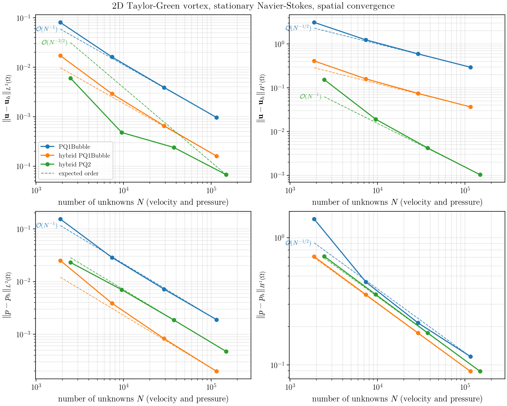
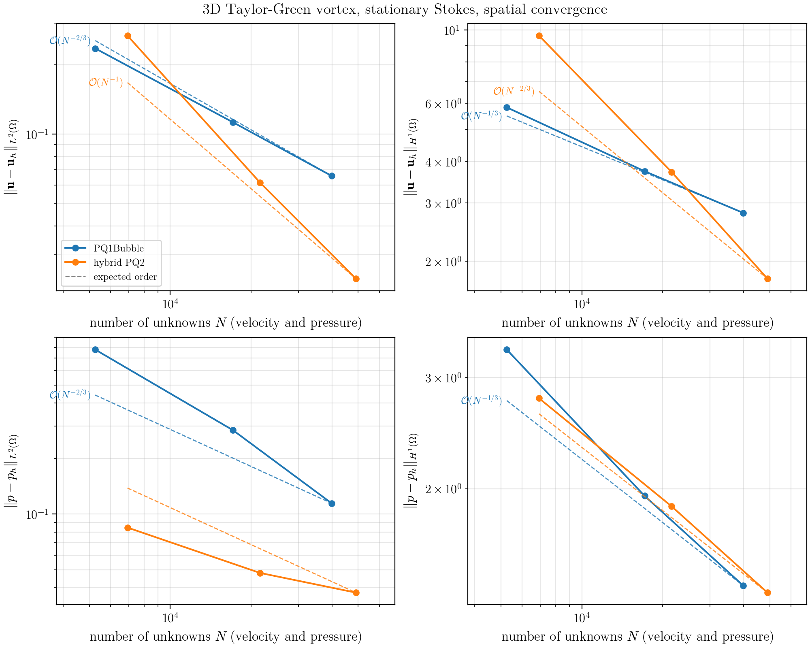
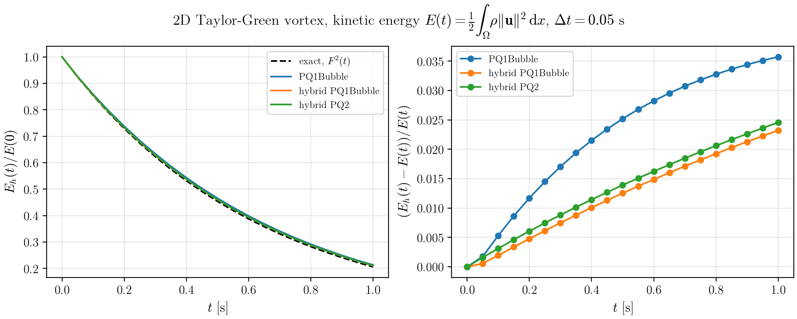

# Taylor-Green vortex {#benchmark-taylor-green-vortex}

## Description

The Taylor-Green vortex @cite Taylor1937 is a periodic array of counter-rotating vortices that
decay under the action of viscosity. It is one of the few flows for which a closed-form solution
of the incompressible Navier-Stokes equations

$$
\begin{align*}
\rho \frac{\partial \mathbf{u}}{\partial t} + \rho (\mathbf{u} \cdot \nabla) \mathbf{u}
- \nabla \cdot \left( \mu \left( \nabla \mathbf{u} + \nabla \mathbf{u}^T \right) \right) + \nabla p &= \mathbf{f}, \\
\nabla \cdot \mathbf{u} &= 0,
\end{align*}
$$

is known, which makes it a standard verification case for the spatial and temporal
accuracy of Navier-Stokes solvers. Here, $\mathbf{u}$ is the velocity, $p$ the pressure,
$\rho$ the density, $\mu = \rho \nu$ the dynamic and $\nu$ the kinematic viscosity.
We use the analytical solutions as given on
[Wikipedia](https://en.wikipedia.org/wiki/Taylor%E2%80%93Green_vortex),
with $k$ the wave number and $U_0$ a reference velocity.

### Two-dimensional case

The classic two-dimensional Taylor-Green vortex @cite Taylor1937 reads

$$
\begin{align*}
u(x, y, t) &= U_0 \sin(k x) \cos(k y) F(t), \\
v(x, y, t) &= -U_0 \cos(k x) \sin(k y) F(t), \\
p(x, y, t) &= \frac{\rho U_0^2}{4} \left( \cos(2 k x) + \cos(2 k y) \right) F^2(t),
\end{align*}
$$

with the temporal decay factor $F(t) = e^{-2 \nu k^2 t}$.

### Three-dimensional case

The original three-dimensional Taylor-Green vortex @cite Taylor1937 is only an initial condition;
its temporal evolution has no closed-form solution. Instead, we use the tri-periodic,
fully three-dimensional analytical solution by Antuono @cite Antuono2020 (reference solution of family 1),

$$
\begin{align*}
u(x, y, z, t) &= \frac{4\sqrt{2}}{3\sqrt{3}} U_0 \left[ \sin\left(k x - \tfrac{5\pi}{6}\right) \cos\left(k y - \tfrac{\pi}{6}\right) \sin(k z)
- \cos\left(k z - \tfrac{5\pi}{6}\right) \sin\left(k x - \tfrac{\pi}{6}\right) \sin(k y) \right] F(t), \\
v(x, y, z, t) &= \frac{4\sqrt{2}}{3\sqrt{3}} U_0 \left[ \sin\left(k y - \tfrac{5\pi}{6}\right) \cos\left(k z - \tfrac{\pi}{6}\right) \sin(k x)
- \cos\left(k x - \tfrac{5\pi}{6}\right) \sin\left(k y - \tfrac{\pi}{6}\right) \sin(k z) \right] F(t), \\
w(x, y, z, t) &= \frac{4\sqrt{2}}{3\sqrt{3}} U_0 \left[ \sin\left(k z - \tfrac{5\pi}{6}\right) \cos\left(k x - \tfrac{\pi}{6}\right) \sin(k y)
- \cos\left(k y - \tfrac{5\pi}{6}\right) \sin\left(k z - \tfrac{\pi}{6}\right) \sin(k x) \right] F(t), \\
p(x, y, z, t) &= -\frac{\rho}{2} \|\mathbf{u}\|^2,
\end{align*}
$$

with $F(t) = e^{-3 \nu k^2 t}$. The flow is a Beltrami flow, i.e. the vorticity is parallel to the
velocity ($\nabla \times \mathbf{u} = \sqrt{3} k \mathbf{u}$), such that the convective term is a pure
gradient balanced by the (Bernoulli) pressure.

### Stationary and instationary variants

* **Instationary** (`Problem.IsStationary = false`): the solutions above are exact solutions of the
  Navier-Stokes equations without source term, $\mathbf{f} = \mathbf{0}$. The simulation is started from the
  analytical solution at $t = 0$ and the decay of the vortex is compared to the analytical one.
* **Stationary** (`Problem.IsStationary = true`): the temporal decay factor is set to $F \equiv 1$,
  i.e. the solution is the vortex at $t = 0$. It is sustained by the manufactured source term
  $\mathbf{f} = -\mu \Delta \mathbf{u}$, i.e. $\mathbf{f} = 2 \mu k^2 \mathbf{u}$ in 2D and
  $\mathbf{f} = 3 \mu k^2 \mathbf{u}$ in 3D.

The source term is implemented generically as
$\mathbf{f} = \rho \partial_t \mathbf{u} + \rho (\mathbf{u} \cdot \nabla) \mathbf{u} - \mu \Delta \mathbf{u} + \nabla p$
evaluated with the analytical solution (using $\nabla \cdot \mathbf{u} = 0$), so both variants
can also be run as Stokes problems (`Problem.EnableInertiaTerms = false`).

### Boundary conditions

The analytical solution is periodic with period $L = 2\pi/k$. By default, the domain is the unit
square/cube with $k = 2\pi$, i.e. exactly one period. Instead of periodic boundaries, the analytical
(time-dependent) velocity is prescribed as Dirichlet condition on the entire boundary and
the pressure is fixed to the analytical value at the lower left corner of the domain.
Optionally (`Problem.UseNeumann = true`), the analytical normal momentum flux
$\left( \rho \mathbf{u} \otimes \mathbf{u} - \mu (\nabla \mathbf{u} + \nabla \mathbf{u}^T) + p \mathbf{I} \right) \mathbf{n}$
is prescribed on the upper boundaries ($x_i = x_{i,\max}$) instead.
Periodic boundary conditions are not yet supported for this test.

### Discretization

The momentum balance is discretized with the control-volume finite-element schemes
PQ1Bubble (@ref PQ1BubbleDiscretization), hybrid PQ1Bubble and hybrid PQ2, the mass balance
always with the Box scheme (@ref BoxDiscretization). The hybrid schemes use a structured cube
grid (`Dune::YaspGrid`). The non-hybrid PQ1Bubble scheme uses a single bubble function per element,
which together with the Box pressure is only inf-sup stable on simplices, so it is run on a
structured simplex grid (`Dune::ALUGrid`, requires dune-alugrid). The new CVFE problem interface is used
(see also the tests `donea` and `sincos`). The convective term is discretized with central
differences (`Flux.UpwindWeight = 0.5`); full upwinding (the default, `Flux.UpwindWeight = 1`)
is only first-order accurate and adds numerical diffusion that visibly damps the vortex.
In time, the implicit Euler method with a constant time step size is used. For the temporal
convergence study, the executable `test_ff_navierstokes_taylorgreen_2d_pq2hybrid_multistage`
additionally provides the multi-stage methods Crank-Nicolson and DIRK3
(`TimeLoop.Scheme`, see @ref benchmark-timestepping-methods).

@note Work in progress: the multi-stage time stepping does not work yet with the hybrid schemes.
Their finite-element storage term (`dumux/freeflow/navierstokes/momentum/cvfe/localresidual.hh`)
requires a time loop (`this->timeLoop().timeStepSize()`), which the multi-stage assembler does not set,
so the executable crashes in the first time step. Without a time loop, the finite-element part of the
storage term would moreover not be evaluated correctly by the multi-stage assembler.

### Related setups

* The stationary three-dimensional Stokes test of Schneider et al. (schneider2022a) uses the
  Taylor-Green initial condition $\mathbf{u} = (-2\cos\sin\sin, \sin\cos\sin, \sin\sin\cos)$ (with
  $A = -2$, $B = C = 1$ in the Wikipedia notation) together with a manufactured pressure and source.
* The [OpenFOAM verification and validation case](https://gitlab.com/openfoam/community/verification-and-validation/-/tree/main/cases/Taylor-Green-vortex)
  simulates the two-dimensional vortex (with opposite sign convention) on a periodic domain
  $[0, 2\pi]^2$ with $k = 1$, $\nu = 1$, $\Delta t = 0.05$ until $t = 0.3$ and compares velocity and pressure profiles.

## Parameters

| Parameter | Symbol | Value (2D) | Value (3D) | Unit | Input parameter |
|-----------|--------|------------|------------|------|-----------------|
| Domain | $\Omega$ | $[0, 1]^2$ | $[0, 1]^3$ | m | `Grid.UpperRight` |
| Grid | | $32 \times 32$ | $8 \times 8 \times 8$ | - | `Grid.Cells` |
| Wave number | $k$ | $2\pi$ | $2\pi$ | 1/m | `Problem.WaveNumber` |
| Reference velocity | $U_0$ | $1$ | $1$ | m/s | `Problem.ReferenceVelocity` |
| Density | $\rho$ | $1$ | $1$ | kg/m³ | `Component.LiquidDensity` |
| Kinematic viscosity | $\nu$ | $0.01$ | $0.01$ | m²/s | `Component.LiquidKinematicViscosity` |
| Reynolds number | $Re = U_0 L / \nu$ | $100$ | $100$ | - | |
| End time | $T$ | $1$ | $1$ | s | `TimeLoop.TEnd` |
| Time step size | $\Delta t$ | $0.05$ | $0.05$ | s | `TimeLoop.DtInitial` |
| Decay at end time | $F(T)$ | $0.45$ | $0.31$ | - | |

The parameters are set in `params_2d.input` and `params_3d.input`. A setup equivalent to the
OpenFOAM case (up to the boundary conditions) is obtained with
`-Grid.UpperRight "6.283185307179586 6.283185307179586" -Problem.WaveNumber 1 -Component.LiquidKinematicViscosity 1 -TimeLoop.TEnd 0.3`.

## Benchmark indicators

* **Spatial convergence** (stationary variant): errors of velocity and pressure in the $L^2$ norm and
  the (full) $H^1$ norm,
  $\|\mathbf{u} - \mathbf{u}_h\|_{L^2(\Omega)}$, $\|\mathbf{u} - \mathbf{u}_h\|_{H^1(\Omega)}$,
  $\|p - p_h\|_{L^2(\Omega)}$, $\|p - p_h\|_{H^1(\Omega)}$, with
  $\|v\|_{H^1(\Omega)}^2 = \|v\|_{L^2(\Omega)}^2 + \|\nabla v\|_{L^2(\Omega)}^2$ (computed by quadrature),
  and the corresponding experimental orders of convergence (EOC) under uniform grid refinement.
  Since the schemes use different element types (quadrilaterals/hexahedra and triangles/tetrahedra)
  and numbers of unknowns per element, the errors are plotted over the total number of unknowns $N$
  (velocity components and pressure), and the EOC are computed with respect to the equivalent mesh
  size $h_N = N^{-1/d}$, i.e. an order $q$ corresponds to the slope $\mathcal{O}(N^{-q/d})$.
  Expected orders:

  | Momentum scheme | $\|\mathbf{u} - \mathbf{u}_h\|_{L^2(\Omega)}$ | $\|\mathbf{u} - \mathbf{u}_h\|_{H^1(\Omega)}$ | $\|p - p_h\|_{L^2(\Omega)}$ (Box) | $\|p - p_h\|_{H^1(\Omega)}$ (Box) |
  |-----------------|---|---|---|---|
  | PQ1Bubble | 2 | 1 | 2 | 1 |
  | hybrid PQ1Bubble | 2 | 1 | 2 | 1 |
  | hybrid PQ2 | 3 | 2 | 2 | 1 |

  The pressure $L^2$ order of 2 is observed on the uniform grids used here (in general, at least 1.5 is expected).
  In 3D, the stationary study is run as Stokes problem (`Problem.EnableInertiaTerms = false`), since the
  Newton solver does not converge for the stationary Navier-Stokes problem on the coarse 3D grids.
  The hybrid PQ1Bubble scheme currently does not converge in 3D (the linear system appears to be singular).

* **Temporal convergence** (instationary variant): the error $\|\mathbf{u} - \mathbf{u}_h\|_{L^2(\Omega)}$ at $t = T$ on a fine grid under
  refinement of the time step size. Expected orders: 1 (implicit Euler), 2 (Crank-Nicolson), 3 (DIRK3).
* **Kinetic energy decay** (instationary variant): $E(t) = \frac{1}{2} \int_\Omega \rho \|\mathbf{u}\|^2 \, \mathrm{d}x$
  compared to the analytical $E(t) = E_0 F^2(t)$ with $E_0 = \rho U_0^2 |\Omega| / 4$ (2D) and
  $E_0 = \rho U_0^2 |\Omega| / 2$ (3D), and the dissipation rate $-\mathrm{d}E/\mathrm{d}t$ compared to
  $4 \nu k^2 E$ (2D) and $6 \nu k^2 E$ (3D).
* **Error history**: $L^2$ errors of velocity and pressure over time.

## Results

The following results were obtained with `benchmark.py` using the default settings
(`--study spatial` in 2D and 3D, `--study energy` in 2D).

**Spatial convergence in 2D** (stationary Navier-Stokes problem, $Re = 100$, $16^2$ to $128^2$ cells).
All schemes reach the expected orders, except for the velocity $L^2$ error of hybrid PQ2, which does
not yet show the expected third order on these grids. At the same number of unknowns, hybrid
PQ1Bubble is considerably more accurate than PQ1Bubble on simplices.



**Spatial convergence in 3D** (stationary Stokes problem, $6^3$ to $12^3$ cells). The velocity errors
converge with the expected orders, whereas the pressure errors are not yet in the asymptotic regime
on these coarse grids. Hybrid PQ1Bubble does not converge in 3D and is not shown.



**Kinetic energy decay in 2D** (instationary Navier-Stokes problem, $32^2$ cells, $\Delta t = 0.05$ s,
implicit Euler). The relative deviation from the analytical energy of about 2-4 % at $t = 1$ s is
dominated by the temporal error of the implicit Euler method, which alone predicts a deviation of 3.1 %.



## How to reproduce results

The executables are named `test_ff_navierstokes_taylorgreen_<dim>_<scheme>` with
`<dim>` in `2d`, `3d` and `<scheme>` in `pq1bubble`, `pq1bubblehybrid`, `pq2hybrid`. Each run writes
the errors and the kinetic energy of every time step to `<Problem.Name>_errors.csv`.
To build all executables and run the convergence studies, execute in the build directory
of this test (`build-cmake/test/freeflow/navierstokes/taylor_green_vortex`):

```bash
cmake --build ../../../.. --target build_taylorgreen_tests
python3 benchmark.py --study all
```

Useful options of `benchmark.py`:

* `--dim 2 3`: spatial dimensions to consider
* `--schemes pq1bubble pq1bubblehybrid pq2hybrid`: momentum discretizations to consider
* `--study spatial temporal energy all`: which study to run
* `--cells N1 N2 ...`: cells per direction of the grid sequence of the spatial study
  (default: 16, 32, 64, 128 in 2D and 6, 9, 12 in 3D, where the direct linear solver limits the grid size)
* `--levels N`: number of time step refinements of the temporal study
* `--reuse`: reuse existing error files instead of rerunning the simulations (e.g. to regenerate the plots)
* `--test`: run a short study with few refinements and check the convergence rates (used by CTest)
* `--check-solution`: verify symbolically (requires `sympy`) that the analytical solutions solve
  the Navier-Stokes equations

The script writes the convergence tables as Markdown (`taylorgreen_<study>_<dim>.md`) and,
if `matplotlib` is available, plots (`taylorgreen_<study>_<dim>.png`) to the current directory.
