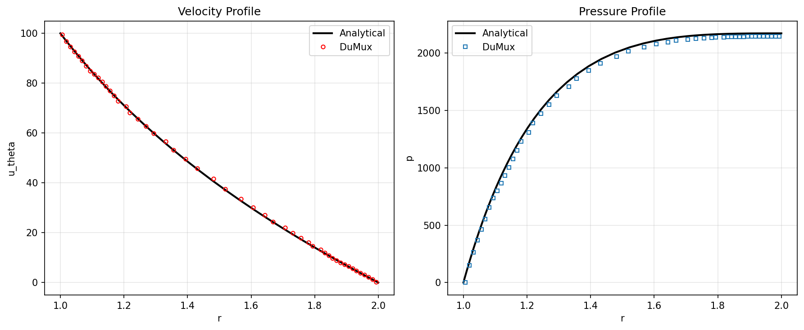

# Taylor-Couette {#benchmark-taylor-couette}

## Steady viscous flow between two rotating cylinders

**Problem Description**

We simulate the steady, laminar flow of an incompressible fluid confined in the annular gap between two concentric, independently rotating cylinders — the classical Taylor-Couette configuration @cite taylor1923. Because a closed-form solution exists, this test case allows a direct comparison of the numerical velocity and pressure fields against the analytical solution.

Assumptions:

- steady state
- laminar flow
- incompressible fluid
- no gravity

The inner cylinder of radius $R_1$ rotates at angular velocity $\Omega_1$, and the outer cylinder of radius $R_2$ rotates at angular velocity $\Omega_2$. In the reference configuration, the outer cylinder is fixed ($\Omega_2 = 0$) and the inner cylinder rotates at $\Omega_1 = 100$ rad/s, corresponding to a Reynolds number $Re = |\Omega_1 R_1| (R_2 - R_1) / \nu = 100$.

**Analytical Reference Solution**

Taylor @cite taylor1923 showed that the tangential velocity $u_{\theta}$ within the annular gap is described by:

$$
u_{\theta}(r) = A r + \frac{B}{r}, \qquad
A = \frac{\Omega_2 R_2^2 - \Omega_1 R_1^2}{R_2^2 - R_1^2},
\qquad
B = \frac{(\Omega_1 - \Omega_2) R_1^2 R_2^2}{R_2^2 - R_1^2}
$$

The corresponding pressure field follows from the radial momentum balance $\partial p/\partial r = \rho\, u_\theta^2/r$:

$$
p(r) = \frac{A^2 r^2}{2} + 2AB \ln(r) - \frac{B^2}{2r^2} + C
$$

where $C$ is fixed by a reference pressure condition.

**Parameters**

| Parameter                        | Symbol     | Value  | Unit  |
|-----------------------------------|------------|--------|-------|
| Inner cylinder radius              | $R_1$      | $1$    | m     |
| Outer cylinder radius              | $R_2$      | $2$    | m     |
| Inner cylinder angular velocity    | $\Omega_1$ | $100$  | rad/s |
| Outer cylinder angular velocity    | $\Omega_2$ | $0$    | rad/s |
| Fluid density                      | $\rho$     | $1$    | kg/m³ |
| Fluid kinematic viscosity          | $\nu$      | $1$    | m²/s  |

**Setup**

The implementation uses the DuMux free-flow Navier-Stokes model. The annular domain is discretized using DuMux's [`CakeGridManager`](https://dumux.org/docs/doxygen/master/class_dumux_1_1_cake_grid_manager.html), which constructs a structured quadrilateral grid directly in polar coordinates: 80 radial cells per zone with mirrored grading toward both cylinder walls, and 320 uniform angular cells over the full $360°$.

**Result**

To run the test and produce the plot below, execute:
```bash
./test_ff_navierstokes_taylorcouette params.input
pvpython plot_results.py
```
The script expects ParaView's `pvpython` and Matplotlib to be available for post-processing.

The comparison of the analytical solution with the numerical solution obtained with DuMux closely agrees across the entire gap $r \in [1, 2]$ m:


*Comparison of the analytical Taylor-Couette solution with the numerical solution for tangential velocity $u_\theta(r)$ and pressure $p(r)$ across the gap $r \in [1, 2]$ m.*
