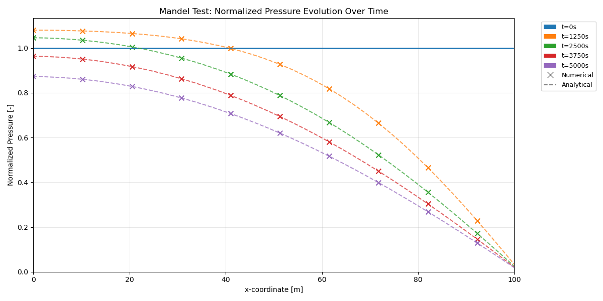

## 1. Introduction of Mandel's Problem
Mandel's problem is a fundamental benchmark in the study of poromechanics, describing the behavior of a fluid-saturated porous medium subjected to loading. It was first introduced by J. Mandel in 1953 [Ref](#references)[1] and is commonly used to validate theoretical models and numerical methods in poromechanics.

## 2. Problem Description
The typical setup for Mandel’s problem involves a rectangular (plane-strain) domain that is initially at equilibrium with uniform pore pressure. At time $ t = 0 $, an instantaneous load is applied (uniformly on the top and bottom surfaces). The resulting response of the medium is governed by:


- **Mechanical deformation** due to the applied load.
- **Fluid flow** induced by the pressure gradients set up by the deformation.

The interplay between these processes leads to a diffusion-like behavior in pore pressure evolution and the characteristic Mandel–Cryer effect. The analytical solution of this process is well documented in [Ref](#references)[2-4].

todo: insert the domain figure.

## 3. Nomenclature

| Symbol | Description | Unit |
|--------|-------------|------|
| $\mathbf{u}$ | Solid matrix displacement | [m] |
| $p$ | Fluid pressure | [Pa] |
| $\boldsymbol{\sigma}_{\mathrm{eff}}$ | Effective stress tensor | [Pa] |
| $\boldsymbol{\sigma}$ | Total stress tensor | [Pa] |
| $\phi$ | Porosity | [-] |
| $\phi_0$ | Initial porosity | [-] |
| $\varrho$ | Fluid density | [kg/m³] |
| $\mathbf{K}$ | Permeability tensor | [m²] |
| $\mu$ | Dynamic viscosity of the fluid | [Pa·s] |
| $\mathbf{g}$ | Gravitational acceleration vector | [m/s²] |
| $q$ | Source/sink term for the fluid | [kg/(m³·s)] |
| $\alpha$ | Biot's coefficient | [-] |
| $\boldsymbol{\mathrm{I}}$ | Identity tensor | [-] |
| $u_x, u_y$ | Displacement components | [m] |
| $\sigma_{xx}$ | Normal stress component | [Pa] |
| $\tau_{xy}, \tau_{yx}$ | Shear stress components | [Pa] |
| $p^+$ | Initial pore pressure after Skempton effect | [Pa] |
| $F$ | Force intensity | [N/m] |
| $K_f$ | Bulk modulus of water | [Pa] |
| $\nu$ | Drained Poisson's ratio | [-] |
| $\nu_u$ | Undrained Poisson's ratio | [-] |
| $M$ | Biot's modulus | [Pa] |
| $\Gamma$ | Domain boundary | - |
| $a$ | Half-width of the domain | [m] |
| $b$ | Half-height of the domain | [m] |
| $G$ | Shear modulus | [Pa] |
| $B$ | Skempton coefficient | [-] |

## 4. Governing Equations

We solve Mandel's 2D consolidation problem using a fully coupled poromechanics model implemented in Dumux. In this formulation, the primary unknowns are the solid matrix displacement ($\mathbf{u}$) and the fluid pressure ($p$). The solver employs a P1-CVFE (Box) scheme for the displacement field and a CC-TPFA method for the pressure field, ensuring robust coupling between the mechanical and hydraulic responses.

The governing equations consist of two main parts:

### 4.1. Momentum Balance for the Solid Matrix

The momentum balance (equilibrium) equation for the porous matrix is given by (see the [poro-elastic model description](https://dumux.org/docs/doxygen/master/group___poro_elastic.html)):

$$
\nabla \cdot \boldsymbol{\sigma}_{\mathrm{eff}} = 0
$$

### 4.2. Mass Balance for the Fluid Phase

The mass conservation (fluid balance) equation is expressed as (see the [single phase model description](https://dumux.org/docs/doxygen/master/group___one_p_model.html)):

$$
\frac{\partial (\phi\, \varrho)}{\partial t} + \nabla \cdot \left\{ - \varrho\, \frac{\mathbf{K}}{\mu} \left( \nabla p - \varrho\, \mathbf{g} \right) \right\} = q
$$

### 4.3. Coupling Equations
The two equations are coupled through:

- Porosity change (see the [documentation](https://dumux.org/docs/doxygen/master/class_dumux_1_1_porosity_deformation.html)):
$$ \phi = \phi_0 + \nabla \cdot \boldsymbol u $$

- Effective stress:
$$\boldsymbol{\sigma}_{\mathrm{eff}} = \boldsymbol{\sigma} - \alpha p  \boldsymbol {\mathrm I}$$

## 5. Boundary and Initial Conditions

Due to the symmetry of the problem, we consider only a quarter of the domain. The boundary conditions are defined as follows:

#### Mechanical:
Initial condition:
$$\boldsymbol u(t=0) = \begin{pmatrix} \frac{F \nu_u x}{2Ga} \\ -\frac{F(1-\nu_u) y}{2Ga} \end{pmatrix}$$

where the initial displacement corresponds to the instantaneous undrained response.

Boundary conditions:
$$ u_x = 0 \quad \text{on } \Gamma_{\text{left}},$$
$$ u_y = 0 \quad \text{on } \Gamma_{\text{bottom}},$$
$$ u_y = u_y(t) \quad \text{on } \Gamma_{\text{top}},$$
$$ \boldsymbol{\sigma} \cdot \boldsymbol{n} = 0 \quad \text{on } \Gamma_{\text{right}},$$

The displacement $u_y(t)$ on the top boundary is prescribed from the analytical solution (see section 6.2 in [Ref](#references)[3]) to satisfy the rigid plate condition. The right boundary is stress-free (traction-free boundary condition).

#### Hydraulic:
Initial condition:
$$p(t=0) = p^+ = \frac{FB(1+\nu_u)}{3a}$$

where $p^+$ is the initial pore pressure after the Skempton effect, representing the instantaneous undrained pressure response [Ref](#references)[2].

Boundary conditions:
$$ \begin{align*}
p &= 0 \quad \text{on } \Gamma_{\text{right}}, \\
\nabla p \cdot \boldsymbol{n} &= 0 \quad \text{on } \Gamma_{\text{left}}, \Gamma_{\text{top}}, \Gamma_{\text{bottom}}.
\end{align*}$$

The right boundary is drained (zero pressure), while all other boundaries are impermeable (no-flow condition).

## 6. Material Parameters

The following material parameters are used in the simulation (as defined in `params.input`):

| Parameter | Symbol | Value | Unit |
|-----------|--------|-------|------|
| Force intensity | $F$ | 6 × 10⁸ | N/m |
| Young's modulus | $E$ | 5.94 × 10⁹ | Pa |
| Drained Poisson's ratio | $\nu$ | 0.2 | - |
| Undrained Poisson's ratio | $\nu_u$ | 0.44 | - |
| Biot's coefficient | $\alpha$ | 1.0 | - |
| Biot's modulus | $M$ | 1.65 × 10¹⁰ | Pa |
| Water bulk modulus | $K_f$ | 3.3 × 10⁹ | Pa |
| Dynamic viscosity | $\mu$ | 1 × 10⁻³ | Pa·s |
| Permeability | $K$ | 9.87 × 10⁻¹⁴ | m² (≈100 Darcy) |
| Initial porosity | $\phi_0$ | 0.2 | - |
| Solid density | $\rho_s$ | 2700 | kg/m³ |

**Domain geometry:**
- Lower left corner: (0, 0) m
- Upper right corner: (100, 10) m
- Grid cells: 40 × 4

An overview of the relation among poroelastic constants is offered in appendix B in [Ref](#references)[4].


## 7. Results

To visualize the results, run the provided Python plotting script:

```bash
python3 plot_results.py
```

The figure below shows the normalized pressure evolution over time along the horizontal centerline of the domain. The plot compares the numerical solution (markers) with the analytical solution (dashed lines) at different time steps, demonstrating the characteristic Mandel-Cryer effect where pore pressure initially increases before dissipating.



## References:
1. Mandel, J. "Consolidation des sols (étude mathématique)." Géotechnique, Vol. 3, No. 7, 1953. [DOI:10.1680/geot.1953.3.7.287](https://doi.org/10.1680/geot.1953.3.7.287)
2. "Mandel's problem revisited." [DOI: 10.1680/geot.1996.46.2.187](https://www.icevirtuallibrary.com/doi/abs/10.1680/geot.1996.46.2.187)
3. "A coupling of mixed and continuous Galerkin finite element methods for poroelasticity I: the continuous in time case" [DOI:10.1007/s10596-007-9045-y](https://link.springer.com/article/10.1007/s10596-007-9045-y)
4. Cheng, Alexander H-D. Poroelasticity. Vol. 27. Berlin: Springer, 2016.[DOI:10.1007/978-3-319-25202-5](https://doi.org/10.1007/978-3-319-25202-5)
