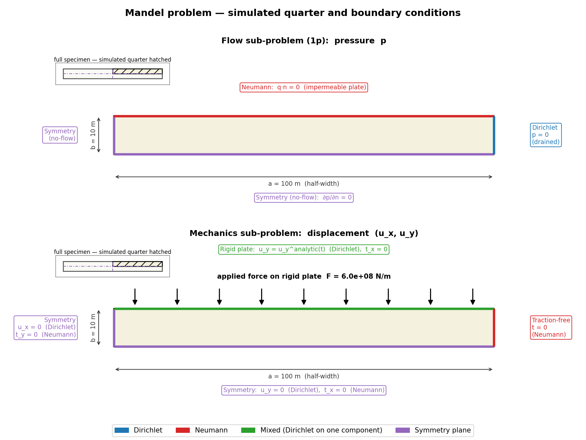
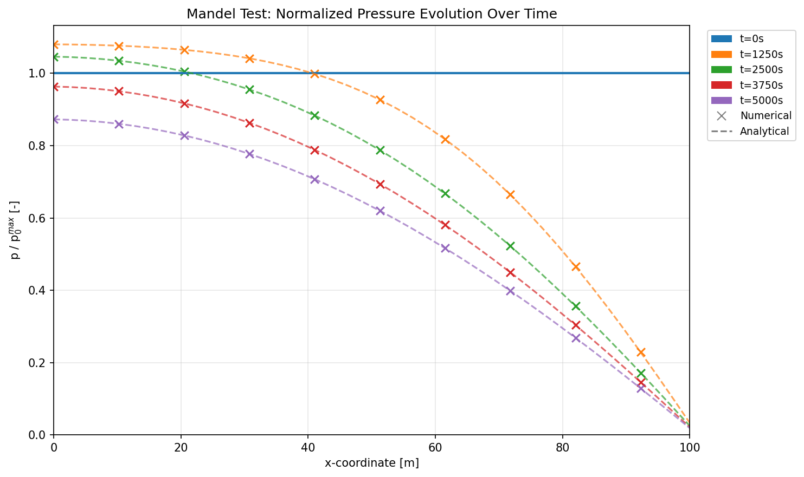
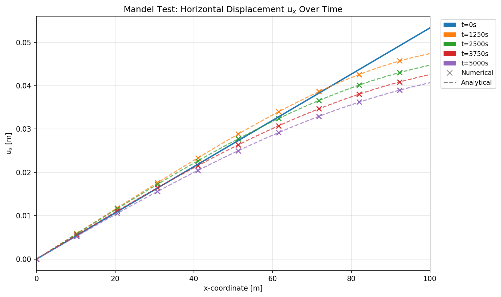
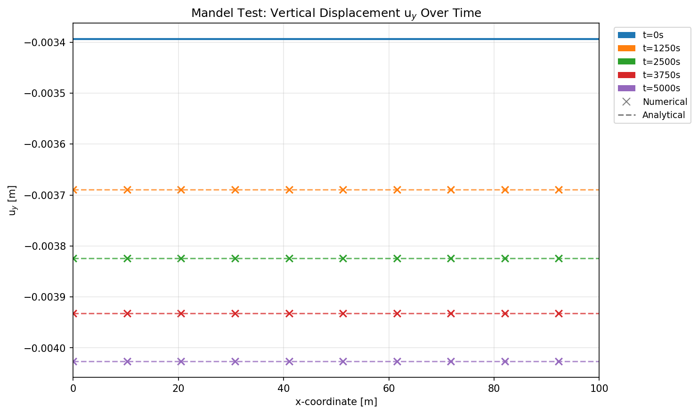

# Mandel's Problem: 2D Poroelastic Consolidation

## 1. Overview

Mandel's problem is a standard benchmark for poromechanics. It describes a fluid-saturated porous medium under an instantaneous load and is commonly used to validate analytical and numerical poroelastic models.

The response combines:

- **solid deformation** from the applied load,
- **fluid flow** driven by pressure gradients,
- the resulting **Mandel-Cryer effect**, where pore pressure can initially rise before dissipating.

This example solves the coupled problem in DuMux and compares the numerical solution with the analytical solution from the literature.

## 2. Problem Setup

A rectangular plane-strain domain is initially at equilibrium with uniform pore pressure. At time $t = 0$, a uniform load is applied on the top and bottom surfaces.

Due to symmetry, only one quarter of the domain is simulated.



## 3. Model

The simulation uses a fully coupled poromechanics formulation with primary variables

$$
\mathbf{u}, \quad p,
$$

where $\mathbf{u}$ is the solid displacement and $p$ is the fluid pressure.

Numerical discretization:

| Field | Method |
|---|---|
| Displacement | P1-CVFE / Box |
| Pressure | CC-TPFA |

### 3.1 Momentum Balance

The solid matrix is governed by mechanical equilibrium:

$$
\nabla \cdot \boldsymbol{\sigma}_{\mathrm{eff}} = 0.
$$

See the [DuMux poro-elastic model documentation](https://dumux.org/docs/doxygen/master/group___poro_elastic.html).

### 3.2 Fluid Mass Balance

The single-phase flow equation is

$$
\frac{\partial (\phi \varrho)}{\partial t}
+ \nabla \cdot \left(-\varrho \frac{\mathbf{K}}{\mu} \nabla p \right) = 0.
$$

See the [DuMux single-phase model documentation](https://dumux.org/docs/doxygen/master/group___one_p_model.html).

### 3.3 Coupling Relations

Porosity update:

$$
\phi = \phi_0 + \nabla \cdot \mathbf{u}.
$$

Effective stress:

$$
\boldsymbol{\sigma}_{\mathrm{eff}}
= \boldsymbol{\sigma} - \alpha p \mathbf{I}.
$$

## 4. Boundary and Initial Conditions

### 4.1 Mechanical Problem

Initial displacement, representing the instantaneous undrained response:

$$
\mathbf{u}(t=0) =
\begin{pmatrix}
\dfrac{F \nu_u x}{2Ga} \\
-\dfrac{F(1-\nu_u)y}{2Ga}
\end{pmatrix}.
$$

Boundary conditions:

| Boundary | Condition | Meaning |
|---|---|---|
| $\Gamma_{\text{left}}$ | $u_x = 0$ | symmetry |
| $\Gamma_{\text{bottom}}$ | $u_y = 0$ | symmetry |
| $\Gamma_{\text{top}}$ | $u_y = u_y(t)$ | rigid plate displacement from analytical solution |
| $\Gamma_{\text{right}}$ | $\boldsymbol{\sigma} \cdot \mathbf{n} = 0$ | traction-free |

### 4.2 Hydraulic Problem

Initial pressure after the Skempton effect:

$$
p(t=0) = p^+ = \frac{FB(1+\nu_u)}{3a}.
$$

Boundary conditions:

| Boundary | Condition | Meaning |
|---|---|---|
| $\Gamma_{\text{right}}$ | $p = 0$ | drained |
| $\Gamma_{\text{left}}$, $\Gamma_{\text{top}}$, $\Gamma_{\text{bottom}}$ | $\nabla p \cdot \mathbf{n} = 0$ | no flow |

## 5. Parameters

Material and numerical parameters are defined in `params.input`.

| Parameter | Symbol | Value | Unit |
|---|---:|---:|---|
| Force intensity | $F$ | $6 \times 10^8$ | N/m |
| Young's modulus | $E$ | $5.94 \times 10^9$ | Pa |
| Drained Poisson's ratio | $\nu$ | 0.2 | - |
| Undrained Poisson's ratio | $\nu_u$ | 0.44 | - |
| Biot's coefficient | $\alpha$ | 1.0 | - |
| Biot's modulus | $M$ | $1.65 \times 10^{10}$ | Pa |
| Water bulk modulus | $K_f$ | $3.3 \times 10^9$ | Pa |
| Dynamic viscosity | $\mu$ | $1 \times 10^{-3}$ | Pa s |
| Permeability | $K$ | $9.87 \times 10^{-14}$ | m² |
| Initial porosity | $\phi_0$ | 0.2 | - |
| Solid density | $\rho_s$ | 2700 | kg/m³ |

Domain:

| Quantity | Value |
|---|---:|
| Lower-left corner | $(0, 0)$ m |
| Upper-right corner | $(100, 10)$ m |
| Grid | $40 \times 4$ cells |

Relations between poroelastic constants are summarized in Appendix B of Cheng [4].

## 6. Analytical Solution

The analytical solution is implemented in `analyticalsolution/analyticalsolution.hh`. It is used for

- initial pressure and displacement,
- top-boundary displacement,
- validation of numerical results.

### 6.1 Consolidation Coefficient

$$
c = \frac{M K}{\mu}
\frac{K_b + \frac{4}{3}G}{K_{bu} + \frac{4}{3}G},
\qquad
K_{bu} = K_b + \alpha^2 M.
$$

Here, $K_b$ is the drained bulk modulus and $K_{bu}$ is the undrained bulk modulus.

### 6.2 Eigenvalues

The eigenvalues $\beta_n$ are the positive roots of

$$
\frac{\tan \beta_n}{\beta_n}
= \frac{1-\nu}{\nu_u-\nu},
\qquad
\beta_n \in \left((n-\tfrac{1}{2})\pi,\, (n+\tfrac{1}{2})\pi\right).
$$

They are computed with Brent's method for

$$
n = 0, \dots, N_\beta - 1,
$$

where `Problem.NBeta = 240`.

### 6.3 Initial Undrained Response

$$
p^+ = \frac{FB(1+\nu_u)}{3a},
$$

$$
u_x(\mathbf{x},0) = \frac{F\nu_u}{2Ga}x,
\qquad
u_y(\mathbf{x},0) = -\frac{F(1-\nu_u)}{2Ga}y.
$$

### 6.4 Pressure

For $t > 0$,

$$
p(x,t) =
\frac{2FB(1+\nu_u)}{3a}
\sum_{n=0}^{N_\beta-1}
\frac{\sin\beta_n}{\beta_n - \sin\beta_n\cos\beta_n}
\left[
\cos\left(\frac{\beta_n x}{a}\right) - \cos\beta_n
\right]
\exp\left(-\frac{\beta_n^2ct}{a^2}\right).
$$

The pressure is independent of $y$ and satisfies the drained condition $p(a,t)=0$.

### 6.5 Displacement

Define

$$
T_n(t)=\exp\left(-\frac{\beta_n^2ct}{a^2}\right),
\qquad
S_n(t)=
\frac{\sin\beta_n\cos\beta_n}{\beta_n - \sin\beta_n\cos\beta_n}T_n(t).
$$

Then

$$
u_x(x,y,t)
= x\left[
\frac{F\nu}{2Ga}
- \frac{F\nu_u}{Ga}\sum_{n=0}^{N_\beta-1}S_n(t)
\right]
+ \frac{F}{G}\sum_{n=0}^{N_\beta-1}
\frac{\cos\beta_n}{\beta_n - \sin\beta_n\cos\beta_n}
\sin\left(\frac{\beta_nx}{a}\right)T_n(t),
$$

$$
u_y(x,y,t)
= y\left[
-\frac{F(1-\nu)}{2Ga}
+ \frac{F(1-\nu_u)}{Ga}\sum_{n=0}^{N_\beta-1}S_n(t)
\right].
$$

As $t \to \infty$, $T_n(t)$ and $S_n(t)$ vanish. The solution approaches drained equilibrium with $p \to 0$.

## 7. Results

Generate the result plots with

```bash
python3 plot_results.py
```

The figures compare numerical results with the analytical solution along the horizontal centerline.

| Result | Description |
|---|---|
|  | Pressure evolution and Mandel-Cryer effect |
|  | Horizontal displacement $u_x$ during consolidation |
|  | Vertical displacement $u_y$ during compaction |

## 8. Nomenclature

| Symbol | Description | Unit |
|---|---|---|
| $\mathbf{u}$ | Solid displacement | m |
| $u_x, u_y$ | Displacement components | m |
| $p$ | Fluid pressure | Pa |
| $p^+$ | Initial Skempton pressure | Pa |
| $\boldsymbol{\sigma}$ | Total stress tensor | Pa |
| $\boldsymbol{\sigma}_{\mathrm{eff}}$ | Effective stress tensor | Pa |
| $\sigma_{xx}$ | Normal stress component | Pa |
| $\tau_{xy}, \tau_{yx}$ | Shear stress components | Pa |
| $\phi, \phi_0$ | Porosity, initial porosity | - |
| $\varrho$ | Fluid density | kg/m³ |
| $\mathbf{K}$ | Permeability tensor | m² |
| $\mu$ | Dynamic viscosity | Pa s |
| $\mathbf{g}$ | Gravitational acceleration | m/s² |
| $q$ | Fluid source/sink term | kg/(m³ s) |
| $\alpha$ | Biot coefficient | - |
| $\mathbf{I}$ | Identity tensor | - |
| $F$ | Force intensity | N/m |
| $K_f$ | Water bulk modulus | Pa |
| $\nu, \nu_u$ | Drained and undrained Poisson's ratios | - |
| $M$ | Biot modulus | Pa |
| $G$ | Shear modulus | Pa |
| $B$ | Skempton coefficient | - |
| $a, b$ | Domain half-width and half-height | m |
| $\Gamma$ | Domain boundary | - |

## References

1. Mandel, J. "Consolidation des sols (étude mathématique)." *Géotechnique*, 3(7), 1953. [DOI:10.1680/geot.1953.3.7.287](https://doi.org/10.1680/geot.1953.3.7.287)
2. "Mandel's problem revisited." [DOI:10.1680/geot.1996.46.2.187](https://www.icevirtuallibrary.com/doi/abs/10.1680/geot.1996.46.2.187)
3. "A coupling of mixed and continuous Galerkin finite element methods for poroelasticity I: the continuous in time case." [DOI:10.1007/s10596-007-9045-y](https://link.springer.com/article/10.1007/s10596-007-9045-y)
4. Cheng, A. H.-D. *Poroelasticity*, Vol. 27. Springer, 2016. [DOI:10.1007/978-3-319-25202-5](https://doi.org/10.1007/978-3-319-25202-5)
