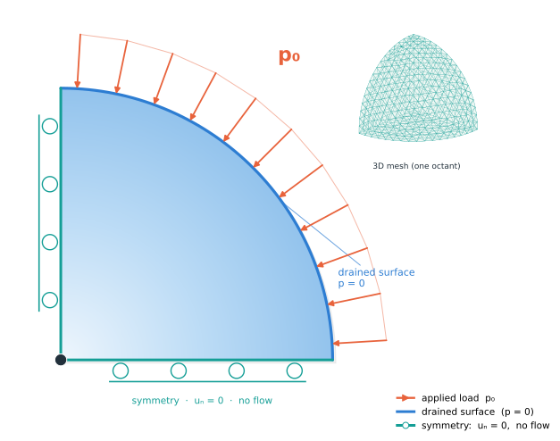

# Cryer's benchmark {#benchmark-cryer}

## Mandel–Cryer Effect (large deformations)



**Problem Description**

This benchmark tests the large-deformation poroelastic model
(@ref PoroElasticLargeDefModel) against the classical analytical solution (for small deformations) of
Cryer @cite Cryer1963 for the consolidation of a fluid-saturated sphere.

A porous sphere of radius $R_0$, fully saturated with an (almost) incompressible
fluid, is instantaneously loaded by a uniform compressive pressure $p_0$ applied
to its outer surface. The surface is perfectly drained ($p_f = 0$), while the
fluid can only escape through that surface. Because the solid skeleton cannot
compress without first expelling pore fluid, the load is initially carried by the
pore fluid and the pore pressure rises almost uniformly to a value close to $p_0$.

As fluid drains from the outside, the outer shell consolidates and squeezes the
still-undrained core. The resulting *non-monotonic* response — the pore pressure
at the **centre** first rises **above** the applied load $p_0$ before decaying to
zero — is the **Mandel–Cryer effect**.

The model solves a three-field mixed formulation
$(\mathbf{d}, p_s, p_f)$ for the displacement $\mathbf{d}$, the (algebraic) solid
volumetric pressure $p_s$, and the fluid pressure $p_f$. The momentum balance uses
the effective first Piola–Kirchhoff stress
$\mathbf{P}_\text{eff} = \mathbf{P}_\text{iso}(\bar{\mathbf{F}})
 + (p_s - \alpha_B p_f)\, J\,\mathbf{F}^{-\top}$
with a Neo-Hookean volumetric–isochoric split; see the
@ref PoroElasticLargeDefModel "model documentation" for the full set of equations.

**Boundary conditions** (modelled on one octant, see *Setup*):

- *Outer sphere surface*: inward radial traction $\mathbf{t} = p_0\,\mathbf{n}$
  (momentum) and drained pressure $p_f = 0$.
- *Symmetry planes* $x=0,\ y=0,\ z=0$: zero normal displacement
  $u_n = 0$ (momentum) and no-flow $\nabla p_f\cdot\mathbf{n}=0$ (fluid).

**Analytical Solution**

For small deformations and incompressible constituents
($\alpha_B = 1$, $S_p = 0$), Cryer @cite Cryer1963 gives the normalised pore
pressure at radial position $r$ and time $t$ as

$$
\frac{p(r,t)}{p_0} = 2m \sum_{i=1}^{\infty}
   \frac{\sin z_i - z_i}{m\,z_i \cos z_i + (2m-1)\sin z_i}\,
   \frac{\sin(z_i\, r/R_0)}{z_i\, r/R_0}\,
   \exp\!\left(-\frac{z_i^2\, c_v\, t}{\beta\, R_0^2}\right),
$$

where the $z_i$ are the positive roots of the characteristic equation

$$ (1 - m\,z^2)\sin z - z\cos z = 0, $$

and the dimensionless / derived parameters are

$$
m = \frac{K + \tfrac{4}{3}G}{4G}\left(1 + \frac{K S_p}{\alpha_B^2}\right), \qquad
c_v = \frac{\kappa}{\mu_f}\left(K + \tfrac{4}{3}G\right), \qquad
\beta = \alpha_B^2 + \left(K + \tfrac{4}{3}G\right) S_p .
$$

At the sphere centre ($r=0$) the sinc factor tends to $1$. With the parameters
below, $m = 0.5$, $c_v = 3\times10^{-3}\ \mathrm{m^2/s}$, $\beta = 1$, and the
centre pressure peaks at $p/p_0 \approx 1.575$ near $t\,c_v/R_0^2 \approx 0.06$.
The series is implemented in `cryer_analytical.hh` (can also be plotted with
`plot_cryer.py`).

**Parameters**

| Parameter | Symbol | Value | Unit |
|-----------|--------|-------|------|
| Shear modulus | $G$ | $1.5\times10^{6}$ | Pa |
| Drained bulk modulus | $K$ | $1.0\times10^{6}$ | Pa |
| Poisson ratio (drained) | $\nu$ | 0 | - |
| Biot coefficient | $\alpha_B$ | 1.0 | - |
| Storage coefficient | $S_p$ | 0 | 1/Pa |
| Initial porosity | $\phi_0$ | 0.5 | - |
| Initial permeability | $\kappa_0$ | $1.0\times10^{-12}$ | m² |
| Fluid viscosity | $\mu_f$ | $1.0\times10^{-3}$ | Pa·s |
| Sphere radius | $R_0$ | 1.0 | m |
| Surface pressure load | $p_0$ | 100 (default; also $p_0/K = 0.25,\ 0.5$) | Pa |
| Consolidation coefficient | $c_v = \tfrac{\kappa_0}{\mu_f}(K+\tfrac43 G)$ | $3\times10^{-3}$ | m²/s |
| Characteristic time | $R_0^2/c_v$ | $333.3$ | s |

The benchmark varies two parameters, giving six cases in total:

- **Surface load** $p_0/K \in \{10^{-4},\ 0.25,\ 0.5\}$. The smallest load
  ($p_0 = 100\ \mathrm{Pa}$) is the small-deformation limit, in which the model
  reproduces the Cryer analytical solution. The two larger loads drive finite
  deformation, where the centre overshoot and the subsequent consolidation deviate
  from the linear theory and no closed-form solution exists.
- **Permeability model**: either constant, $\kappa = \kappa_0$, or a
  deformation-dependent Kozeny–Carman law
  $\kappa(J) = \tfrac{d_p^2}{180}\,\tfrac{\phi^3}{(1-\phi)^2}$ with
  $\phi(J) = 1 - (1-\phi_0)/J$. With Kozeny–Carman the permeability drops as the
  medium compacts, slowing drainage; at large loads the centre therefore compresses
  less and the pore pressure decays more slowly than for a constant permeability.

The runtime parameters are the load `Problem.PressureLoad` ($p_0$) and
`SpatialParams.PermeabilityModel` (`Constant` or `KozenyCarman`); the
`run_benchmark.py` driver sweeps all six combinations (see *Results*).

**Setup**

By symmetry only one octant of the sphere is modelled, with the applied surface load
$p_0$ and drained ($p_f = 0$) condition on the spherical surface and zero normal
displacement / no-flow on the three symmetry planes (see the figure at the top).
The domain is an
eighth-sphere ($R_0 = 1\ \mathrm{m}$) discretized with an unstructured tetrahedral
mesh. The mesh is generated with
[Gmsh](https://gmsh.info) from `generate_mesh.py`,
two ready-made meshes are avaiable in the source:

- `sphere_eighth.msh` — moderate $\approx 854$-node mesh, the benchmark default
  (good agreement with the analytical solution),
- `sphere_eighth_coarse.msh` — $\approx 223$-node mesh used only for the fast CI
  smoke test.

Regenerate or refine with `python3 generate_mesh.py --lc <size> --output <file>`
(e.g. `--lc 0.095` $\to$ 854 nodes, `--lc 0.08` $\to$ 1311 nodes).

The three subdomains are coupled through the @ref MultiDomain framework:

- **Momentum** ($\mathbf{d}$): quadratic displacement on a Taylor–Hood-style hybrid
  control-volume finite element scheme (@ref PQ2Discretization).
- **Solid pressure** ($p_s$) and **fluid pressure** ($p_f$): linear Box scheme
  (@ref BoxDiscretization).

Time integration uses the experimental multi-stage time stepper: implicit Euler
for the fast CI smoke test and a third-order diagonally-implicit Runge–Kutta scheme
(DIRK3) for the production benchmark run.

**Results**

Each run writes a centre time series to `cryer_center_pressure.csv` (columns:
`time`, `t*cv/R0^2`, `p_f_center`, `p_analytical`, `p_f/p0`, `p_analytical/p0`,
`J_center`) alongside VTK output with both the numerical and analytical pressure
fields.

*Single load case.* To run one case and produce the comparison plot:

```bash
./test_cryer_poroelastic_large_def -Problem.PressureLoad 100.0 \
    -Grid.File sphere_eighth.msh -TimeLoop.Scheme DIRK3
python3 plot_cryer.py
```

`params.input` already selects the moderate mesh, the `DIRK3` scheme and the
log-spaced `TimeLoop.DtGrowthFactor` schedule that resolves the full peak-and-decay
curve in ~50 steps. The Cryer (1963) analytical solution exhibits the defining
non-monotonic centre pressure (the Mandel–Cryer overshoot above $1$); in the
small-deformation limit ($p_0/K = 10^{-4}$) the simulation (markers) tracks it
through the entire response — rise, overshoot, and decay back to zero:


*Finite-deformation parameter study.* Beyond the small-deformation verification, the
benchmark probes the large-deformation regime by sweeping the three loads
$p_0/K \in \{10^{-4},\,0.25,\,0.5\}$ and the two permeability models (Kozeny–Carman,
constant) — six runs in total. The driver script runs all cases and produces the
summary figures:

```bash
python3 run_benchmark.py <build_dir>                          # all 6 cases (DIRK3)
python3 run_benchmark.py <build_dir> --scheme ImplicitEuler   # faster, coarser tail
python3 run_benchmark.py <build_dir> --skip-run               # only re-plot existing CSVs
```

- **Centre pressure** $p(0,t)/p_0$ for the three loads (Kozeny–Carman / constant
  permeability). The small load matches the Cryer analytical solution; larger loads
  deviate from it as finite deformation sets in.
- **Volume ratio** $J = V/V_0$ at the centre. For $p_0/K = 10^{-4}$ the volume is
  essentially unchanged ($J \approx 1$); larger loads compress the centre, and a
  constant permeability drains (and compresses) faster than Kozeny–Carman.


