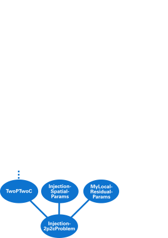

# Exercise #2 (DuMuX course)
<br>
## Problem set-up

The problem setup is identical to the previous [_exercise 1_](../ex1/README.md).

## Preparing the exercise

* Navigate to the directory `dumux/tutorial/dumux-course`

_Exercise 2_ deals with a two-phase compositional problem (__2p2c__). Goal is to learn how to use compile and runtime parameters and the _DuMuX property system_.

<br><br>
### Task 1: Getting familiar with the code
<hr>

Locate all the files you will need for this exercise
* The __main file__: `exercise2.cc`
* The __problem file__: `injection2p2cproblem.hh`
* The __spatial parameters file__: `injection2pspatialparams.hh`
* The __input file__: `exercise2.input`
* Two header files containing:
  * a custom __local residual__ in: `mylocalresidual.hh`
  * a custom __material law__ in:: `mymateriallaw.hh`


<hr><br><br>
### Task 2: Compiling and running the program
<hr>

* Change to the build-directory

```bash
cd build-cmake/tutorial/exercise2
```

* Compile the executable `exercise2`

```bash
make exercise2
```

* Execute the two problems and inspect the result

```bash
./exercise2
```
Note: Because the input file has the same name as the
executable, DuMuX will find it automatically.

If gnuplot is installed on your system, you should see a plot of the capillary pressure - saturation relationship.

<hr><br><br>
### Task 3: Implement and use a different material law
<hr>

DuMuX uses the term _material law_ to describe the law used to compute
* pc-Sw relations
* kr-Sw relations
* their inverse relations

The file `mymateriallaw.hh` contains a custom implementation of such a material law.

* Implement the method `Scalar pc(Scalar sw)` by implementing your own capillary pressure relationship, e.g. a simple linear relationship $`p_C(S_w) = 1\cdot 10^5 \cdot (1-S_w) + p_e`$.

Note: `MyMaterialLaw` uses the `BrooksCoreyParams` class as parameter input. You can get the entry pressure that is set in the spatial params as follows

```c++
const auto pe = params.pe();
```

The type (i.e. C++ type) of the material law is set in the file `injection2pspatialparams.hh` by using the DuMuX property system

```c++
SET_PROP(InjectionSpatialParams, MaterialLaw)
{
    using Scalar = typename GET_PROP_TYPE(TypeTag, Scalar);
    using type = EffToAbsLaw<RegularizedBrooksCorey<Scalar>>;
};
```

* Make DuMuX use your own material law by including the header `mymateriallaw.hh` and changing the alias `type`. This will make sure that your material law is used everywhere else in the code.

Note: Also use the wrapper class `EffToAbsLaw`. It takes care of converting absolute to effective saturations considering residual saturations. `MyMaterialLaw`
as other material laws (like Brooks-Corey, VanGenuchten, ...) in DuMuX only deals with effective saturations.

Verify your changes by recompiling and running the program. You should see a plot of your new function.

For the next task disable the plotting feature by changing the settings in the input file `exercise2.input`

```ini
[Problem]
OnlyPlotMaterialLaws = false
```

<hr><br><br>
### Task 4: Enable/Disable Gravity -> DuMuX parameters
<hr>

DuMuX has many parameters that have default values. For example, per default all simulation consider gravity effects.
You can disable gravity for a study, simply by setting the parameter in the input file

```ini
[Problem]
EnableGravity = false
```

Run the simulation with and without gravity. Change the `Problem.Name` parameter to create output files with different
names. Compare the results using paraview. You should immediately see the difference.

A list of parameters that can be set through the input file are given [here](http://www.dumux.org/doxygen-stable/html-2.11/a06387.php).


<hr><br><br>
### Task 5: Implement your own local residual
<hr>

Most types in DuMuX are properties that can be changed just like the material law. In the following task we implement our own 2p2c local residual, i.e. the class that computes the element residual  in every Newton step. The file `mylocalresidual.hh` contains a copy of the original local residual class used for the 2p2c model renamed to `template<class TypeTag> class MyTwoPTwoCLocalResidual`.

* Make DuMuX use this new local residual by inluding the header `mylocalresidual.hh` and setting the corresponding property in the `Property` namespace in the file `injection2p2cproblem.hh`

```c++
// note that every property struct knows about TypeTag
SET_PROP(Injection2p2cProblem, LocalResidual)
{
    using type = MyTwoPTwoCLocalResidualocal<TypeTag>;
};

// or using the convenience macro
SET_TYPE_PROP(Injection2p2cProblem, LocalResidual,
              MyTwoPTwoCLocalResidualocal<TypeTag>);
```

* Implement an output to the terminal in the constructor of `MyTwoPTwoCLocalResidual` e.g.

```c++
MyTwoPTwoCLocalResidual()
{
    std::cout << "Using MyTwoPTwoCLocalResidual." << std::endl;
}
```

* Verify you are using the new class by compiling and running the new program and inspecting the terminal output.

You want to make the new local residual special by adding a switch enabling / disabling diffusion. We will achieve this with a DuMuX parameter, a parameter read from the input file that defaults to a property value if the input file doesn't contain the parameter.

* Create a new `TypeTag` node, a new `PropertyTag`, and set a default in the `mylocalresidual.hh` file by adding

```c++
namespace Dumux {

namespace Properties
{
    NEW_TYPE_TAG(MyLocalResidualParams); // creates a new TypeTag node
    NEW_PROP_TAG(ProblemEnableDiffusion); // creates a new property
    SET_BOOL_PROP(MyLocalResidualParams,
                  ProblemEnableDiffusion, true); // set a default value
}
...
```

* Then enhance the problem TypeTag (the master TypeTag) by inheriting from the created node (in `injection2p2cproblem.hh`)

```c++
...
  NEW_TYPE_TAG(Injection2p2cProblem, // the problem TypeTag
               INHERITS_FROM(TwoPTwoC, // the 2p2c model TypeTag node
                            InjectionSpatialParams, // the spatial params TypeTag node
                            MyLocalResidualParams)); // the local residual params TypeTag node
...
```
Note: the property inheritance graph now looks like this




* Modify the `computeFlux` method to only call the `diffusiveFlux` method if diffusion is enabled. You can get the new parameter by adding the lines

```c++
// ... in the constructor of MyTwoPTwoCLocalResidual
    enableDiffusion_ = GET_PARAM_FROM_GROUP(TypeTag, bool,
                            Problem, EnableDiffusion);

// ... in the private member section of MyTwoPTwoCLocalResidual
private:
    bool enableDiffusion_;
```

You can now enable and disable diffusion through the input file

```ini
[Problem]
EnableDiffusion = true / false
```

Verify the difference in the parameter $`x_w^{N2}`$, i.e. the mole fraction of nitrogen in the
water phase, with and without diffusion. Note that due to diffusion being a slow process you
can only see the difference in later times.
