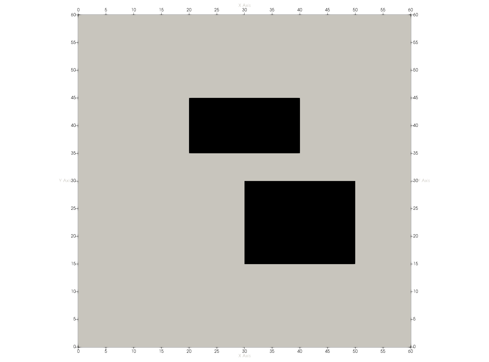
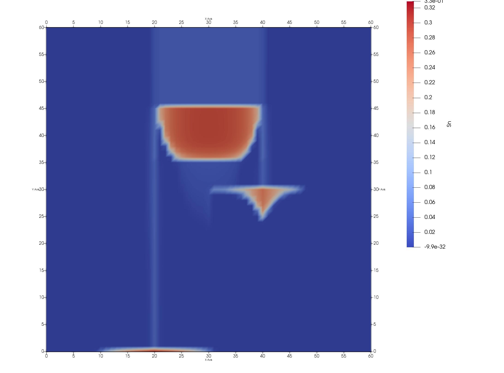
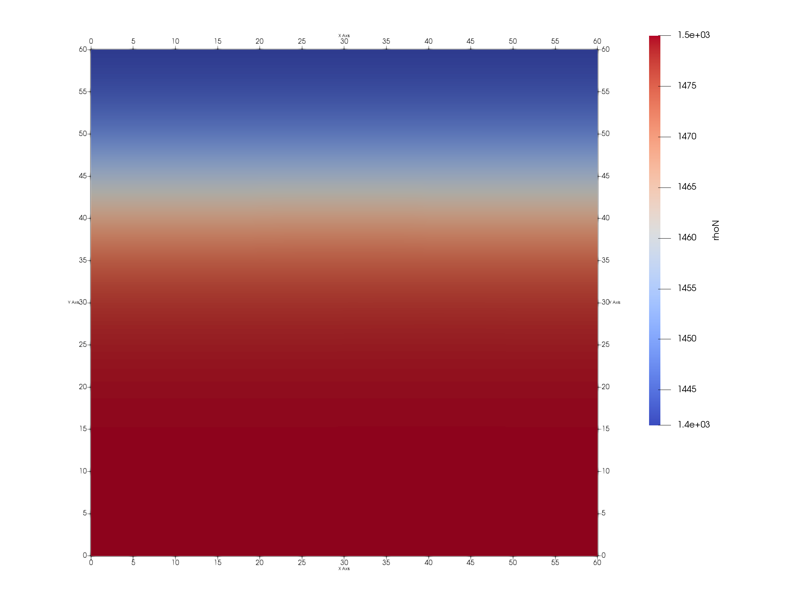

# Exercise #3 (DuMuX course)

The aim of this exercise is to get familiar with the _DuMuX_ way of implementing new components (fluids) and fluid systems (mixtures). In the scope of this exercise, a new fictitious component is implemented (exercise _3a_) as well as its mixture with water (exercise _3b_).

## Problem set-up

The domain has a size of 60 x 60 m and contains two low-permeable lenses. Initially, the domain is fully water saturated and the fictitious component is injected through the middle portion of the upper boundary by means of a Neumann boundary condition. The remaining parts of the upper and the entire lower boundary are Neumann no-flow while on the two lateral sides Dirichlet boundary conditions are applied (hydrostatic conditions for the pressure and zero saturation).




## Preparing the exercise

* Navigate to the directory `dumux/tutorial/ex3`

### 1. Getting familiar with the code

Locate all the files you will need for this exercise
* The shared __main file__ : `exercise3.cc`
* The __input file__ for part a: `exercise3_a.input`
* The __problem file__ for part a: `2pproblem.hh`
* The __input file__ for part b: `exercise3_b.input`
* The __problem file__ for part b: `2p2cproblem.hh`
* The __spatial parameters file__: `spatialparams.hh`

Furthermore you will find the following folders:
* `binarycoefficients`: Stores headers containing data/methods on binary mixtures
* `components`: Stores headers containing data/methods on pure components
* `fluidsystems`: Stores headers containing data/methods on mixtures of pure components. Uses methods from `binarycoefficients`.

To see more components, fluidsystems and binarycoefficients implementations, have a look at the folder `dumux/material`.

### 2. Implement a new component

In the following, the basic steps required to set the desired fluid system are outlined. Here, this is done in the __problem file__, i.e. for this part of the exercise the code shown below is taken from the `2pproblem.hh` file.

In this part of the exercise we will consider a system consisting of two immiscible phases. Therefore, the _TypeTag_ for this problem (`ExerciseThreeBoxTwoPTypeTag`) derives from a base _TypeTag_ (`ExerciseThreeTwoPTypeTag`) that itself derives from the `TwoP` _TypeTag_ (immiscible two-phase model properties).

```c++
NEW_TYPE_TAG(ExerciseThreeTwoPTypeTag, INHERITS_FROM(TwoP));
```

In order to be able to derive from this _TypeTag_, the declaration of the `TwoP` _TypeTag_ has to be included. It can be found in the `2p/model.hh` header:

```c++
// The numerical model
#include <dumux/porousmediumflow/2p/model.hh>
```

Additionally, the _TypeTag_ for this problem (`ExerciseThreeBoxTwoPTypeTag`) derives from the `BoxModel` _TypeTag_, to specify properties of the discretization scheme. For a cell-centered scheme, you could derive from `CCTpfaModel` or `CCMpfaModel` instead. Again the corresponding header has to be included

```c++
// The discretization
#include <dumux/discretization/box/properties.hh>
```

As wetting phase we want to use water and we want to precompute tables on which the properties are then interpolated in order to save computational time. Thus, in a first step we have to include the following headers:

```c++
// The water component
#include <dumux/material/components/tabulatedcomponent.hh>
#include <dumux/material/components/h2o.hh>
```
The non-wetting phase will be our new component, where we want to implement an incompressible and a compressible variant. The respective headers are prepared, but still incomplete. The compressible variant is still commented so that compilation does not fail when finishing the incompressible variant.

```c++
// The components that will be created in this exercise
#include "components/myincompressiblecomponent.hh"
// #include "components/mycompressiblecomponent.hh"
```
As mentioned above, we want to simulate two non-mixing components. The respective fluid system is found in:

```c++
// The two-phase immiscible fluid system
#include <dumux/material/fluidsystems/2pimmiscible.hh>
```

This fluid system expects __phases__ as input and so far we have only included the components, which contain data on the pure component for all physical states. Thus, we need to include

```c++
// We will only have liquid phases here
#include <dumux/material/fluidsystems/1pliquid.hh>
```

which creates a _liquid phase_ from a given component. Finally, using all of the included classes we set the fluid system property by choosing that the non-wetting phase is a one-phase liquid (OnePLiquid) consisting of the incompressible fictitious component and that the wetting-phase consists of tabulated water in the immiscible fluid system:


```c++
// we use the immiscible fluid system here
SET_PROP(ExerciseThreeTwoPTypeTag, FluidSystem)
{
private:
    using Scalar = typename GET_PROP_TYPE(TypeTag, Scalar);
    using TabulatedH2O = Components::TabulatedComponent<Components::H2O<Scalar>>;
    using WettingPhase = typename FluidSystems::OnePLiquid<Scalar, TabulatedH2O>;
    /*!
     * Uncomment first line and comment second line for using the incompressible component
     * Uncomment second line and comment first line for using the compressible component
     */
    using NonWettingPhase = typename FluidSystems::OnePLiquid<Scalar, MyIncompressibleComponent<Scalar> >;
    // using NonWettingPhase = typename FluidSystems::OnePLiquid<Scalar, MyCompressibleComponent<Scalar> >;

public:
    using type = typename FluidSystems::TwoPImmiscible<Scalar, WettingPhase, NonWettingPhase>;
};
```

### 2.1. Incompressible component

Open the file `myincompressiblecomponent.hh`. You can see in line 42 that a component should always derive from the _Base_ class (see `dumux/material/components/base.hh`), which defines the interface of a _DuMuX_ component with possibly required functions to be overloaded by the actual implementation. Additionally it is required for liquids to derive from the _Liquid_ class (see `dumux/material/components/liquid.hh`), for gases to derive from the _Gas_ class (see `dumux/material/components/gas.hh`) and for solids to derive from the _Solid_ class (see `dumux/material/components/solid.hh`), with functions specific to liquid, gas or solid.

```c++
/*!
 * \ingroup Components
 * \brief A ficitious component to be implemented in exercise 3.
 *
 * \tparam Scalar The type used for scalar values
 */
template <class Scalar>
class MyIncompressibleComponent
: public Components::Base<Scalar, MyIncompressibleComponent<Scalar> >
, public Components::Liquid<Scalar, MyIncompressibleComponent<Scalar> >
```

__Task__:

Implement an incompressible component into the file `myincompressiblecomponent.hh`, which has the following specifications:

| Parameter | unit | value |
| -----| --------| -------- |
| $`M`$ | $`Kg/mol`$   | $`131.39 \cdot 10^{-3}`$ |
| $`\rho_{liquid}`$ | $`Kg/m^3`$   | $`1460`$   |
| $`\mu_{liquid}`$ | $`Pa \cdot s`$   | $`5.7 \cdot 10^{-4}`$   |

In order to do so, have a look at the files `dumux/material/components/base.hh` and `dumux/material/components/liquid.hh` to see how the interfaces are defined and overload them accordingly.

In order to execute the program, change to the build directory and compile and execute the program by typing

```bash
cd build-cmake/tutorial/ex3
make exercise3_a
./exercise3_a exercise3_a.input
```

The saturation distribution of the nonwetting phase at the final simulation time should look like this:



### 2.2. Compressible component

We now want to implement a pressure-dependent density for our component. Open the file `mycompressiblecomponent.hh` and copy in the functions you implemented for the incompressible variant. Now substitute the method that returns the density by the following expression:

$`\displaystyle \rho_{MyComp} = \rho_{min} + \frac{ \rho_{max} - \rho_{min} }{ 1 + \rho_{min}*e^{-1.0*k*(\rho_{max} - \rho_{min})*p} } `$

where $`p`$ is the pressure and $`\rho_{min} = 1440 `$, $`\rho_{max} = 1480 `$ and $`k = 5 \cdot 10^{-7} `$. Also, make sure the header is included in the `2pproblem.hh` file by uncommenting line 45. Furthermore, the new component has to be set as the non-wetting phase in the fluid system, i.e. comment line 90 and uncomment line 91. The non-wetting density distribution at the final simulation time should look like this:



### 3. Implement a new fluid system

The problem file for this part of the exercise is `2p2cproblem.hh`. We now want to implement a new fluid system consisting of two liquid phases, which are water and the previously implemented compressible component. We will consider compositional effects, which is why we now have to derive our _TypeTag_ (`ExerciseThreeBoxTwoPTwoCTypeTag`) from a _TypeTag_ (`ExerciseThreeTwoPTwoCTypeTag`) that derives from the `TwoPTwoC` model _TypeTag_:

```c++
// The numerical model
#include <dumux/porousmediumflow/2p2c/model.hh>
```

```c++
// Create a new type tag for the problem
NEW_TYPE_TAG(ExerciseThreeTwoPTwoCTypeTag, INHERITS_FROM(TwoPTwoC));
NEW_TYPE_TAG(ExerciseThreeBoxTwoPTwoCTypeTag, INHERITS_FROM(BoxModel, ExerciseThreeTwoPTwoCTypeTag));
```

The new fluid system is to be implemented in the file `fluidsystems/h2omycompressiblecomponent.hh`. This is already included in the problem and the fluid system property is set accordingly.

```c++
// The fluid system that is created in this exercise
#include "fluidsystems/h2omycompressiblecomponent.hh"
```

```c++
// The fluid system property
SET_PROP(ExerciseThreeTwoPTwoCTypeTag, FluidSystem)
{
private:
    using Scalar = typename GET_PROP_TYPE(TypeTag, Scalar);
public:
    using type = FluidSystems::H2OMyCompressibleComponent<Scalar>;
};
```

In the `fluidsystems/h2omycompressiblecomponent.hh` file, your implemented component and the binary coefficient files are already included.

```c++
// the ficitious component that was created in exercise 3a
#include <tutorial/ex3/components/mycompressiblecomponent.hh>

// the binary coefficients corresponding to this fluid system
#include <tutorial/ex3/binarycoefficients/h2omycompressiblecomponent.hh>
```

__Task__:

Under the assumption that one molecule of `MyCompressibleComponent` displaces exactly one molecule of water, the water phase density can be expressed as follows:

$` \rho_{w} = \frac{ \rho_{w, pure} }{ M_{H_2O} }*(M_{H_2O}*x_{H_2O} + M_{MyComponent}*x_{MyComponent}) `$

Implement this dependency in the `density()` method in the fluid system. In order to compile and execute the program run

```bash
cd build-cmake/tutorial/ex3
make exercise3_b
./exercise3_b exercise3_b.input
```

You will observe an error message and an abortion of the program. This is due to the fact that in order for the constraint solver and other mechanisms in the two-phase two-component model to work, an additional functionality in the component has to be implemented. The model has to know the vapour pressure. As in the previous exercise, check the `dumux/material/components/base.hh` file for this function and implement it into `mycompressiblecomponent.hh`. For the vapour pressure, use a value of $`3900`$  Pa.
